# Case Studies in Building Intelligent Textbooks

This document provides 62 samples of some of the intelligent textbooks that have been created with our workflows.  This list is changing every day, so please check back
frequently.

- **[AI Assisted Geometry](https://dmccreary.github.io/geometry-course)**

    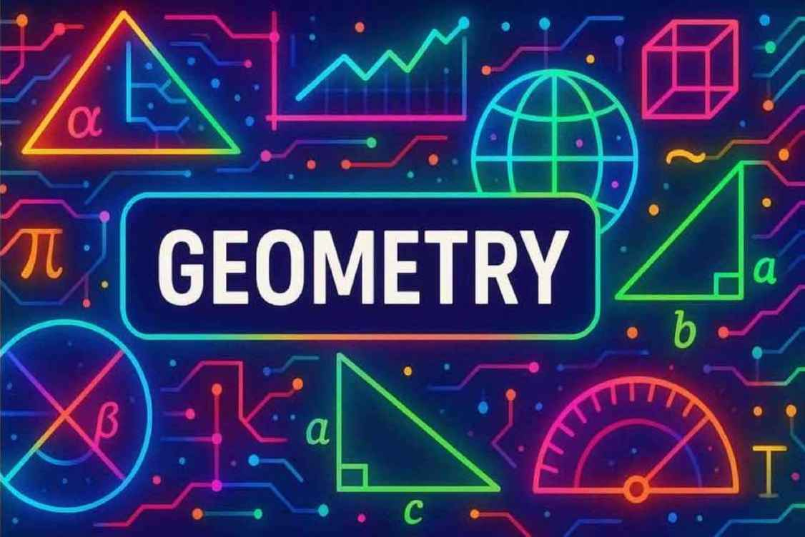

    An online intelligent textbook that uses AI to help high-school students learn geometry using MicroSims. Features a detailed learning graph and about a dozen MicroSims.

    [:octicons-mark-github-16: Repository](https://github.com/dmccreary/geometry-course) · 47 Files · 18K Words · 3 MicroSims

- **[AI Based Data Science with Python](https://dmccreary.github.io/data-science-course)**

    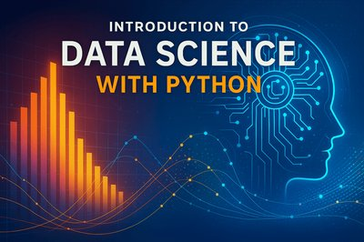

    An AI-based course that helps undergraduate college students learn data science with Python. Includes a detailed learning graph.

    [:octicons-mark-github-16: Repository](https://github.com/dmccreary/data-science-course) · 21 Files · 23K Words · 143 Glossary Terms

- **[AI Circuits Course](https://dmccreary.github.io/circuits/)**

    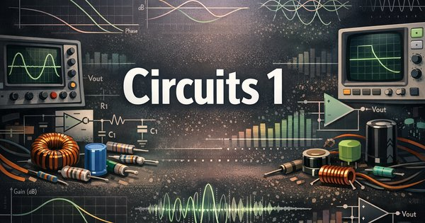

    Designing circuits using AI. Created to support Dr. Sharat Bhatra's circuits course at the University of Minnesota. Early stage development.

    [:octicons-mark-github-16: Repository](https://github.com/dmccreary/circuits)

- **[AI Racing League](https://coderdojotc.github.io/ai-racing-league)**

    

    A fun way of teaching AI and machine learning using a $300 RC car with a Raspberry Pi and Camera. Supports DonkeyCar projects.

    [:octicons-mark-github-16: Repository](https://github.com/CoderDojoTC/ai-racing-league) · 107 Files · 39K Words

- **[Algebra I](https://dmccreary.github.io/algebra-1)**

    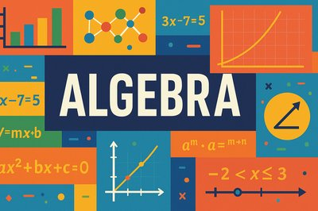

    An introductory course to Algebra covering fundamental concepts and skills with many interactive simulations. Designed for high school students.

    [:octicons-mark-github-16: Repository](https://github.com/dmccreary/algebra-1) · Active Development

- **[Linear Algebra for AI and Machine Learning](https://dmccreary.github.io/linear-algebra)**

    

    A college-level course bridging abstract linear algebra with real-world AI applications. Covers vectors, matrices, eigenvalues, neural networks, computer vision, and autonomous systems.

    [:octicons-mark-github-16: Repository](https://github.com/dmccreary/linear-algebra) · 206 Files · 195K Words · 126 MicroSims · 299 Glossary Terms

- **[ASL Book](https://Olufsonc-hub.github.io/asl-book/)**

    An intelligent textbook on American Sign Language designed to help students learn ASL through interactive content.

    [:octicons-mark-github-16: Repository](https://github.com/Olufsonc-hub/asl-book)

- **[Architectural Tradeoff Analysis Method](https://dmccreary.github.io/atam/)**

    

    ATAM is a method for evaluating software architecture, applied to database selection. Companion to 'Making Sense of NoSQL'.

    [:octicons-mark-github-16: Repository](https://github.com/dmccreary/atam) · Early Stage

- **[Automating Instructional Design](https://dmccreary.github.io/automating-instructional-design/)**

    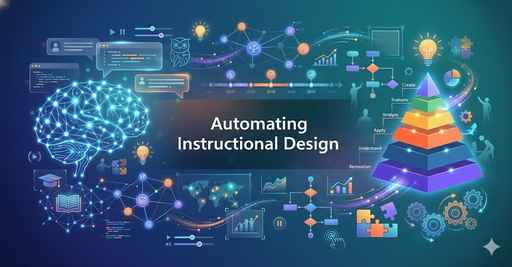

    A hands-on guide to automating instructional design tasks using AI and other tools. Covers workflows for course development.

    [:octicons-mark-github-16: Repository](https://github.com/dmccreary/automating-instructional-design)

- **[Beginning Electronics with AI](https://dmccreary.github.io/beginning-electronics)**

    

    An online course using MicroSims to help junior high and high school students learn the basics of electronics.

    [:octicons-mark-github-16: Repository](https://github.com/dmccreary/beginning-electronics) · 40 Files · 16K Words · 6 MicroSims

- **[Building AI Agents with Python](https://dmccreary.github.io/agents-course/)**

    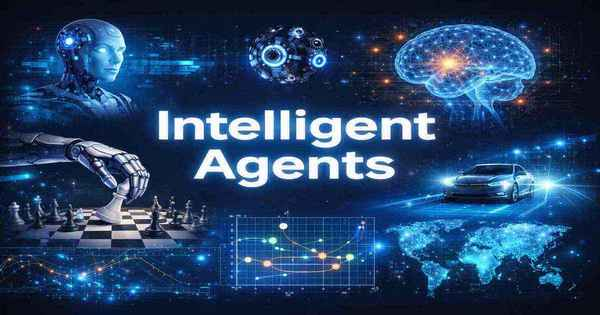

    Creating intelligent agents with Python and LLMs. Early stage development focused on modern agent architectures.

    [:octicons-mark-github-16: Repository](https://github.com/dmccreary/agents-course)

- **[Conversational AI](https://dmccreary.github.io/conversational-ai)**

    

    A college-level course on creating chatbots. Covers NLP foundations, semantic search, LLMs, embeddings, and vector databases.

    [:octicons-mark-github-16: Repository](https://github.com/dmccreary/conversational-ai) · Active Development

- **[Control Systems](https://dmccreary.github.io/control-systems)**

    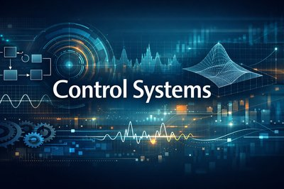

    Upper-division undergraduate course on classical control theory. Covers feedback, Laplace transforms, Bode plots, root locus, Nyquist stability, and PID design with Gyra the balancing robot.

    [:octicons-mark-github-16: Repository](https://github.com/dmccreary/control-systems) · 70 Files · 152K Words · 6 MicroSims · 297 Glossary Terms

- **[Deep Learning with AI](https://dmccreary.github.io/deep-learning-course)**

    

    Undergraduate Deep Learning Course with Dr. Sang-Hyun Oh at the University of Minnesota.

    [:octicons-mark-github-16: Repository](https://github.com/dmccreary/deep-learning-course)

- **[Clocks and Watches with AI](https://dmccreary.github.io/clocks-and-watches)**

    

    Learn to design and build clocks and watches using breadboards, microcontrollers, RTCs, and displays. Ready for classroom testing.

    [:octicons-mark-github-16: Repository](https://github.com/dmccreary/clocks-and-watches) · 124 Files · 37K Words · 11 MicroSims

- **[Claude Skills for Intelligent Textbooks](https://dmccreary.github.io/claude-skills/)**

    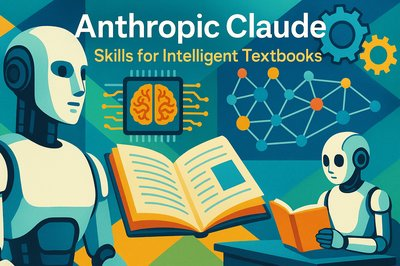

    A collection of skills and techniques for building intelligent textbooks using Claude AI. Includes prompts, workflows, and best practices.

    [:octicons-mark-github-16: Repository](https://github.com/dmccreary/claude-skills)

- **[Clan MacQuarrie](https://dmccreary.github.io/clan-macquarrie/)**

    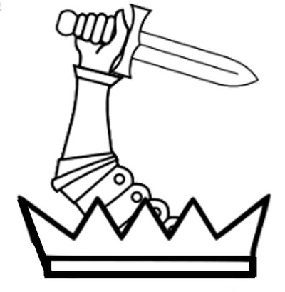

    Educational resources on the history of the Scottish clan system with a focus on Clan MacQuarrie heritage and traditions.

    [:octicons-mark-github-16: Repository](https://github.com/dmccreary/clan-macquarrie)

- **[Digital Design With Programmable Logic](https://mcbasken.github.io/umn-senior-design/)**

    Digital design course focusing on programmable logic devices and FPGAs.

    [:octicons-mark-github-16: Repository](https://github.com/mcbasken/umn-senior-design)

- **[Digital Electronics with AI](https://dmccreary.github.io/digital-electronics)**

    

    MicroSims for high school students learning digital electronics with breadboards, LEDs, buttons, and logic gates (~$50 in parts).

    [:octicons-mark-github-16: Repository](https://github.com/dmccreary/digital-electronics) · 86 Files · 171K Words · 8 MicroSims

- **[Digital Transformation 2.0 with Generative AI](https://yarmoluk.github.io/Digital-Transformation-with-AI-Spring-2026/)**

    

    Graduate course (SEIS 666) at University of St. Thomas exploring how generative AI reshapes digital transformation, business models, and workforce dynamics. By Daniel Yarmoluk.

    [:octicons-mark-github-16: Repository](https://github.com/Yarmoluk/Digital-Transformation-with-AI-Spring-2026) · 81 Files · 109K Words · 33 MicroSims · 223 Glossary Terms

- **[Economics Course](https://dmccreary.github.io/economics-course/)**

    

    Interactive intelligent textbook on Introduction to Economics for high school students covering microeconomics, macroeconomics, personal finance, and the digital economy.

    [:octicons-mark-github-16: Repository](https://github.com/dmccreary/economics-course) · 29 Files · 82K Words · Early Stage

- **[Ethics in Modern Society](https://dmccreary.github.io/ethics-course)**

    

    Ethical issues backed by critical thinking and data science. Covers harm measurement, impact analysis, and systems thinking.

    [:octicons-mark-github-16: Repository](https://github.com/dmccreary/ethics-course) · MicroSims included

- **[FFT Benchmarking](https://dmccreary.github.io/fft-benchmarking/)**

    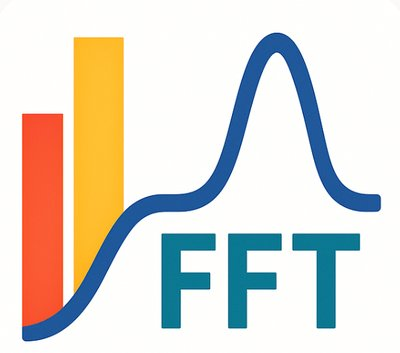

    A collection of resources for learning about Fast Fourier Transforms and benchmarking techniques across platforms.

    [:octicons-mark-github-16: Repository](https://github.com/dmccreary/fft-benchmarking)

- **[Fluid Power Systems](https://dmccreary.github.io/fluid-power-systems/)**

    Fluid power systems course created in conjunction with Peter Vinck at Inflow Corporation. Early stage development.

    [:octicons-mark-github-16: Repository](https://github.com/dmccreary/fluid-power-systems)

- **[Generative AI Architecture Patterns](https://dmccreary.github.io/genai-arch-patterns)**

    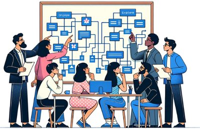

    Helps software architects understand how to use generative AI to create and maintain AI architecture patterns.

    [:octicons-mark-github-16: Repository](https://github.com/dmccreary/genai-arch-patterns) · 34 Files · 7K Words

- **[Generative AI Strategy](https://dmccreary.github.io/cmm-for-genai)**

    Helps business leaders understand how to use generative AI to create and maintain their AI business strategy.

    [:octicons-mark-github-16: Repository](https://github.com/dmccreary/cmm-for-genai) · 22 Files · 7K Words · 3 MicroSims

- **[Generative AI for Teachers](https://coderdojotc.github.io/chatgpt-for-teachers)**

    Helps teachers understand how to use generative AI to create and maintain AI teaching materials. Many sample prompts.

    [:octicons-mark-github-16: Repository](https://github.com/CoderDojoTC/chatgpt-for-teachers) · 98 Files · 19K Words · 100 MicroSims

- **[Graph Algorithms with AI](https://dmccreary.github.io/graph-algorithms)**

    

    MicroSims to help undergraduate college students learn graph algorithms using various JavaScript libraries.

    [:octicons-mark-github-16: Repository](https://github.com/dmccreary/graph-algorithms) · 71 Files · 30K Words · 15 MicroSims

- **[Graph Data Modeling with AI](https://dmccreary.github.io/graph-data-modeling-course)**

    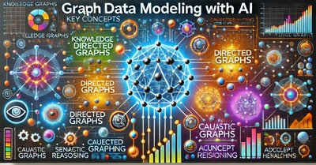

    MicroSims for graph data modeling. Example models created for a variety of domains using vis.js.

    [:octicons-mark-github-16: Repository](https://github.com/dmccreary/graph-data-modeling-course) · 49 Files · 13K Words · 156 Glossary Terms

- **[Graph Learning Management Systems](https://dmccreary.github.io/graph-lms)**

    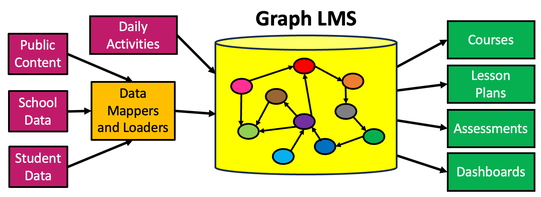

    How graphs are used to build AI learning management systems. Created for startups integrating AI into production LMS.

    [:octicons-mark-github-16: Repository](https://github.com/dmccreary/graph-lms) · 17 Files · 8K Words · 10 MicroSims

- **[GraphRAG](https://dmccreary.github.io/graph-rag)**

    An online course teaching concepts around GraphRAG (Retrieval Augmented Generation with graphs).

    [:octicons-mark-github-16: Repository](https://github.com/dmccreary/graph-rag) · 14 Files · 8K Words · 33 Glossary Terms

- **[Intelligent Textbooks](https://dmccreary.github.io/intelligent-textbooks)**

    

    Tutorial for building intelligent textbooks using mkdocs-material. Contains detailed tutorials and best practices.

    [:octicons-mark-github-16: Repository](https://github.com/dmccreary/intelligent-textbooks) · 12K Words · 4 MicroSims

- **[AI Infographics](https://dmccreary.github.io/infographics/)**

    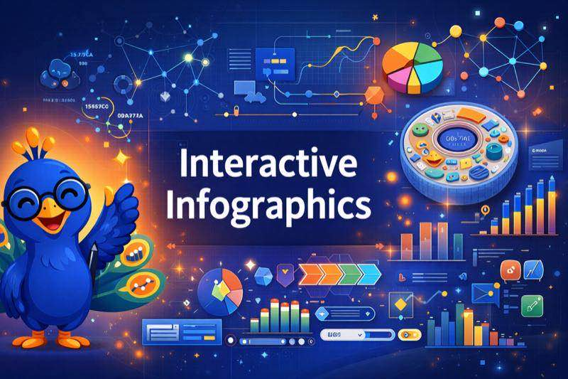

    A collection of resources for creating interactive infographics using AI tools. Includes templates and examples.

    [:octicons-mark-github-16: Repository](https://github.com/dmccreary/infographics)

- **[Introduction to Graph Databases](https://dmccreary.github.io/intro-to-graph)**

    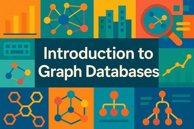

    Interactive textbook covering graph databases: graph thinking, data modeling, NoSQL, labeled property graphs, and query languages.

    [:octicons-mark-github-16: Repository](https://github.com/dmccreary/intro-to-graph) · Extensive MicroSims

- **[Introduction to Microcontrollers with PIC24](https://irvinggsea.github.io/i-book-v1/)**

    Introduction to microcontrollers using the PIC24 platform for embedded systems education.

    [:octicons-mark-github-16: Repository](https://github.com/irvinggsea/i-book-v1)

- **[Introduction to Operating Systems](https://btlepak.github.io/Intelligent_Textbook/)**

    Fundamentals of operating systems including process management, memory, and file systems.

    [:octicons-mark-github-16: Repository](https://github.com/btlepak/Intelligent_Textbook)

- **[Introduction to Physics](https://dmccreary.github.io/intro-to-physics-course)**

    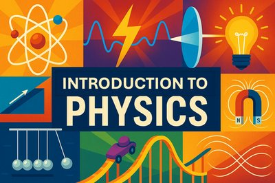

    Year-long intro physics course covering motion, forces, energy, waves, optics, and electricity with MicroSims.

    [:octicons-mark-github-16: Repository](https://github.com/dmccreary/intro-to-physics-course) · Active Development

- **[Investor Relations](https://dberglu.github.io/ir-textbook/)**

    Executive-level course on AI-powered IR modernization by David Berglund. 15 chapters with full content.

    [:octicons-mark-github-16: Repository](https://github.com/dberglu/ir-textbook) · Glossary, FAQs, Quizzes, MicroSims

- **[IT Management with Graphs](https://dmccreary.github.io/it-management-graph)**

    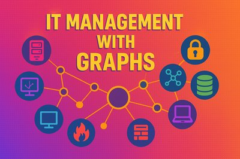

    IT management using graph databases. Covers ITIL, configuration management, asset management, and IT operations.

    [:octicons-mark-github-16: Repository](https://github.com/dmccreary/it-management-graph) · Active Development

- **[Learning Graphs](https://dmccreary.github.io/learning-graphs)**

    

    Creation and maintenance of learning graphs. Extensive examples using vis.js for visualization.

    [:octicons-mark-github-16: Repository](https://github.com/dmccreary/learning-graphs) · 74 Files · 33K Words · 47 Glossary Terms

- **[Learning Linux](https://dmccreary.github.io/learning-linux/)**

    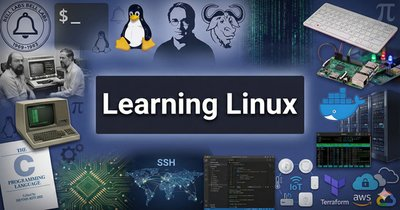

    A comprehensive 15-week course teaching high school students Linux fundamentals including command line, file systems, and scripting.

    [:octicons-mark-github-16: Repository](https://github.com/dmccreary/learning-linux)

- **[Learning MicroPython with AI](https://dmccreary.github.io/learning-micropython)**

    

    Helps kids learn MicroPython on microcontrollers using fun low-cost projects. Thousands of monthly users worldwide.

    [:octicons-mark-github-16: Repository](https://github.com/dmccreary/learning-micropython) · 204 Files · 63K Words

- **[McCreary Family Heritage](https://dmccreary.github.io/mccreary-heritage/)**

    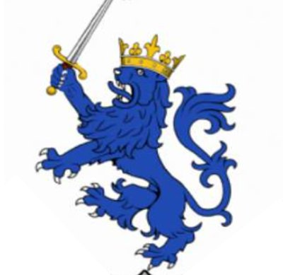

    Educational resources for teaching Scottish, Irish, and immigration history with a focus on building critical thinking skills.

    [:octicons-mark-github-16: Repository](https://github.com/dmccreary/mccreary-heritage)

- **[MicroSim Search](https://dmccreary.github.io/search-microsims/)**

    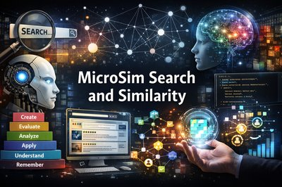

    Client-side faceted search system for educational MicroSims. Crawls GitHub repositories to collect metadata and provides browser-based search with filtering by subject, grade level, Bloom's Taxonomy, and framework.

    [:octicons-mark-github-16: Repository](https://github.com/dmccreary/search-microsims) · 125 Files · 138K Words · 58 MicroSims

- **[MicroSims for Electrical Engineering](https://kenn0727.github.io/ee-microsims)**

    11 MicroSims created by University of Minnesota EE students using p5.js and prompt engineering.

    [:octicons-mark-github-16: Repository](https://github.com/kenn0727/ee-microsims) · 14 Files · 12 MicroSims

- **[MicroSims](https://dmccreary.github.io/microsims)**

    

    Showcase for creating MicroSims using JavaScript and p5.js across diverse subjects.

    [:octicons-mark-github-16: Repository](https://github.com/dmccreary/microsims) · 88 Files · 18K Words · 66 MicroSims

- **[Modeling Healthcare Data with Graphs](https://dmccreary.github.io/modeling-healthcare-data)**

    

    Undergraduate textbook on graph-based healthcare data modeling: patient-centric models, provider operations, clinical workflows.

    [:octicons-mark-github-16: Repository](https://github.com/dmccreary/modeling-healthcare-data) · Active Development

- **[Moving Rainbow](https://dmccreary.github.io/moving-rainbow)**

    

    Using colorful addressable LED strips and noodles for hands-on computational thinking projects with MicroPython.

    [:octicons-mark-github-16: Repository](https://github.com/dmccreary/moving-rainbow) · 49 Files · 17K Words

- **[Neurodiversity Course](https://dmccreary.github.io/neurodiversity-course/)**

    Course on neurodiversity awareness and inclusion strategies.

    [:octicons-mark-github-16: Repository](https://github.com/dmccreary/neurodiversity-course)

- **[Personal Finance](https://dmccreary.github.io/personal-finance/)**

    

    Helps high school students learn personal finance with MicroSims, infographics, and graphic novel storytelling.

    [:octicons-mark-github-16: Repository](https://github.com/dmccreary/personal-finance)

- **[Prompt Engineering Class](https://dmccreary.github.io/prompt-class)**

    

    Hands-on labs covering lists, Mermaid diagrams, markdown tables, p5.js visualizations, and data science applications.

    [:octicons-mark-github-16: Repository](https://github.com/dmccreary/prompt-class) · Active Development

- **[Reading for Kindergarten](https://dmccreary.github.io/reading-for-kindergarten/)**

    

    An intelligent textbook for teaching reading skills to kindergarten students with age-appropriate interactive content.

    [:octicons-mark-github-16: Repository](https://github.com/dmccreary/reading-for-kindergarten)

- **[Robot Day](https://dmccreary.github.io/robot-day)**

    Resources for single-day STEM events with hands-on projects leading to understanding collision-avoidance robots.

    [:octicons-mark-github-16: Repository](https://github.com/dmccreary/robot-day) · 52 Files · 26K Words

- **[Semiconductor Physics Course](https://dmccreary.github.io/semiconductor-physics-course)**

    

    College-level semiconductor physics with interactive simulations including PN Junction visualization.

    [:octicons-mark-github-16: Repository](https://github.com/dmccreary/semiconductor-physics-course) · Early Stage

- **[STEM Robots](https://dmccreary.github.io/stem-robots)**

    

    STEM and robotics using the Raspberry Pi RP2040 on low-cost robotics kits for computational thinking.

    [:octicons-mark-github-16: Repository](https://github.com/dmccreary/stem-robots) · 74 Files · 18K Words · 5 MicroSims

- **[Signal Processing](https://dmccreary.github.io/signal-processing)**

    

    Demonstrates using generative AI to create undergraduate signal processing courses.

    [:octicons-mark-github-16: Repository](https://github.com/dmccreary/signal-processing) · 53 Files · 28K Words · 6 MicroSims

- **[Spectrum Analyzer](https://dmccreary.github.io/spectrum-analyzer/)**

    

    Build a spectrum analyzer using Raspberry Pi Pico and a microphone with detailed hardware and software tutorials.

    [:octicons-mark-github-16: Repository](https://github.com/dmccreary/spectrum-analyzer)

- **[STEM Classroom Administration](https://dmccreary.github.io/stem-classroom-admin/)**

    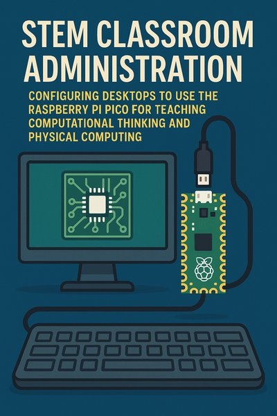

    Helps teachers use AI to setup and administer a STEM classroom with a focus on computational thinking and microcontrollers.

    [:octicons-mark-github-16: Repository](https://github.com/dmccreary/stem-classroom-admin)

- **[Systems Thinking in the Age of AI](https://dmccreary.github.io/systems-thinking)**

    

    Interactive resources for teaching systems thinking from high school to executive level. Multiple course descriptions.

    [:octicons-mark-github-16: Repository](https://github.com/dmccreary/systems-thinking) · MicroSims included

- **[Tracking AI](https://dmccreary.github.io/tracking-ai-course)**

    

    Tracking AI progress for strategy consulting in education and knowledge management organizations.

    [:octicons-mark-github-16: Repository](https://github.com/dmccreary/tracking-ai-course) · 47 Files · 18K Words · 3 MicroSims

- **[US Geography](https://dmccreary.github.io/us-geography)**

    

    Interactive intelligent geography for grade school students (3rd-6th grade). Explore all 50 states with clickable maps, zoomable regions, and discovery challenges.

    [:octicons-mark-github-16: Repository](https://github.com/dmccreary/us-geography) · 85 Files · 81K Words · 34 MicroSims · 200 Glossary Terms

- **[Trigonometric Functions](https://stage03.iowerx.com:8443/)**

    Foundational course on relationships between angles and sides in right triangles by Hank Ratzesberger. 200 concepts.

    High School · Bridges algebra and geometry

