# Case Studies in Building Intelligent Textbooks

This document provides 100 samples of some of the intelligent textbooks that have been created with our workflows.  This list is changing every day, so please check back
frequently.

<!-- This is inline CSS for the completion status icons at the end of each case study -->

<!-- Modal (single instance for the page) -->

  

    <h3>Book Completion Status</h3>
    
This icon indicates the development stage of each intelligent textbook:

    
 Early Development

    
 Initial Content

    
 In Progress

    
 Nearly Complete

    
 Complete

    <button class="completion-modal-close" onclick="document.getElementById('completionModal').classList.remove('active')">Close</button>
  

- **[A Skeptic's Guide to Quantum Computing](https://dmccreary.github.io/quantum-computing/)**

    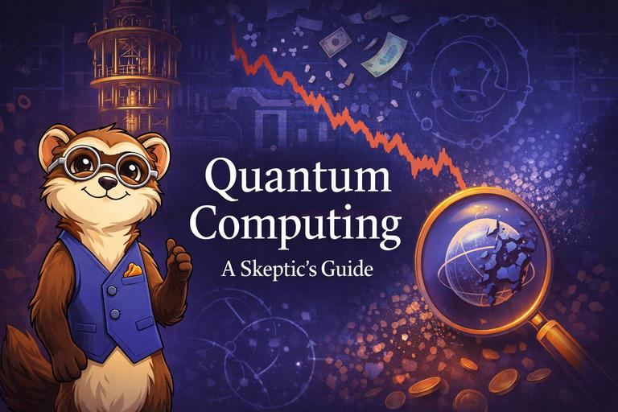

    An evidence-based interactive intelligent textbook examining why quantum computing may never be economically viable, covering physics constraints, hardware realities, investment risk, and cognitive biases.  Designed for upper-division undergraduates, graduate students, technology investors, and policymakers.

    241 Concepts · 17 Chapters · 200K Words · 241 Glossary Terms · 53 MicroSims · 
    
    [:octicons-mark-github-16: Repository](https://github.com/dmccreary/quantum-computing)

- **[AI Assisted Geometry](https://dmccreary.github.io/geometry-course)**

    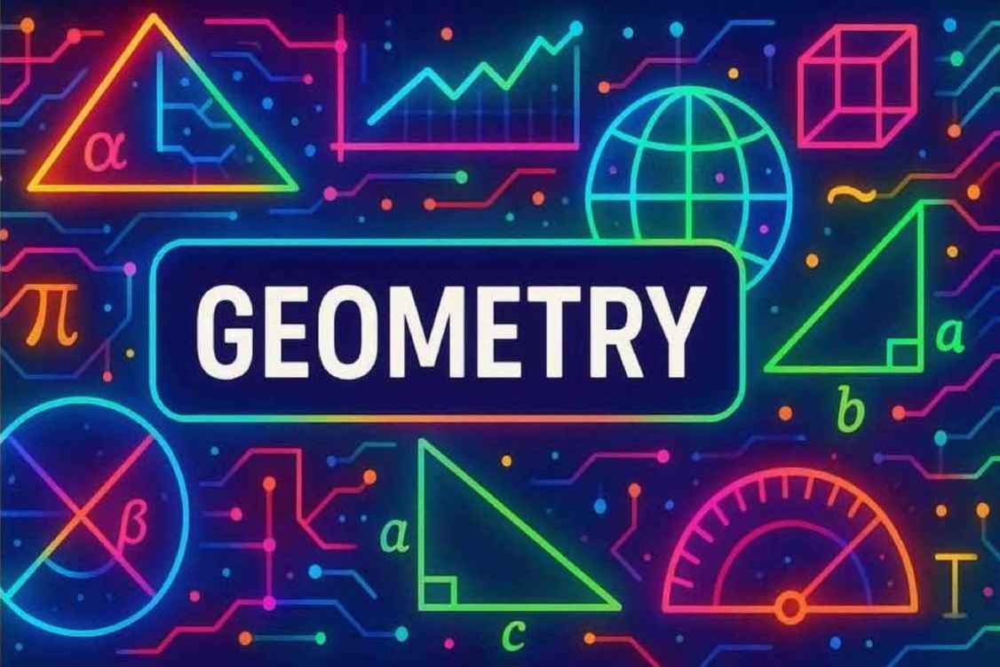

    An online interactive intelligent textbook for high-school geometry using MicroSims. Features a detailed learning graph and over 130 interactive geometry MicroSims.

    200 Concepts · 12 Chapters · 171K Words · 138 MicroSims · 
    · [:octicons-mark-github-16: Repository](https://github.com/dmccreary/geometry-course)

- **[AI Based Data Science with Python](https://dmccreary.github.io/data-science-course)**

    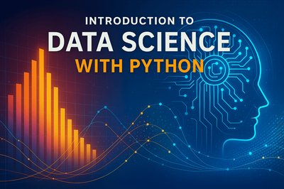

    An AI-based course that helps undergraduate college students learn data science with Python. Includes a detailed learning graph.

    300 Concepts · 21 Files · 23K Words · 143 Glossary Terms 
    · 
    · [:octicons-mark-github-16: Repository](https://github.com/dmccreary/data-science-course) 

- **[AI Circuits Course](https://dmccreary.github.io/circuits/)**

    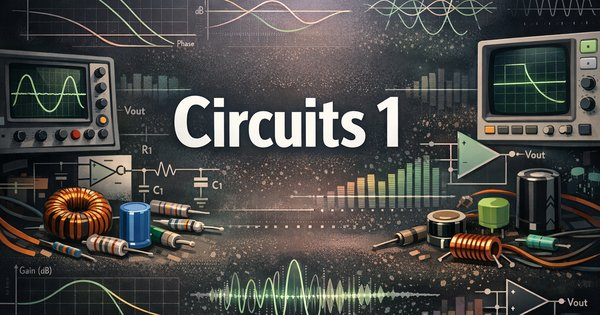

    Learn electronic circuits with AI-powered simulations and knowledge graphs. Created to support the circuits course at the University of Minnesota.

    Concepts: 300

    [:octicons-mark-github-16: Repository](https://github.com/dmccreary/circuits) · 113 Files · 154K Words · 23 MicroSims · 

- **[Interactive Infographics with AI](https://dmccreary.github.io/infographics/)**

    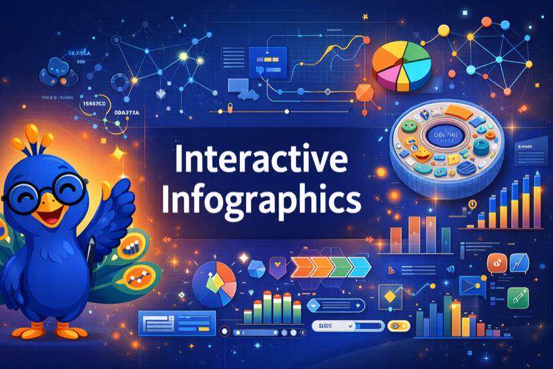

    An AI-assisted guide that teaches non-programmers how to design high-quality detailed interactive infographic MicroSims with many examples, prompts, templates, and workflow examples for intelligent textbooks.  Many examples come from the [Biology](ttps://github.com/dmccreary/biology) textbook.

    Concepts: 350

    [:octicons-mark-github-16: Repository](https://github.com/dmccreary/infographics) · 20 Chapters ·  · Learning Mascot · 

- **[AI Racing League](https://dmccreary.github.io/ai-racing-league)**

    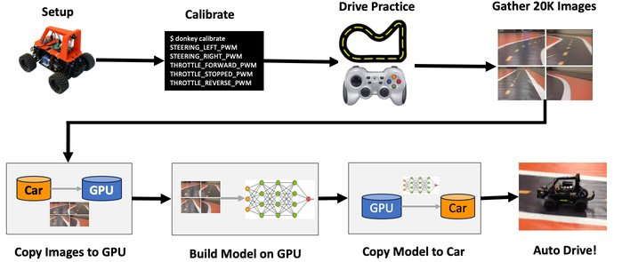

    A fun way of teaching AI and machine learning using a $300 RC car with a Raspberry Pi and Camera. Supports DonkeyCar projects.

    [:octicons-mark-github-16: Repository](https://github.com/dmccreary/ai-racing-league) · 105 Files · 51K Words · 19 Glossary Terms · 

- **[Algebra I](https://dmccreary.github.io/algebra-1)**

    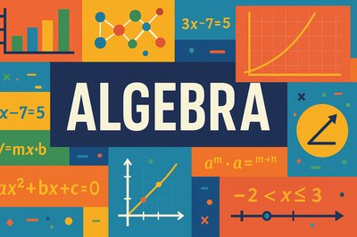

    An introductory course to Algebra covering fundamental concepts and skills with many interactive simulations. Designed for high school students.

    Concepts: 200

    [:octicons-mark-github-16: Repository](https://github.com/dmccreary/algebra-1) · Active Development · 

- **[Architecture Tradeoff Analysis Method (ATAM)](https://dmccreary.github.io/atam/)**

    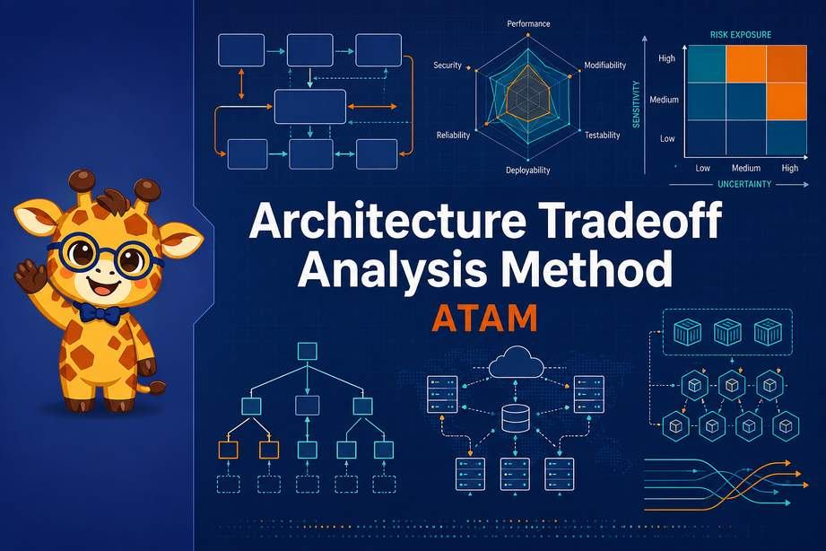

    ATAM is a method for evaluating software architectures.  This is a 14-week
    course for senior undergraduate or graduate school software engineering students
    that are focused on software and hardware architectures.  This method
    is used in other textbooks such as the Selecting the Right Database textbook.

    [:octicons-mark-github-16: Repository](https://github.com/dmccreary/atam) · 18 Files · 11K Words · 1 MicroSim · Early Stage · 

- **[Biology: An Interactive Course](https://dmccreary.github.io/biology/)**

    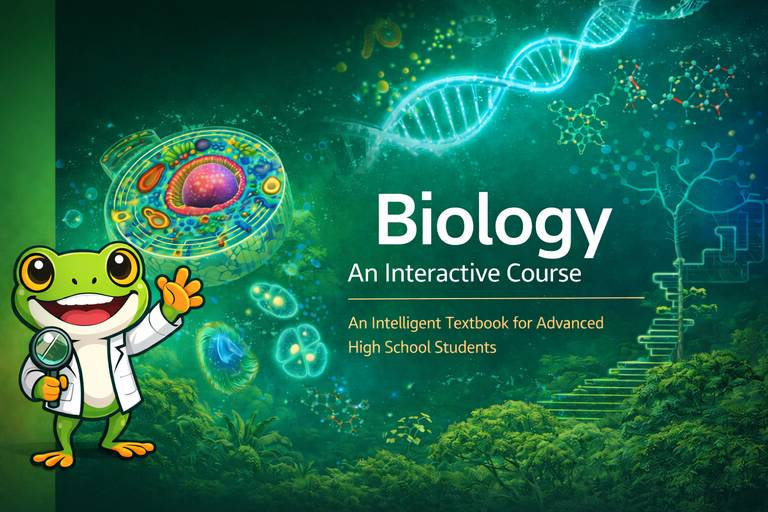

    Interactive intelligent textbook for Biology designed for advanced high school students preparing for a college credit exam. Covers all eight College Board units with MicroSims, a 375+ concept learning graph, and college credit exam strategies.

    Concepts: 380

    [:octicons-mark-github-16: Repository](https://github.com/dmccreary/biology-textbook) · 189 Files · 240K Words · 90 MicroSims · 378 Glossary Terms · 

- **[Calculus](https://dmccreary.github.io/calculus)**

    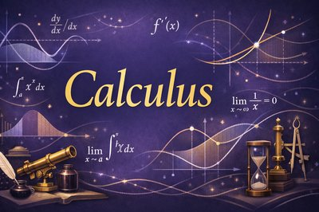

    Interactive Calculus textbook for high school students with 23 chapters, 100 MicroSims, and Delta the robot mascot. Covers both AB and BC curricula.  Designed to help you get college credit.

    Concepts: 380

    [:octicons-mark-github-16: Repository](https://github.com/dmccreary/calculus) · 208 Files · 248K Words · 100 MicroSims · 230 Glossary Terms · 

- **[Chemistry](https://dmccreary.github.io/chemistry/)**

    

    Interactive intelligent textbook for Chemistry designed for high school students seeking college credit. Features 18 chapters, SMILES molecule rendering, mhchem equation support, and an interactive learning graph.

    Concepts: 500

    [:octicons-mark-github-16: Repository](https://github.com/dmccreary/chemistry) · 124 Files · 223K Words · 48 MicroSims · 472 Glossary Terms · 

- **[ASL Book](https://Olufsonc-hub.github.io/asl-book/)**

    An intelligent textbook on American Sign Language designed to help students learn ASL through interactive content.

    Concepts: 200

    [:octicons-mark-github-16: Repository](https://github.com/Olufsonc-hub/asl-book) · 

- **[Automating Instructional Design](https://dmccreary.github.io/automating-instructional-design/)**

    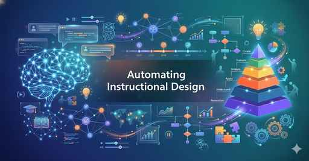

    A hands-on guide to automating instructional design tasks using AI and other tools. Covers workflows for course development.

    Concepts: 200

    [:octicons-mark-github-16: Repository](https://github.com/dmccreary/automating-instructional-design) · 

- **[Ancient History](https://dmccreary.github.io/ancient-history/)**

    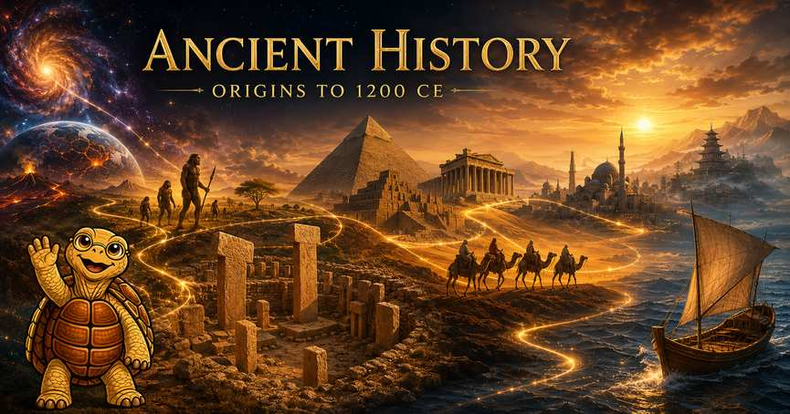

    An interactive intelligent textbook covering ancient world history from cosmic origins through post-classical civilizations (to ~1200 CE). Organized around the UCLA "World History for Us All" Big Era framework with a learning graph of 297 concepts.

    Concepts: 297

    [:octicons-mark-github-16: Repository](https://github.com/dmccreary/ancient-history) · 32 Files · 108K Words · 250 Glossary Terms · 1 MicroSim · 

- **[Beginning Electronics with AI](https://dmccreary.github.io/beginning-electronics)**

    

    An online course using MicroSims to help junior high and high school students learn the basics of electronics.

    Concepts: 274

    [:octicons-mark-github-16: Repository](https://github.com/dmccreary/beginning-electronics) · 40 Files · 16K Words · 6 MicroSims · 

- **[Bioinformatics](https://dmccreary.github.io/bioinformatics/)**

    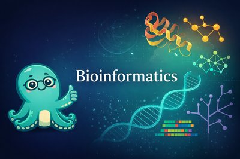

    Interactive intelligent textbook for bioinformatics covering sequence analysis, structural biology, network analysis, knowledge graphs, and multi-omics integration with graph-based approaches throughout.

    Concepts: 480

    [:octicons-mark-github-16: Repository](https://github.com/dmccreary/bioinformatics) · 137 Files · 188K Words · 57 MicroSims · 

- **[Blockchain: A Skeptic's Guide to Trust Technologies](https://dmccreary.github.io/blockchain/)**

    

    An interactive intelligent textbook examining blockchain, certificate authorities, cost analysis, architecture tradeoffs, and cognitive biases in technology decisions.

    Concepts: 200

    [:octicons-mark-github-16: Repository](https://github.com/dmccreary/blockchain) · 74 Files · 105K Words · 36 MicroSims · 200 Glossary Terms
    

- **[Building AI Agents with Python](https://dmccreary.github.io/agents-course/)**

    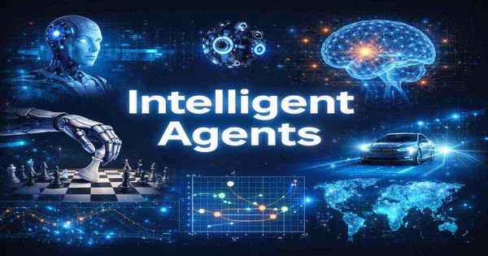

    Creating intelligent agents with Python and LLMs. Early stage development focused on modern agent architectures.

    [:octicons-mark-github-16: Repository](https://github.com/dmccreary/agents-course) · 

- **[Clan MacQuarrie](https://dmccreary.github.io/clan-macquarrie/)**

    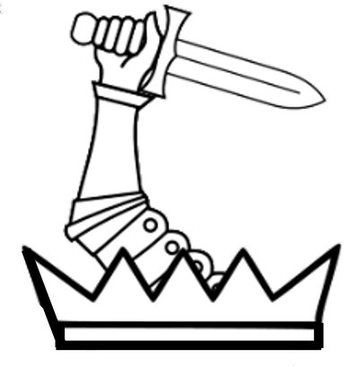

    Educational resources on the history of the Scottish clan system with a focus on Clan MacQuarrie heritage and traditions.

    [:octicons-mark-github-16: Repository](https://github.com/dmccreary/clan-macquarrie) · 

- **[Claude Skills for Intelligent Textbooks](https://dmccreary.github.io/claude-skills/)**

    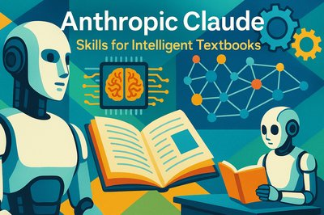

    A collection of skills and techniques for building intelligent textbooks using Claude AI. Includes prompts, workflows, and best practices.

    Concepts: 200

    [:octicons-mark-github-16: Repository](https://github.com/dmccreary/claude-skills) · 

- **[Clocks and Watches with AI](https://dmccreary.github.io/clocks-and-watches)**

    

    Learn to design and build digital clocks and watches using breadboards, microcontrollers, RTCs, and displays. Many complete sample clocks and watches ready for classroom testing.

    [:octicons-mark-github-16: Repository](https://github.com/dmccreary/clocks-and-watches) · 124 Files · 37K Words · 11 MicroSims · 

- **[Context Graph: How Organizations Use LLMs Cost Effectively](https://dmccreary.github.io/context-graph/)**

    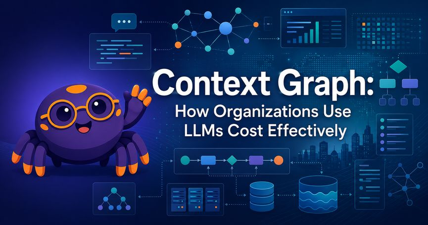

    An intelligent textbook for enterprise architects, AI/ML practitioners, and technical product managers on building context graphs — enterprise graph structures that get the right organizational knowledge into an LLM's prompt in the fewest tokens. Features 22 chapters, 496 concepts, 47 MicroSims, and Nexus the Spider as the pedagogical mascot.

    Concepts: 496

    [:octicons-mark-github-16: Repository](https://github.com/dmccreary/context-graph) · 22 Chapters · 245K Words · 498 Glossary Terms · 47 MicroSims · 

- **[Control Systems](https://dmccreary.github.io/control-systems)**

    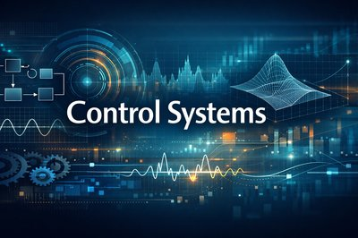

    Upper-division undergraduate course on classical control theory. Covers feedback, Laplace transforms, Bode plots, root locus, Nyquist stability, and PID design with Gyra the balancing robot.

    Concepts: 300

    [:octicons-mark-github-16: Repository](https://github.com/dmccreary/control-systems) · 70 Files · 152K Words · 6 MicroSims · 297 Glossary Terms · 

- **[Conversational AI](https://dmccreary.github.io/conversational-ai)**

    

    A college-level course on creating chatbots. Covers NLP foundations, semantic search, LLMs, embeddings, and vector databases.

    Concepts: 200

    [:octicons-mark-github-16: Repository](https://github.com/dmccreary/conversational-ai) · Active Development · 

- **[Computer Science with Python](https://dmccreary.github.io/computer-science)**

    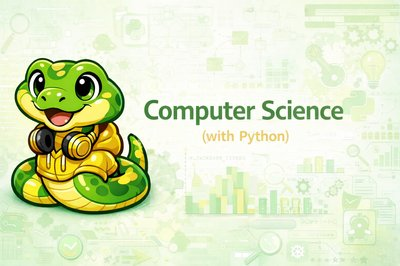

    An interactive, AI-assisted textbook for college credit Computer Science using Python. Features 400 mapped concepts, 20 chapters, and MicroSims to make abstract computing ideas concrete for high school and early college learners.

    Concepts: 400

    [:octicons-mark-github-16: Repository](https://github.com/dmccreary/computer-science) · 58 Files · 153K Words · 17 MicroSims · 400 Glossary Terms · 

- **[Cybersecurity: Foundations, Practice, and Professional Responsibility](https://dmccreary.github.io/cybersecurity/)**

    

    An ABET CAC-aligned intelligent textbook covering cryptography, software security, network defense, system hardening, governance, and ethics for undergraduate students of cybersecurity, computer science, and information systems.

    Concepts: 390

    [:octicons-mark-github-16: Repository](https://github.com/dmccreary/cybersecurity) · 36 Files · 152K Words · 390 Glossary Terms
    

- **[Deep Learning with AI](https://dmccreary.github.io/deep-learning-course)**

    

    Undergraduate Deep Learning Course with Dr. Sang-Hyun Oh at the University of Minnesota.

    [:octicons-mark-github-16: Repository](https://github.com/dmccreary/deep-learning-course) · 

- **[Digital Citizenship: Building Safe, Kind and Balanced Lives Online](https://dmccreary.github.io/digital-citizenship/)**

    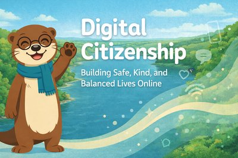

    An interactive intelligent textbook for grades 5-9 on building safe, kind, and balanced lives online, aligned to the ISTE Student Standards.

    Concepts: 265

    [:octicons-mark-github-16: Repository](https://github.com/dmccreary/digital-citizenship) · 199K Words · 11 MicroSims · 267 Glossary Terms · 15 Mini Graphic Novels
    

- **[Digital Design With Programmable Logic](https://mcbasken.github.io/umn-senior-design/)**

    Digital design course focusing on programmable logic devices and FPGAs.

    [:octicons-mark-github-16: Repository](https://github.com/mcbasken/umn-senior-design) · 

- **[Digital Electronics with AI](https://dmccreary.github.io/digital-electronics)**

    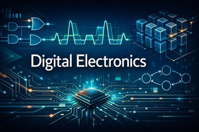

    Undergraduate course with MicroSims for learning digital electronics using breadboards, LEDs, buttons, and logic gates (~$50 in parts).

    Concepts: 300

    [:octicons-mark-github-16: Repository](https://github.com/dmccreary/digital-electronics) · 86 Files · 171K Words · 8 MicroSims · 

- **[Digital Transformation 2.0 with Generative AI](https://yarmoluk.github.io/Digital-Transformation-with-AI-Spring-2026/)**

    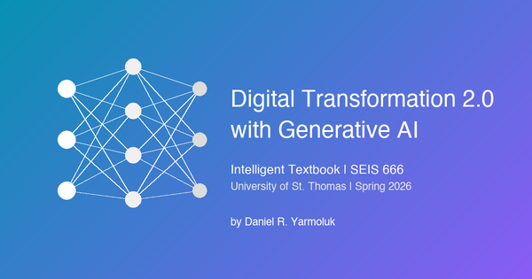

    Graduate course (SEIS 666) at University of St. Thomas exploring how generative AI reshapes digital transformation, business models, and workforce dynamics. By Daniel Yarmoluk.

    Concepts: 200

    [:octicons-mark-github-16: Repository](https://github.com/Yarmoluk/Digital-Transformation-with-AI-Spring-2026) · 81 Files · 109K Words · 33 MicroSims · 223 Glossary Terms · 

- **[Economics Course](https://dmccreary.github.io/economics-course/)**

    

    Interactive intelligent textbook on Introduction to Economics for high school students covering microeconomics, macroeconomics, personal finance, and the digital economy.

    Concepts: 206

    [:octicons-mark-github-16: Repository](https://github.com/dmccreary/economics-course) · 29 Files · 82K Words · Early Stage · 

- **[Ecology: Systems Thinking for a Changing Planet](https://dmccreary.github.io/ecology/)**

    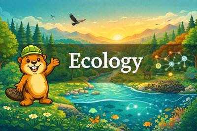

    An interactive intelligent textbook for high school students (grades 9-12) on ecosystems, biodiversity, populations, climate change, and environmental policy, with a focus on systems thinking and scientific literacy.

    Concepts: 380

    [:octicons-mark-github-16: Repository](https://github.com/dmccreary/ecology) · 191 Files · 350K Words · 87 MicroSims · 381 Glossary Terms
    

- **[English Language Arts](https://dmccreary.github.io/english-language-arts)**

    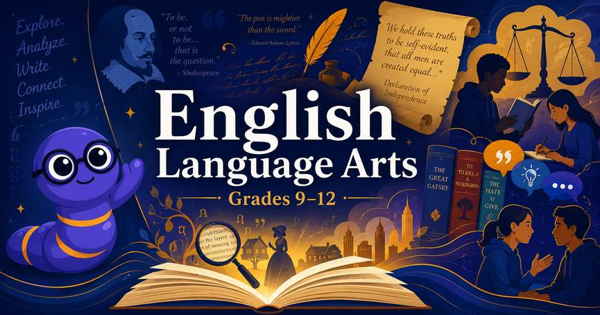

    An interactive intelligent textbook for US high school students (grades 9–12) covering the complete Common Core ELA curriculum: reading literature, informational text, writing, speaking, listening, and language conventions.

    [:octicons-mark-github-16: Repository](https://github.com/dmccreary/english-language-arts) · 81 Files · 251K Words · 21 MicroSims · 295 Glossary Terms · 295 Concepts
    

- **[Ethics in Modern Society](https://dmccreary.github.io/ethics-course)**

    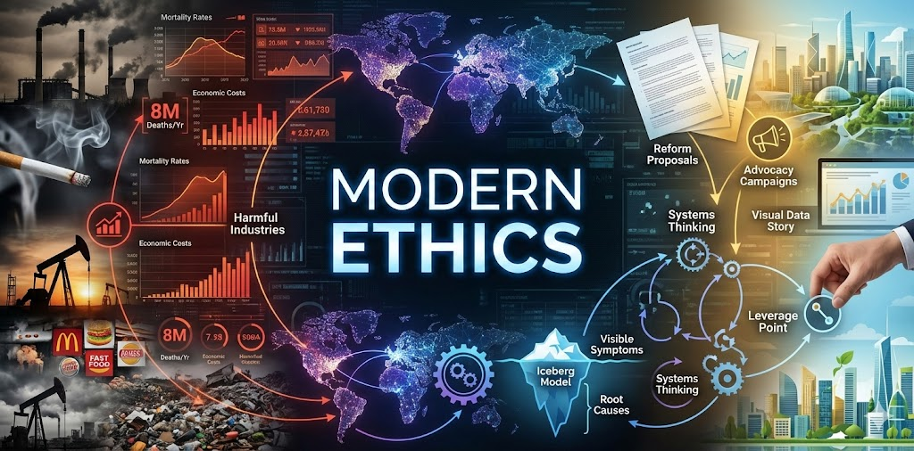

    Ethical issues backed by critical thinking and data science. Covers harm measurement, impact analysis, and systems thinking.

    Concepts: 250

    [:octicons-mark-github-16: Repository](https://github.com/dmccreary/ethics-course) · MicroSims included · 

- **[FFT Benchmarking](https://dmccreary.github.io/fft-benchmarking/)**

    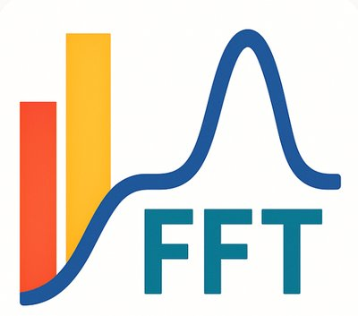

    A collection of resources for learning about Fast Fourier Transforms and benchmarking techniques across platforms.

    Concepts: 200

    [:octicons-mark-github-16: Repository](https://github.com/dmccreary/fft-benchmarking) · 

- **[Fluid Power Systems](https://dmccreary.github.io/fluid-power-systems/)**

    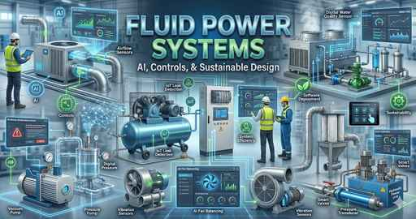

    Interactive textbook for technicians working with HVAC, vacuum, compressed air, cooling water, dust collection, hydraulics, pumping, and fan systems. Created with Peter Vinck at Inflow Corporation.

    [:octicons-mark-github-16: Repository](https://github.com/dmccreary/fluid-power-systems) · 36 Files · 20K Words · 3 MicroSims · 103 Glossary Terms · 

- **[Food Science for 9th Grade](https://dmccreary.github.io/food-science)**

    

    Year-long intelligent textbook for 9th graders exploring the chemistry, biology, and physics of food through virtual MicroSim labs and hands-on kitchen experiments. Covers 15 chapters from kitchen chemistry to food engineering.

    Concepts: 241

    [:octicons-mark-github-16: Repository](https://github.com/dmccreary/food-science) · 113 Files · 211K Words · 33 MicroSims · 241 Glossary Terms
    

- **[Forensic Science](https://dmccreary.github.io/forensic-science/)**

    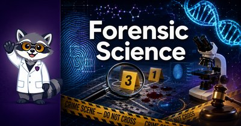

    Open-source intelligent textbook for high school students (grades 9–12) covering 19 chapters across six forensic modules — from trace evidence and biological analysis to digital forensics and OSINT. Features a learning graph of 278 concepts, guided by the mascot Trace the Raccoon.

    Concepts: 278

    [:octicons-mark-github-16: Repository](https://github.com/dmccreary/forensic-science) · 135 Files · 261K Words · 40 MicroSims · 258 Glossary Terms
    

- **[GED Science Prep](https://camgross.github.io/GED-Science-prep/)**

    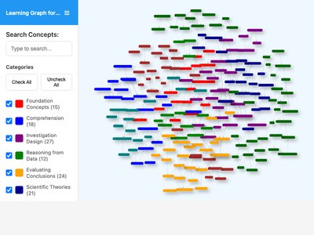

    Intelligent textbook for GED Science test preparation covering Life Science, Physical Science, and Earth & Space Science. Aligned with the official GED Science Assessment Targets and eight Science Practices.

    [:octicons-mark-github-16: Repository](https://github.com/camgross/GED-Science-prep) · 27 Files · 12K Words · 7 MicroSims · 
    

- **[Generative AI Architecture Patterns](https://dmccreary.github.io/genai-arch-patterns)**

    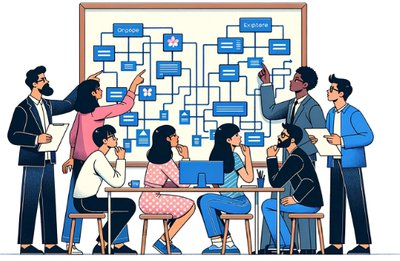

    Helps software architects understand how to use generative AI to create and maintain AI architecture patterns.

    [:octicons-mark-github-16: Repository](https://github.com/dmccreary/genai-arch-patterns) · 34 Files · 7K Words · 

- **[Generative AI for Teachers](https://coderdojotc.github.io/chatgpt-for-teachers)**

    Helps teachers understand how to use generative AI to create and maintain AI teaching materials. Many sample prompts.

    [:octicons-mark-github-16: Repository](https://github.com/CoderDojoTC/chatgpt-for-teachers) · 98 Files · 19K Words · 100 MicroSims · 

- **[Generative AI Strategy](https://dmccreary.github.io/cmm-for-genai)**

    Helps business leaders understand how to use generative AI to create and maintain their AI business strategy.

    [:octicons-mark-github-16: Repository](https://github.com/dmccreary/cmm-for-genai) · 22 Files · 7K Words · 3 MicroSims · 
    

- **[Genetics: Analysis, Genomics, and Modern Inference](https://dmccreary.github.io/genetics/)**

    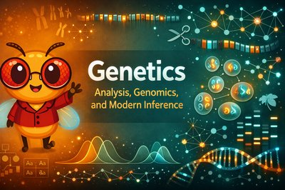

    An interactive intelligent textbook for advanced high school and early undergraduate students covering genetic analysis, genomics, and modern inference.

    Concepts: 450

    [:octicons-mark-github-16: Repository](https://github.com/dmccreary/genetics) · 93 Files · 118K Words · 60 MicroSims · 450 Glossary Terms
    

- **[Graph Algorithms with AI](https://dmccreary.github.io/graph-algorithms)**

    

    MicroSims to help undergraduate college students learn graph algorithms using various JavaScript libraries.

    [:octicons-mark-github-16: Repository](https://github.com/dmccreary/graph-algorithms) · 71 Files · 30K Words · 15 MicroSims · 

- **[Graph Data Modeling with AI](https://dmccreary.github.io/graph-data-modeling-course)**

    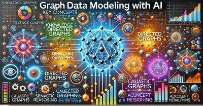

    MicroSims for graph data modeling. Example models created for a variety of domains using vis.js.

    Concepts: 259

    [:octicons-mark-github-16: Repository](https://github.com/dmccreary/graph-data-modeling-course) · 49 Files · 13K Words · 156 Glossary Terms · 

- **[Graph Learning Management Systems](https://dmccreary.github.io/graph-lms)**

    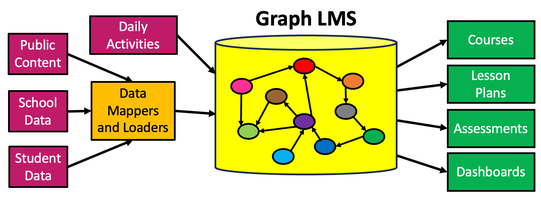

    How graphs are used to build AI learning management systems. Created for startups integrating AI into production LMS.

    [:octicons-mark-github-16: Repository](https://github.com/dmccreary/graph-lms) · 17 Files · 8K Words · 10 MicroSims · 

- **[GraphRAG](https://dmccreary.github.io/graph-rag)**

    An online course teaching concepts around GraphRAG (Retrieval Augmented Generation with graphs).

    [:octicons-mark-github-16: Repository](https://github.com/dmccreary/graph-rag) · 14 Files · 8K Words · 33 Glossary Terms · 

- **[Hydroponics: From Mason Jar to Vertical Farm](https://dmccreary.github.io/hydroponics)**

    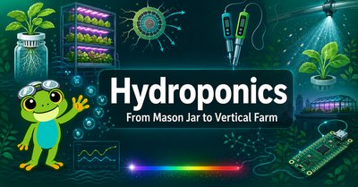

    An interactive intelligent textbook on hydroponics for advanced high-school and college students, featuring MicroSims that bring plant physiology, nutrient science, and system design to life.

    Concepts: 500

    [:octicons-mark-github-16: Repository](https://github.com/dmccreary/hydroponics) · 70 Files · 102K Words · 32 MicroSims
    

- **[Information Systems](https://dmccreary.github.io/information-systems/)**

    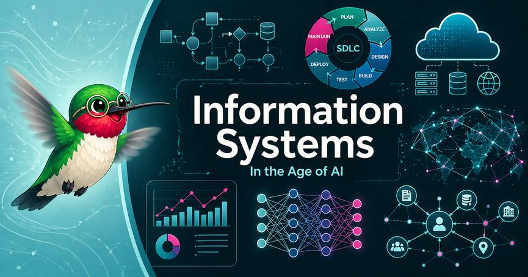

    An ABET CAC-aligned, AI-forward intelligent textbook on Information Systems for college sophomores and juniors — from "what is data?" to "what is an Enterprise Nervous System?"

    Concepts: 580

    [:octicons-mark-github-16: Repository](https://github.com/dmccreary/information-systems) · 143 Files · 279K Words · 45 MicroSims · 

- **[Intelligent Textbooks](https://dmccreary.github.io/intelligent-textbooks)**

    

    Tutorial for building intelligent textbooks using mkdocs-material. Contains detailed tutorials and best practices.

    Concepts: 149

    [:octicons-mark-github-16: Repository](https://github.com/dmccreary/intelligent-textbooks) · 12K Words · 4 MicroSims · 

- **[Introduction to 3D Printing](https://dmccreary.github.io/3d-printing-course/)**

    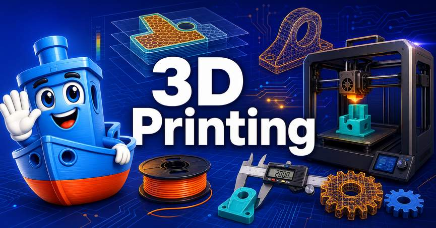

    An interactive intelligent textbook with MicroSims to teach high-school students about 3D printing, designed to maximize the probability of college credit.

    Concepts: 292

    [:octicons-mark-github-16: Repository](https://github.com/dmccreary/3d-printing-course) · 123 Files · 194K Words · 47 MicroSims · 

- **[Introduction to Graph Databases](https://dmccreary.github.io/intro-to-graph)**

    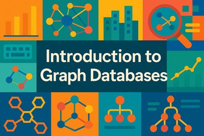

    Interactive textbook covering graph databases: graph thinking, data modeling, NoSQL, labeled property graphs, and query languages.

    Concepts: 200

    [:octicons-mark-github-16: Repository](https://github.com/dmccreary/intro-to-graph) · Extensive MicroSims · 

- **[Introduction to Microcontrollers with PIC24](https://irvinggsea.github.io/i-book-v1/)**

    Introduction to microcontrollers using the PIC24 platform for embedded systems education.

    [:octicons-mark-github-16: Repository](https://github.com/irvinggsea/i-book-v1) · 

- **[Introduction to Operating Systems](https://btlepak.github.io/Intelligent_Textbook/)**

    Fundamentals of operating systems including process management, memory, and file systems.

    [:octicons-mark-github-16: Repository](https://github.com/btlepak/Intelligent_Textbook) · 

- **[Introduction to Physics](https://dmccreary.github.io/intro-to-physics-course)**

    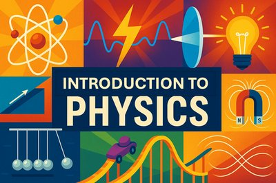

    Year-long intro physics course covering motion, forces, energy, waves, optics, and electricity with MicroSims.

    Concepts: 200

    [:octicons-mark-github-16: Repository](https://github.com/dmccreary/intro-to-physics-course) · Active Development · 

- **[Introduction to Public Health](https://dmccreary.github.io/public-health)**

    

    Interactive intelligent textbook covering the five CEPH core public health domains — epidemiology, biostatistics, environmental health, health policy, and social and behavioral sciences — with embedded simulations and a systems-thinking focus. Designed for undergraduate and graduate students.

    Concepts: 500

    [:octicons-mark-github-16: Repository](https://github.com/dmccreary/public-health) · 84 Files · 136K Words · 48 MicroSims
    

- **[Investor Relations](https://dberglu.github.io/ir-textbook/)**

    Executive-level course on AI-powered IR modernization by David Berglund. 15 chapters with full content.

    Concepts: 298

    [:octicons-mark-github-16: Repository](https://github.com/dberglu/ir-textbook) · Glossary, FAQs, Quizzes, MicroSims · 

- **[IT Management with Graphs](https://dmccreary.github.io/it-management-graph)**

    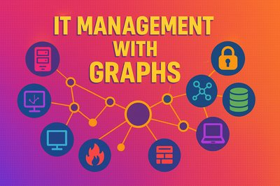

    IT management using graph databases. Covers ITIL, configuration management, asset management, and IT operations.

    Concepts: 200

    [:octicons-mark-github-16: Repository](https://github.com/dmccreary/it-management-graph) · Active Development · 

- **[Learning Graphs](https://dmccreary.github.io/learning-graphs)**

    

    Creation and maintenance of learning graphs. Extensive examples using vis.js for visualization.

    [:octicons-mark-github-16: Repository](https://github.com/dmccreary/learning-graphs) · 74 Files · 33K Words · 47 Glossary Terms · 

- **[Learning Linux](https://dmccreary.github.io/learning-linux/)**

    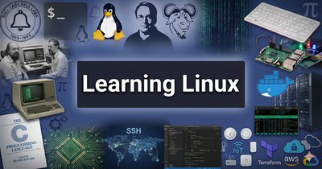

    A comprehensive 15-week course teaching high school students Linux fundamentals including command line, file systems, and scripting.

    Concepts: 550

    [:octicons-mark-github-16: Repository](https://github.com/dmccreary/learning-linux) · 

- **[Learning MicroPython with AI](https://dmccreary.github.io/learning-micropython)**

    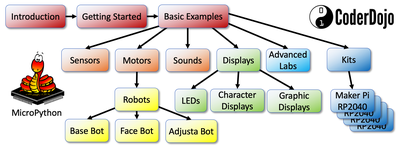

    Helps kids learn MicroPython on microcontrollers using fun low-cost projects. Thousands of monthly users worldwide.

    [:octicons-mark-github-16: Repository](https://github.com/dmccreary/learning-micropython) · 204 Files · 63K Words · 
    

- **[Learning Sciences for Intelligent Textbook Design](https://dmccreary.github.io/learning-sciences/)**

    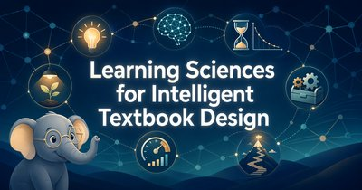

    An intelligent textbook on the Seven Domains of the Learning Sciences — motivation, understanding, retention, application, expertise, measurement, and learning conditions — applied to authoring AI-augmented textbooks for educators and AI researchers.

    Concepts: 230

    [:octicons-mark-github-16: Repository](https://github.com/dmccreary/learning-sciences) · 117 Files · 193K Words · 64 MicroSims · 221 Glossary Terms
    

- **[Linear Algebra for AI and Machine Learning](https://dmccreary.github.io/linear-algebra)**

    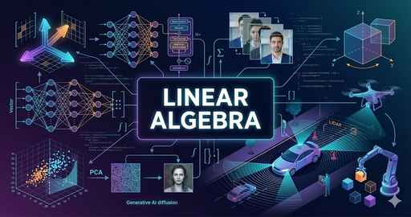

    A college-level course bridging abstract linear algebra with real-world AI applications. Covers vectors, matrices, eigenvalues, neural networks, computer vision, and autonomous systems.

    Concepts: 300

    [:octicons-mark-github-16: Repository](https://github.com/dmccreary/linear-algebra) · 206 Files · 195K Words · 126 MicroSims · 299 Glossary Terms · 

- **[Machine Learning: Algorithms and Applications](https://anvithpothula.github.io/machine-learning-textbook/)**

    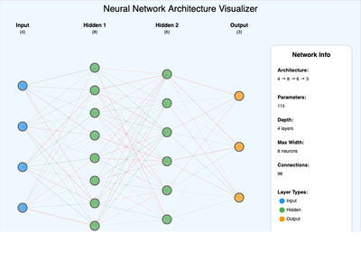

    Comprehensive intelligent textbook on machine learning for college undergraduates. Covers supervised learning, unsupervised learning, neural networks, CNNs, and transfer learning with Python code examples.

    [:octicons-mark-github-16: Repository](https://github.com/AnvithPothula/machine-learning-textbook) · 60 Files · 103K Words · 18 MicroSims · 199 Glossary Terms · 
    

- **[Mathematics Functions](https://dmccreary.github.io/functions/)**

    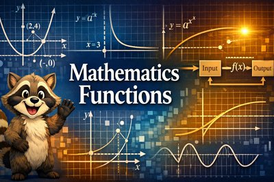

    An interactive intelligent textbook for high school students mastering the unifying theme of functions in mathematics through mathematical models, coordinate geometry, and real-world applications.

    Concepts: 208

    [:octicons-mark-github-16: Repository](https://github.com/dmccreary/functions) · 97 Files · 148K Words · 31 MicroSims · 208 Glossary Terms
    

- **[McCreary Family Heritage](https://dmccreary.github.io/mccreary-heritage/)**

    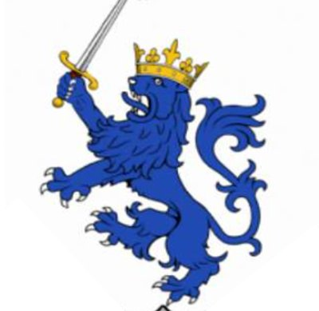

    Educational resources for teaching Scottish, Irish, and immigration history with a focus on building critical thinking skills.

    [:octicons-mark-github-16: Repository](https://github.com/dmccreary/mccreary-heritage) · 

- **[MicroSim Search](https://dmccreary.github.io/search-microsims/)**

    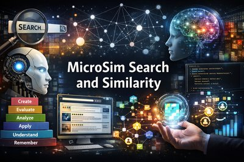

    Client-side faceted search system for educational MicroSims. Crawls GitHub repositories to collect metadata and provides browser-based search with filtering by subject, grade level, Bloom's Taxonomy, and framework.

    Concepts: 200

    [:octicons-mark-github-16: Repository](https://github.com/dmccreary/search-microsims) · 125 Files · 138K Words · 58 MicroSims · 

- **[MicroSims](https://dmccreary.github.io/microsims)**

    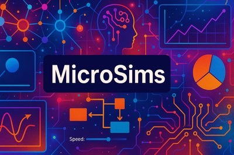

    Showcase for creating MicroSims using JavaScript and p5.js across diverse subjects.

    Concepts: 242

    [:octicons-mark-github-16: Repository](https://github.com/dmccreary/microsims) · 88 Files · 18K Words · 66 MicroSims · 

- **[MicroSims for Electrical Engineering](https://kenn0727.github.io/ee-microsims)**

    11 MicroSims created by University of Minnesota EE students using p5.js and prompt engineering.

    [:octicons-mark-github-16: Repository](https://github.com/kenn0727/ee-microsims) · 14 Files · 12 MicroSims · 

- **[Modeling Healthcare Data with Graphs](https://dmccreary.github.io/modeling-healthcare-data)**

    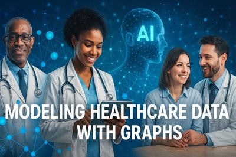

    Undergraduate textbook on graph-based healthcare data modeling: patient-centric models, provider operations, clinical workflows.

    Concepts: 200

    [:octicons-mark-github-16: Repository](https://github.com/dmccreary/modeling-healthcare-data) · Active Development · 
    

- **[Moss](https://dmccreary.github.io/moss/)**

    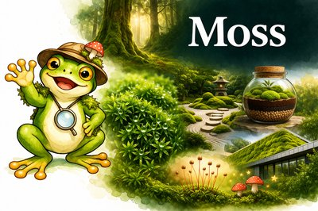

    An interactive intelligent textbook exploring the biology, ecology, design, and sustainability of moss, with simulations and a learning graph for curious learners and naturalists.

    Concepts: 400

    [:octicons-mark-github-16: Repository](https://github.com/dmccreary/moss) · 104 Files · 163K Words · 34 MicroSims · 400 Glossary Terms
    

- **[Moving Rainbow](https://dmccreary.github.io/moving-rainbow)**

    

    Using colorful addressable LED strips and noodles for hands-on computational thinking projects with MicroPython.

    [:octicons-mark-github-16: Repository](https://github.com/dmccreary/moving-rainbow) · 49 Files · 17K Words · 

- **[Networking and Communication](https://dmccreary.github.io/networking/)**

    

    An ABET CAC-aligned intelligent textbook covering the foundations of networking and communication — layered architecture, routing, reliable transport, wireless, network security, and modern programmable networks.

    Concepts: 338

    [:octicons-mark-github-16: Repository](https://github.com/dmccreary/networking) · 41 Files · 130K Words · 1 MicroSim · 

- **[Neurodiversity Course](https://dmccreary.github.io/neurodiversity-course/)**

    Course on neurodiversity awareness and inclusion strategies.

    [:octicons-mark-github-16: Repository](https://github.com/dmccreary/neurodiversity-course) · 

- **[Organizational Analytics with AI](https://dmccreary.github.io/organizational-analytics)**

    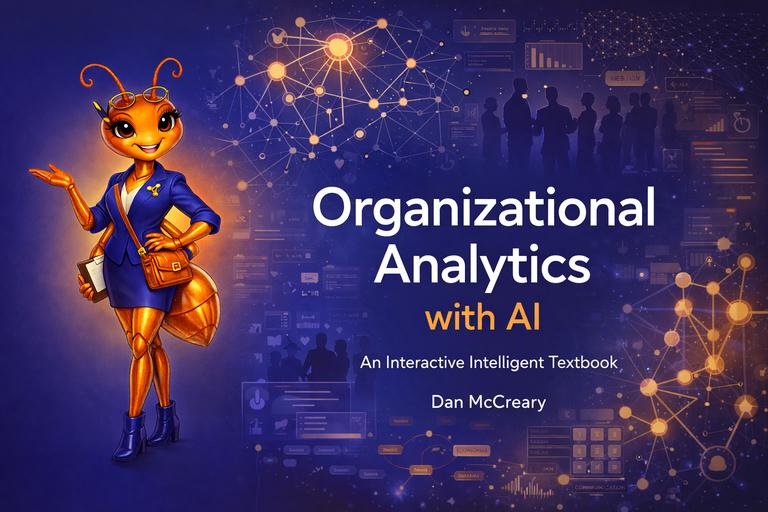

    Interactive textbook teaching how to use graph databases, AI, and NLP to unlock hidden insights in HR data including influence, collaboration, sentiment, and organizational health.

    Concepts: 200

    [:octicons-mark-github-16: Repository](https://github.com/dmccreary/organizational-analytics) · 151 Files · 203K Words · 73 MicroSims · 201 Glossary Terms · 

- **[Personal Finance](https://dmccreary.github.io/personal-finance/)**

    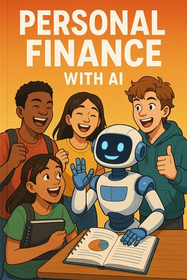

    Helps high school students learn personal finance with MicroSims, infographics, and graphic novel storytelling.

    Concepts: 200

    [:octicons-mark-github-16: Repository](https://github.com/dmccreary/personal-finance) · 
    

- **[Pre-Calculus](https://dmccreary.github.io/pre-calc/)**

    

    An interactive intelligent textbook for pre-calculus designed to prepare high school students for advanced math coursework.

    Concepts: 307

    [:octicons-mark-github-16: Repository](https://github.com/dmccreary/pre-calc) · 43 Files · 100K Words · 307 Glossary Terms · 1 MicroSim
    

- **[Prompt Engineering Class](https://dmccreary.github.io/prompt-class)**

    

    Hands-on labs covering lists, Mermaid diagrams, markdown tables, p5.js visualizations, and data science applications.

    [:octicons-mark-github-16: Repository](https://github.com/dmccreary/prompt-class) · Active Development · 

- **[Psychology](https://dmccreary.github.io/psychology/)**

    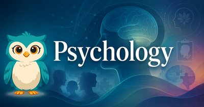

    An AP-level intelligent textbook covering biological bases of behavior, sensation and perception, development, social influence, and psychological disorders for high school students preparing for the AP Psychology exam.

    Concepts: 387

    [:octicons-mark-github-16: Repository](https://github.com/dmccreary/psychology) · 17 Chapters · 100K Words · 5 MicroSims · 

- **[Reading for Kindergarten](https://dmccreary.github.io/reading-for-kindergarten/)**

    

    An intelligent textbook for teaching reading skills to kindergarten students with age-appropriate interactive content.

    Concepts: 195

    [:octicons-mark-github-16: Repository](https://github.com/dmccreary/reading-for-kindergarten) · 

- **[Robot Day](https://dmccreary.github.io/robot-day)**

    Resources for single-day STEM events with hands-on projects leading to understanding collision-avoidance robots.

    [:octicons-mark-github-16: Repository](https://github.com/dmccreary/robot-day) · 52 Files · 26K Words · 

- **[Selecting the Right Database](https://dmccreary.github.io/right-database/)**

    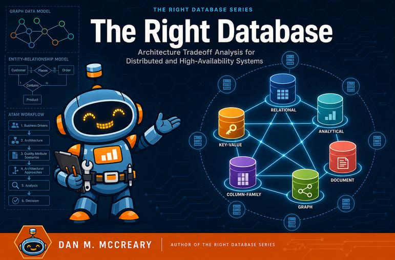

    An intelligent textbook for software architects, senior engineers, and database administrators on making real-world database selection decisions using the CMU SEI Architecture Tradeoff Analysis Method (ATAM). Covers six database paradigms, CAP theorem, consensus, distributed scaling, vector search, and LLM embeddings.

    Concepts: 254

    [:octicons-mark-github-16: Repository](https://github.com/dmccreary/right-database) · 16 Chapters · 163K Words · 251 Glossary Terms · 5 MicroSims · 

- **[Semiconductor Physics Course](https://dmccreary.github.io/semiconductor-physics-course)**

    

    College-level semiconductor physics with interactive simulations including PN Junction visualization.

    Concepts: 600

    [:octicons-mark-github-16: Repository](https://github.com/dmccreary/semiconductor-physics-course) · Early Stage · 

- **[Signal Processing](https://dmccreary.github.io/signal-processing)**

    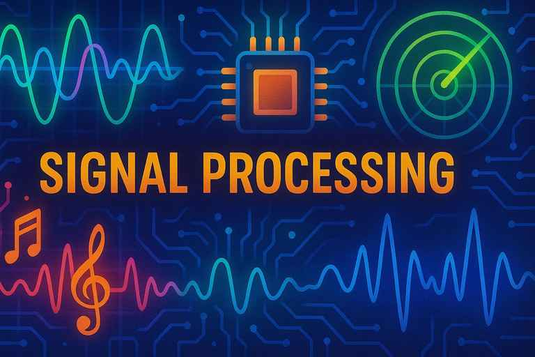

    Demonstrates using generative AI to create undergraduate signal processing courses.

    Concepts: 200

    [:octicons-mark-github-16: Repository](https://github.com/dmccreary/signal-processing) · 53 Files · 28K Words · 6 MicroSims · 

- **[Spectrum Analyzer](https://dmccreary.github.io/spectrum-analyzer/)**

    

    Build a spectrum analyzer using Raspberry Pi Pico and a microphone with detailed hardware and software tutorials.

    [:octicons-mark-github-16: Repository](https://github.com/dmccreary/spectrum-analyzer) · 
    

- **[Statistics](https://dmccreary.github.io/statistics-course/)**

    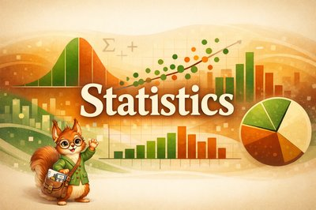

    A simulation-filled interactive intelligent statistics textbook designed to help high school students earn college credit, hosted by Sylvia the Squirrel.

    Concepts: 300

    [:octicons-mark-github-16: Repository](https://github.com/dmccreary/statistics-course) · 194 Files · 237K Words · 112 MicroSims · 295 Glossary Terms
    

- **[STEM Classroom Administration](https://dmccreary.github.io/stem-classroom-admin/)**

    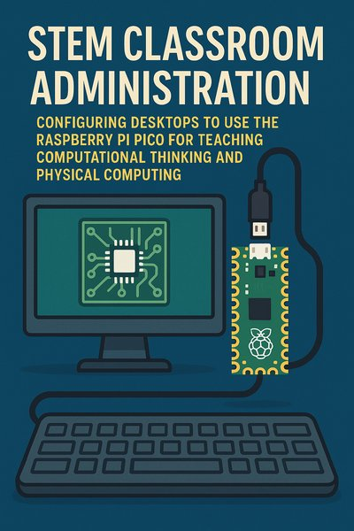

    Helps teachers use AI to setup and administer a STEM classroom with a focus on computational thinking and microcontrollers.

    [:octicons-mark-github-16: Repository](https://github.com/dmccreary/stem-classroom-admin) · 

- **[STEM Robots](https://dmccreary.github.io/stem-robots)**

    

    STEM and robotics using the Raspberry Pi RP2040 on low-cost robotics kits for computational thinking.

    [:octicons-mark-github-16: Repository](https://github.com/dmccreary/stem-robots) · 74 Files · 18K Words · 5 MicroSims · 

- **[Systems Thinking in the Age of AI](https://dmccreary.github.io/systems-thinking)**

    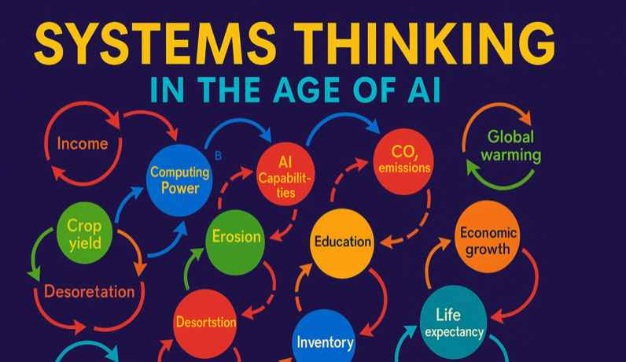

    Interactive resources for teaching systems thinking from high school to executive level. Multiple course descriptions.

    [:octicons-mark-github-16: Repository](https://github.com/dmccreary/systems-thinking) · MicroSims included · 

- **[Theory of Knowledge](https://dmccreary.github.io/theory-of-knowledge/)**

    

    A free, open-source intelligent textbook for the IB Theory of Knowledge (TOK) course, exploring how knowledge is produced, validated, and communicated through interactive MicroSimulations and a learning graph of 275 interconnected concepts.

    Concepts: 275

    [:octicons-mark-github-16: Repository](https://github.com/dmccreary/theory-of-knowledge) · 129 Files · 235K Words · 72 MicroSims · 275 Glossary Terms
    

- **[Token Efficiency](https://dmccreary.github.io/token-efficiency/)**

    

    A vendor-pluralistic intelligent textbook on measuring, analyzing, and reducing the cost of generative AI across Anthropic Claude, OpenAI, and Google Gemini for software engineers, ML engineers, and engineering managers.

    Concepts: 475

    [:octicons-mark-github-16: Repository](https://github.com/dmccreary/token-efficiency) · 109 Files · 182K Words · 475 Glossary Terms · 47 MicroSims
    

- **[Tracking AI](https://dmccreary.github.io/tracking-ai-course)**

    

    Tracking AI progress for strategy consulting in education and knowledge management organizations.

    Concepts: 249

    [:octicons-mark-github-16: Repository](https://github.com/dmccreary/tracking-ai-course) · 47 Files · 18K Words · 3 MicroSims · 

- **[Trigonometric Functions](https://stage03.iowerx.com:8443/)**

    Foundational course on relationships between angles and sides in right triangles by Hank Ratzesberger. 200 concepts.

    High School · Bridges algebra and geometry
    

- **[Understanding Dementia](https://rtanler.github.io/Dementia/)**

    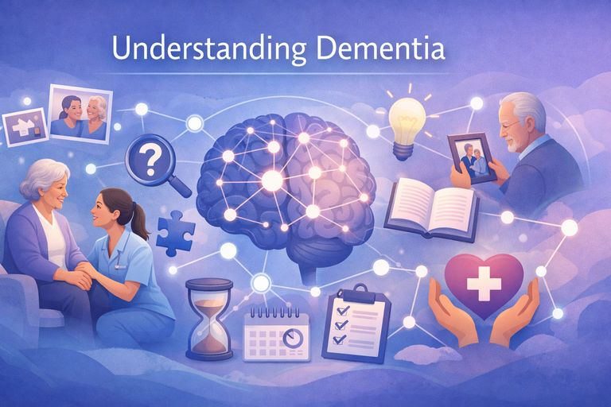

    AI-generated intelligent textbook on dementia and cognitive decline for patients, caregivers, families, and healthcare professionals. Features 200 interconnected concepts in a learning graph. By rtanler.

    Concepts: 200

    [:octicons-mark-github-16: Repository](https://github.com/rtanler/Dementia) · 34 Files · 44K Words · 1 MicroSim · 

- **[Unicorns and Other Mythical Beasts](https://dmccreary.github.io/unicorns/)**

    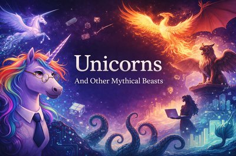

    A satirical interactive intelligent textbook about unicorns, mythical beasts, and the AI technologies that will improve them — exploring AI hype, education resistance, and technology fantasies.

    Concepts: 140

    [:octicons-mark-github-16: Repository](https://github.com/dmccreary/unicorns) · 142 Files · 267K Words · 34 MicroSims · 145 Glossary Terms
    

- **[US Geography](https://dmccreary.github.io/us-geography)**

    

    Interactive intelligent geography for grade school students (3rd-6th grade). Explore all 50 states with clickable maps, zoomable regions, and discovery challenges.

    Concepts: 200

    [:octicons-mark-github-16: Repository](https://github.com/dmccreary/us-geography) · 85 Files · 81K Words · 34 MicroSims · 200 Glossary Terms · 
    

- **[U.S. History](https://dmccreary.github.io/us-history)**

    

    An interactive intelligent textbook for AP-level U.S. History covering major eras from Colonial America through the present, featuring primary source analysis, historical reasoning skills, and interactive MicroSims for understanding cause and effect across key events.

    Concepts: 450

    [:octicons-mark-github-16: Repository](https://github.com/dmccreary/us-history) · 227 Files · 301K Words · 38 MicroSims · 450 Glossary Terms
    

- **[US Government](https://dmccreary.github.io/us-government/)**

    

    An interactive intelligent textbook aligned with the AP US Government and Politics curriculum for high school students (grades 9–12). Covers constitutional foundations, the three branches, federalism, civil rights, and the impact of AI on democracy.

    Concepts: 200

    [:octicons-mark-github-16: Repository](https://github.com/dmccreary/us-government) · 86 Files · 132K Words · 23 MicroSims · 200 Glossary Terms
    

- **[xAPI for Intelligent Textbooks](https://dmccreary.github.io/xapi-course/)**

    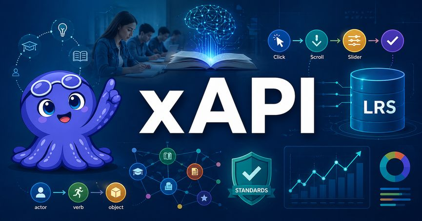

    An interactive intelligent textbook on the xAPI (Experience API) standard for software professionals implementing xAPI in Level 3 intelligent textbooks and learning systems. Features 50 MicroSims built with p5.js and vis-network.

    Concepts: 250

    [:octicons-mark-github-16: Repository](https://github.com/dmccreary/xapi-course) · 113 Files · 154K Words · 50 MicroSims · 

