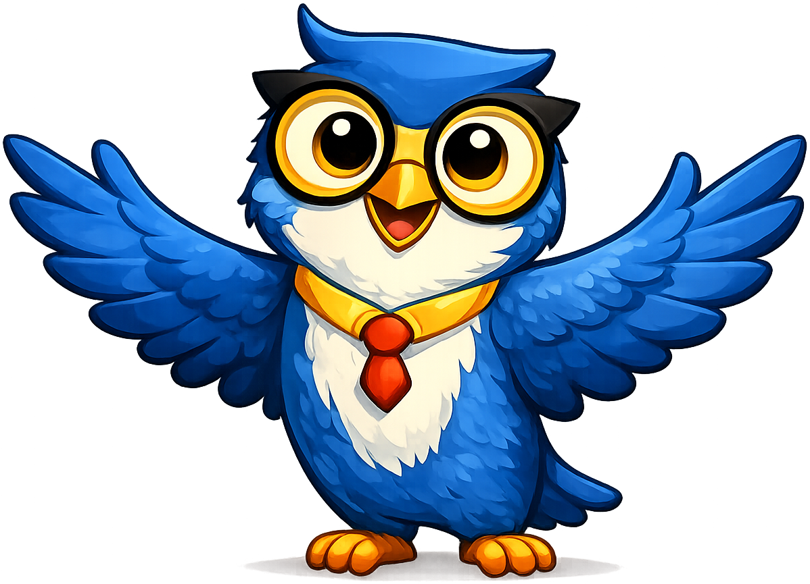

# Learning Graph

{ width="200px", align="right"}

This section contains the learning graph for this textbook. A learning graph is
a graph of concepts used in this textbook. Each concept is represented by a
node in a network graph. Concepts are connected by directed edges that indicate
what concepts each node depends on before that concept is understood by the student.

A learning graph is the foundational data structure for intelligent textbooks
that can recommend learning paths. A learning graph is like a roadmap of
concepts to help students arrive at their learning goals.

At the left of the learning graph are prerequisite or foundational concepts. They
have no outbound edges. They only have inbound edges for other concepts that depend on
understanding these foundational prerequisite concepts. At the far right
we have the most advanced concepts in the course. To master these concepts you
must understand all the concepts that they point to.

## Learning Graph Data

- [Intelligent Textbooks CSV](intelligent-textbooks.csv) — The concept dependency list in CSV format with columns for ConceptID, ConceptName, Dependencies, and TaxonomyID. This is the source of truth for the graph data and is easy to edit in a spreadsheet.
- [Intelligent Textbooks JSON](intelligent-textbooks.json) — The same concept dependency graph in the vis-network JavaScript library format, using `nodes`, `edges`, and `metadata` elements. This file is consumed by the interactive learning graph viewer.

## Axiom the Owl Mascot

Axiom the Owl is the narrative mascot for the Intelligent Textbooks ecosystem.
These files describe his visual identity, pose library, and how to integrate
him into a textbook.

- [Axiom Mascot Guide](axiom-mascot-guide.md) — Narrative description of Axiom the Owl, including his visual design, personality traits, and pedagogical role as a learning companion.
- [Axiom Style Guide](axiom-style-guide.md) — Formal style guide covering Axiom's core identity, color palette, proportions, and usage rules to keep mascot renderings consistent across textbooks.
- [Axiom Mascot Test](axiom-mascot-test.md) — Test page that verifies all Axiom mascot admonitions render correctly with the owl positioned in the upper-left corner.
- [Axiom Prompts](axiom-prompts.md) — Collection of image-generation prompts used to produce Axiom mascot artwork in a consistent style.
- [Axiom Prompt Assembler (JSON)](axiom-prompt-assembler.json) — Structured prompt library for automated generation of Axiom mascot poses, with defaults for render style, background, and recommended sizes.
- [Trim Mascot Padding](trim-mascot-padding.md) — Step-by-step notes for removing excess transparent borders from mascot PNGs using Pillow, so the admonition layout has consistent spacing.
- [Book Mascot LinkedIn Announcement](book-mascot-linkedin-announcement.md) — Draft LinkedIn post announcing the Book Mascot feature in the Claude Code Skills for Intelligent Textbooks.

## Project Sustainability

- [Sponsorship Plan](sponsorship-plan.md) — Practical, values-aligned sponsorship plan for keeping every intelligent textbook free and open while covering the real costs of creating them.
