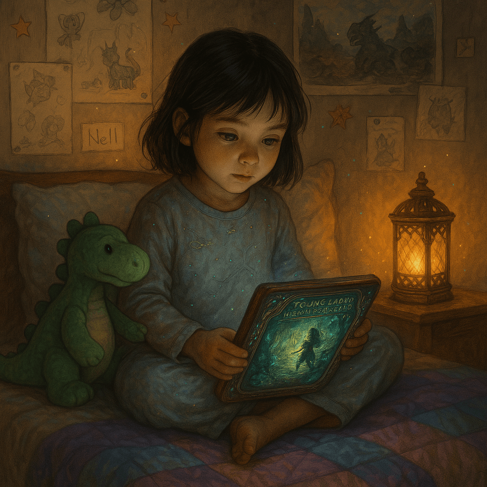
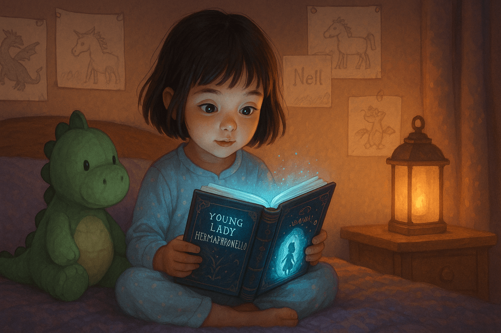

# Generate Cover Image

## New Cover Inspired by Nell from Diamond Age

!!! prompt
    Overall Scene

    This scene is inspired by the character Nell in the book Diamond Age by Neal Stephenson.

    The image depicts a warm, softly lit bedroom scene at night. A young girl sits on a bed, completely absorbed in reading a glowing, intelligent book. The atmosphere is cozy and dreamlike, with gentle lighting creating a sense of wonder and imagination.

    ## Main Character: Nell

    Age & Appearance: Nell appears to be around 5 to 7 years old, with a round, youthful face and soft features. Her skin is fair, and she has straight, dark brown hair cut in a slightly shaggy bob with bangs brushing her forehead.

    Expression: Her eyes are wide with curiosity and awe, focused intently on the glowing book she holds. She is clearly captivated by its contents.

    Clothing: Nell wears light blue pajamas with faint patterns or sparkles—perhaps stars—suggesting a celestial or magical theme.

    Posture: She is seated cross-legged in a relaxed, natural pose, leaning slightly forward, with the glowing book resting on her knees. Her hands gently cradle the book, giving the impression of reverence and engagement.

    ## The Intelligent Book

    Appearance: The book has a thick, ornate cover, possibly with embedded lights or enchanted detailing. It radiates a soft, bluish glow, casting gentle illumination on Nell's face and hands.

    Cover Title: The text on the book’s cover reads:

    “A YOUNG LADY's PRIMER”

    Cover Art: The cover features the silhouette of a young girl—likely Nell herself—walking into a swirling, glowing forest or portal, reinforcing the magical, exploratory nature of the book.

    Function: The glow suggests that this is not an ordinary book, but rather an intelligent or enchanted book—possibly interactive, perhaps reading itself aloud, projecting scenes, or adapting its content to the reader's imagination.

    ## Bedroom Setting

    Walls: The wall behind Nell is covered in children’s drawings taped or pinned up. These feature fantastical creatures like dragons, unicorns, and knights—indicating Nell’s vivid imagination and love for mythical stories.

    One drawing is labeled with her name: “Nell” in a child’s handwriting.

    **Lighting:** A small lantern-style lamp sits on the nightstand to her right, emitting a soft amber glow that adds to the dreamlike warmth of the scene.

    **Bed:** She sits on a quilted bedspread in tones of purple and blue. The quilt has a subtle pattern, enhancing the cozy feel of the room.

    ## Plushy Dinosaur

    Appearance: Sitting close beside Nell is a green plush dinosaur—her likely bedtime companion.

    The dinosaur is cartoonishly cute with a rounded body, soft limbs, small black eyes, and a lighter green belly.

    Its back features soft, scalloped ridges (spines), and it has a friendly expression.

    Significance: The dinosaur’s placement—right beside Nell and facing the book—suggests it shares in the bedtime story. It reinforces a sense of comfort, companionship, and the imaginative world Nell inhabits.

    Mood & Symbolism

    The entire image glows with a sense of wonder, safety, and curiosity. It conveys the magic of bedtime reading, childhood imagination, and perhaps the idea of intelligent textbooks or personalized storytelling in the future. The glowing book acts as a symbol of living knowledge, perfectly aligned with the theme of “intelligent textbooks.”

## Result

## Social Media Preview

!!! prompt
    Please regenerate this image for use as a social media link preview that conforms to the social graph standards.  The width to height ratio must be 1.91:1.  It is a wide-landscape formatted image.  Avoid
    the use of small text since it will be converted to a small icon.

## Old Cover

This was the original cover for the book.  Unfortunately, it looked a little too computer generated.

!!! prompt
    Please create an image for the following website.  Do not place any text in the image.

    This website is part of a series of resources to help teachers from around the world create the foundation for free and open intelligent textbooks.

    There are many ways to store intelligent textbooks on a website. Many of our teachers don't want to pay a hosting service for hosting their content. Since GitHub Pages is free, we focussed on GitHub Pages publishing tools that support Markdown, code highlighting and equations on GitHub.

    When we gave ChatGPT the following requirements:

    - Content is stored in Markdown format
    - Easy publishing to GitHub pages
    - Ability to format code
    - Ability to format equations
    - Here is the summary of ChatGPT's recommendation:

    MkDocs with the Material Theme is the most aligned with your requirements due to its simplicity, robust features, and ease of deployment to GitHub Pages. It handles code highlighting and mathematical formulas gracefully and has a straightforward configuration process.

    We have also found the mkdocs-material support extremely good, with our questions often being answered within hours.

    Because of the close match of mkdocs-material's features with our intelligent textbook requirements, we have created about 20 sample websites that test these tools. We have also found that mkdocs-material can be quickly extended to support the features we need in advanced intelligent textbooks.

    Note that these tools generate a 2.9 level intelligent textbook. THis is up to but does not include personalization to the knowledge of the student. This gets your textbook ready to move to level 3, where a knowledge graph of what concepts they are aware of are used to generate personalized content.

    We hope the glossary and tutorials we provide are useful.

## Result

