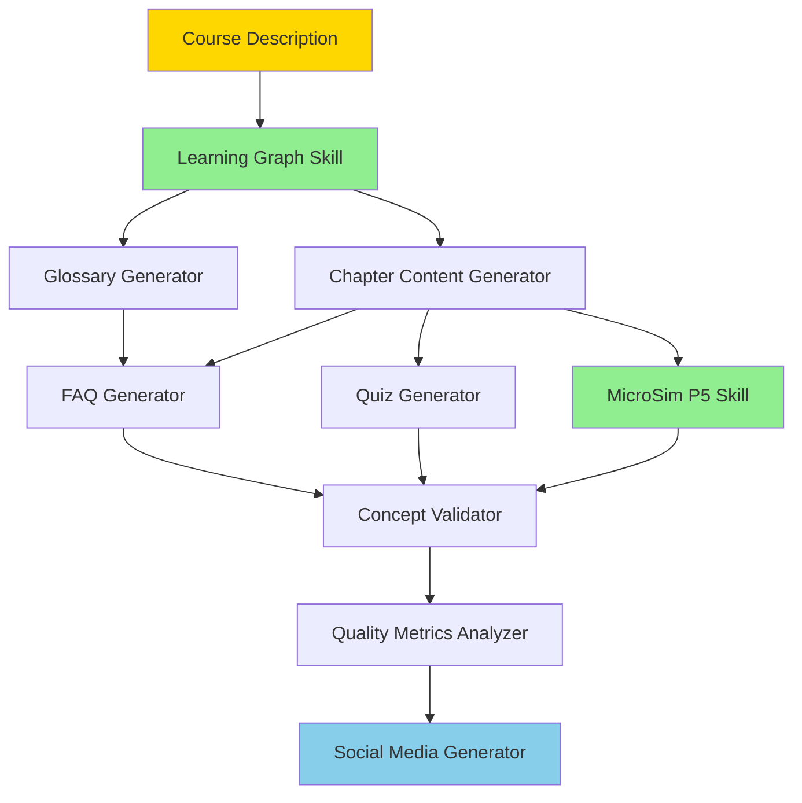

# Recommended Claude Skills for Intelligent Textbooks

Based on analysis of the intelligent-textbooks repository workflows and content patterns, here are the recommended Claude Skills to complement your existing MicroSim and Learning Graph skills.

## Overview

You currently have:

1. ✅ **MicroSim P5** - Creates interactive p5.js simulations
2. ✅ **Learning Graph** - Generates concept dependency graphs

Recommended additions:

3. **Glossary Generator** - Automated glossary creation from concepts
4. **FAQ Generator** - Creates comprehensive FAQ from content
5. **Chapter Content Generator** - Generates complete chapter content with scaffolding
6. **Quiz Generator** - Creates assessments aligned to Bloom's Taxonomy
7. **Quality Metrics Analyzer** - Comprehensive textbook quality analysis
8. **Social Media Generator** - Creates social cards and promotional content
9. **Concept Validator** - Validates concept integration across all components

## Recommended Execution Order

### Workflow Phases

**Phase 1: Foundation (Existing)**

- Course Description created manually
- Learning Graph Skill generates concept structure
- MicroSim P5 Skill creates interactive simulations (ongoing)

**Phase 2: Content Generation (New Skills)**

1. **Glossary Generator** - Run after learning graph finalized
2. **Chapter Content Generator** - Run after chapter structure defined
3. **FAQ Generator** - Run after chapters written

**Phase 3: Assessment (New Skill)**

4. **Quiz Generator** - Run after each chapter or in batch

**Phase 4: Validation (New Skill)**

5. **Concept Validator** - Run at milestones (every 10 chapters, before release)

**Phase 5: Quality & Promotion (New Skills)**

6. **Quality Metrics Analyzer** - Run before release and periodically
7. **Social Media Generator** - Run when ready to promote

## Skill Comparison Matrix

| Skill | Primary Input | Primary Output | Quality Metric Focus | Execution Time |
|-------|---------------|----------------|---------------------|----------------|
| **Learning Graph** | Course Description | Concept dependency CSV | DAG validity, concept quality | Medium (20-30 min) |
| **MicroSim P5** | Concept description | Interactive simulation | Functionality, educational value | Medium (15-25 min) |
| **Glossary Generator** | Concept list | glossary.md | ISO 11179 compliance | Fast (10-15 min) |
| **FAQ Generator** | All content | faq.md | Coverage, Bloom's distribution | Medium (20-30 min) |
| **Chapter Content Generator** | Learning graph + outline | Chapter markdown files | Scaffolding, completeness | Slow (30-45 min/chapter) |
| **Quiz Generator** | Chapter content | Quiz markdown/JSON | Question quality, coverage | Fast (10-15 min/chapter) |
| **Quality Metrics Analyzer** | Entire repository | Quality reports | Comprehensive metrics | Medium (15-25 min) |
| **Social Media Generator** | All content | Social cards + posts | Engagement potential | Medium (20-30 min) |
| **Concept Validator** | All components | Validation reports | Integration completeness | Fast (10-20 min) |

## Detailed Skill Summaries

### 1. Glossary Generator ⭐⭐⭐ (High Priority)

**Purpose**: Converts learning graph concepts into ISO 11179-compliant glossary definitions

**Key Features**:

- Generates precise, concise, non-circular definitions
- Includes relevant examples for context
- Alphabetically organized
- Quality scoring for each definition

**When to Use**: After learning graph concept list is finalized and reviewed

**Inputs**:

- Learning graph concept list (02-concept-list-v1.md)
- Course description for context

**Outputs**:

- docs/glossary.md (complete glossary)
- Quality report assessing definition compliance

**Quality Metrics**:

- Input: Concept uniqueness (100%), Title Case formatting (95%+), length <32 chars (98%+)
- Output: ISO compliance (4 criteria × 25 pts), readability, example coverage (60-80%)

**Success Score**: >85/100 (no circular definitions, all concepts included)

---

### 2. FAQ Generator ⭐⭐⭐ (High Priority)

**Purpose**: Creates comprehensive FAQ from content, learning graph, and glossary

**Key Features**:
- Questions organized by category and difficulty
- Answers with links to relevant sections
- Chatbot training data export (JSON)
- Bloom's Taxonomy distribution across questions

**When to Use**: After course description, learning graph, glossary, and 30%+ of chapters exist

**Inputs**:
- Course description
- Learning graph (concept dependencies)
- Glossary (50+ terms recommended)
- Chapter content (5,000+ words preferred)

**Outputs**:
- docs/faq.md (categorized FAQ)
- faq-chatbot-training.json (for RAG systems)
- Quality report with coverage analysis

**Quality Metrics**:
- Input: Content completeness, learning graph validity, glossary size
- Output: Coverage (30 pts - 80%+ concepts), Bloom's distribution (25 pts), answer quality (25 pts), organization (20 pts)

**Success Score**: >75/100 (minimum 40 questions, 60% concept coverage)

---

### 3. Chapter Content Generator ⭐⭐⭐⭐ (Critical Priority)

**Purpose**: Generates comprehensive chapter content with proper scaffolding and Bloom's alignment

**Key Features**:
- Concept-to-chapter mapping from learning graph
- Prerequisite compliance validation
- Examples and practice exercises
- MicroSim recommendations
- Progressive complexity

**When to Use**: After learning graph complete, chapter structure defined in mkdocs.yml

**Inputs**:
- Learning graph dependencies (CSV)
- Concept taxonomy (CSV)
- Course description
- Chapter outline (concept-to-chapter mapping)
- Glossary (optional but recommended)

**Outputs**:
- Chapter markdown files (docs/[section]/[chapter].md)
- Chapter metadata (JSON)
- Generation report with quality scores
- Content gaps analysis
- Quiz bank (suggested questions)
- MicroSim recommendations

**Quality Metrics**:
- Input: Learning graph quality (100 pts scale), chapter specification clarity
- Output: Scaffolding (25 pts), Bloom's alignment (20 pts), completeness (25 pts), readability (15 pts), engagement (15 pts)

**Success Score**: >75/100 per chapter (100% prerequisite compliance, 2000+ words, 3+ examples)

---

### 4. Quiz Generator ⭐⭐⭐ (High Priority)

**Purpose**: Creates multiple-choice quizzes aligned to Bloom's Taxonomy for each chapter

**Key Features**:
- 8-12 questions per chapter
- Distributed across cognitive levels
- Quality distractors (plausible wrong answers)
- Explanations for all answers
- Links to chapter sections

**When to Use**: After chapter content exists (1000+ words per chapter)

**Inputs**:
- Chapter content (markdown files)
- Learning graph (concept mapping)
- Glossary (for terminology questions)
- Course description (Bloom's outcomes)

**Outputs**:
- Quiz markdown (embedded or separate files)
- Quiz metadata (JSON)
- Quiz bank (JSON for LMS/chatbot)
- Generation report with quality scores

**Quality Metrics**:
- Input: Chapter word count (1000+), example coverage (60%+), glossary coverage (80%+)
- Output: Question quality (30 pts), Bloom's distribution (25 pts), concept coverage (20 pts), answer balance (15 pts), pedagogical value (10 pts)

**Success Score**: >70/100 (8-12 questions, Bloom's ±15% target, 75% concept coverage)

---

### 5. Quality Metrics Analyzer ⭐⭐⭐⭐ (Critical Priority)

**Purpose**: Comprehensive quality analysis across all textbook dimensions

**Key Features**:
- Content structure metrics (navigation, balance, coverage)
- Engagement features (MicroSims, quizzes, interactivity)
- Technical quality (build config, links, accessibility)
- Educational effectiveness (Bloom's, scaffolding, learning graph)
- Trend analysis (if historical data available)

**When to Use**: Before deployment, after milestones, periodically for mature textbooks

**Inputs**:
- Entire docs/ directory
- mkdocs.yml configuration
- Learning graph
- Glossary, MicroSims, all content

**Outputs**:
- quality-report.md (comprehensive summary)
- metrics-[date].json (machine-readable)
- Content structure analysis
- Engagement analysis
- Technical quality analysis
- Educational effectiveness analysis
- Prioritized recommendations

**Quality Metrics**:
- Content structure (25 pts): Navigation, balance, coverage
- Engagement features (25 pts): Interactivity, variety, practice
- Technical quality (25 pts): Build config, code quality, production readiness
- Educational effectiveness (25 pts): Bloom's alignment, scaffolding, learning support

**Success Score**: >75/100 for publication readiness

---

### 6. Social Media Generator ⭐⭐ (Medium Priority)

**Purpose**: Creates social media assets and promotional campaign for textbook marketing

**Key Features**:
- Custom Open Graph images (1200×630px)
- Platform-specific posts (Twitter, LinkedIn, Facebook, Reddit)
- Launch campaign schedule
- MicroSim preview GIFs
- UTM tracking links

**When to Use**: After 70%+ chapters complete, before marketing/promotion efforts

**Inputs**:
- All markdown content
- Learning graph
- MicroSims
- Course description
- Branding assets (logo, colors)

**Outputs**:
- Social cards (PNG images)
- Open Graph metadata (frontmatter)
- MicroSim preview GIFs
- Social media posts (20-30 pre-written)
- Launch campaign plan
- Visual quote cards
- UTM link library

**Quality Metrics**:
- Social card quality: Visual design (25 pts), content effectiveness (25 pts), technical quality (25 pts), platform optimization (25 pts)
- Promotional content: Messaging (30 pts), platform appropriateness (25 pts), campaign coherence (25 pts), engagement potential (20 pts)

**Success Score**: >75/100 for social cards, >70/100 for promotional content

---

### 7. Concept Validator ⭐⭐⭐⭐ (Critical Priority)

**Purpose**: Validates concept integration across all textbook components (chapters, glossary, quizzes, MicroSims)

**Key Features**:
- Coverage matrix (concept × component)
- Scaffolding compliance verification
- Terminology consistency checking
- Gap identification and prioritization
- Cross-component integration validation

**When to Use**: After learning graph complete, periodically during development, before release

**Inputs**:
- Learning graph (dependencies + taxonomy)
- All chapter content
- Glossary
- Quiz files
- MicroSims
- FAQ (optional)

**Outputs**:
- validation-report.md (comprehensive analysis)
- validation-[date].json (machine-readable results)
- concept-coverage-matrix.csv (detailed matrix)
- gap-analysis.md (actionable gaps)
- scaffolding-validation.md (prerequisite compliance)
- consistency-report.md (terminology standardization)

**Quality Metrics**:
- Coverage completeness (40 pts): Chapter, glossary, quiz, MicroSim coverage per concept
- Pedagogical quality (30 pts): Scaffolding, Bloom's alignment, examples
- Consistency & integration (20 pts): Terminology, cross-references, context
- Support & accessibility (10 pts): FAQ coverage, multiple modalities

**Concept Health Categories**:
- Excellent (85-100): Publication ready
- Good (70-84): Minor enhancements
- Adequate (55-69): Improvements recommended
- Insufficient (40-54): Remediation needed
- Critical Gap (<40): Immediate attention required

**Success Score**: Overall health >75/100, no critical gaps, 100% prerequisite compliance

---

## Implementation Recommendations

### Priority Ranking

**Must Have (Build First)**:

1. **Chapter Content Generator** - Core content creation
2. **Concept Validator** - Quality assurance critical path
3. **Quality Metrics Analyzer** - Comprehensive quality gate

**Should Have (Build Next)**:

4. **Glossary Generator** - Essential reference, fast ROI
5. **FAQ Generator** - Student support + chatbot prep
6. **Quiz Generator** - Assessment fundamental

**Nice to Have (Build Later)**:

7. **Social Media Generator** - Marketing/promotion phase

### Build Order Recommendation

**Iteration 1** (Weeks 1-2):

1. Glossary Generator (simplest, high value)
2. Concept Validator (validates everything, useful immediately)

**Iteration 2** (Weeks 3-4):

3. Chapter Content Generator (most complex, highest impact)
4. Quiz Generator (complements chapters)

**Iteration 3** (Weeks 5-6):

5. FAQ Generator (leverages existing content)
6. Quality Metrics Analyzer (comprehensive validation)

**Iteration 4** (Week 7):

7. Social Media Generator (polish for launch)

### Integration Strategy

**Skill Chaining**:

- Learning Graph → Glossary Generator (automatic handoff)
- Chapter Generator → Quiz Generator (automatic quiz creation)
- All skills → Concept Validator (continuous validation)
- Concept Validator → Quality Metrics (comprehensive report)

**Automation Opportunities**:

1. After Learning Graph finalized → Auto-run Glossary Generator
2. After each chapter generated → Auto-run Quiz Generator
3. Every 5 chapters → Auto-run Concept Validator
4. Before deployment → Auto-run Quality Metrics Analyzer

**Quality Gates**:

- **Gate 1**: Concept Validator health score >60 (Alpha)
- **Gate 2**: Quality Metrics score >70 (Beta)
- **Gate 3**: Both scores >75 + Social Media ready (Production)

## Expected Time Savings

**Without Skills** (Manual work):

- Glossary (200 terms): ~8-10 hours
- FAQ (40 questions): ~6-8 hours
- Chapters (20 chapters): ~40-60 hours
- Quizzes (20 chapters × 10 questions): ~20-30 hours
- Quality analysis: ~4-6 hours
- Social media (30 posts + cards): ~8-12 hours
- **Total: 86-126 hours**

**With Skills** (AI-assisted):

- Glossary: ~30 minutes (review + refinement)
- FAQ: ~1 hour (review + refinement)
- Chapters: ~15-20 hours (review + refinement)
- Quizzes: ~5 hours (review + refinement)
- Quality analysis: ~1 hour (review)
- Social media: ~2 hours (review + customization)
- **Total: 24-30 hours**

**Time Savings: 60-95 hours (70-75% reduction)**

## Quality Improvement

**Consistency Benefits**:

- 100% prerequisite compliance (vs. ~80-90% manual)
- ISO 11179 glossary standards (vs. informal definitions)
- Balanced Bloom's Taxonomy (vs. memorization-heavy)
- Comprehensive coverage validation (vs. spot checks)

**New Capabilities**:

- Automated gap detection (not feasible manually)
- Trend analysis across textbook versions
- Systematic quality metrics (objective scoring)
- Integration validation (cross-component checking)

## Next Steps

1. **Review**: Examine each skill specification in detail
2. **Prioritize**: Confirm build order based on your needs
3. **Prototype**: Start with Glossary Generator (simplest, high value)
4. **Iterate**: Add skills incrementally, refining based on usage
5. **Integrate**: Chain skills together for automated workflows
6. **Measure**: Track time savings and quality improvements

---

## Skill Files Created

All detailed specifications available in:

- [Glossary Generator](./glossary-generator.md)
- [FAQ Generator](./faq-generator.md)
- [Chapter Content Generator](./chapter-generator.md)
- [Quiz Generator](./quiz-generator.md)
- [Quality Metrics Analyzer](./quality-metrics-analyzer.md)
- [Social Media Generator](./social-media-generator.md)
- [Concept Validator](./concept-validator.md)

Each file follows the [template structure](./template.md) with detailed input/output specifications and quality metrics.
