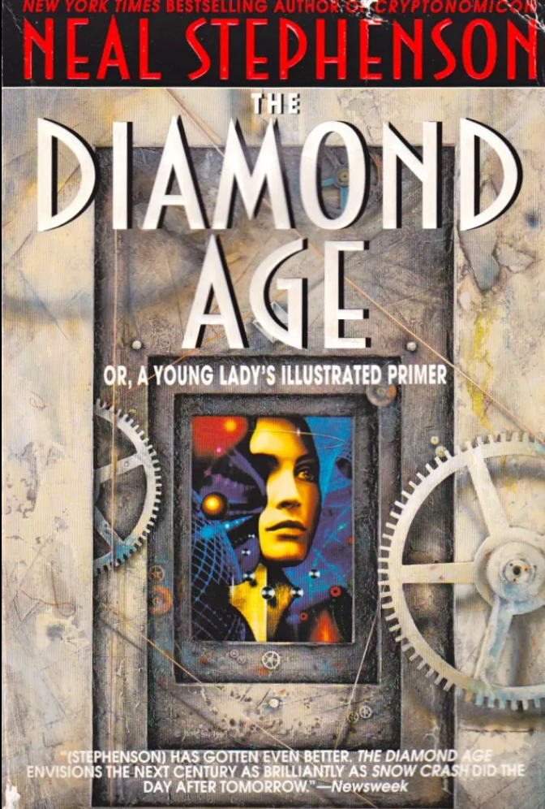
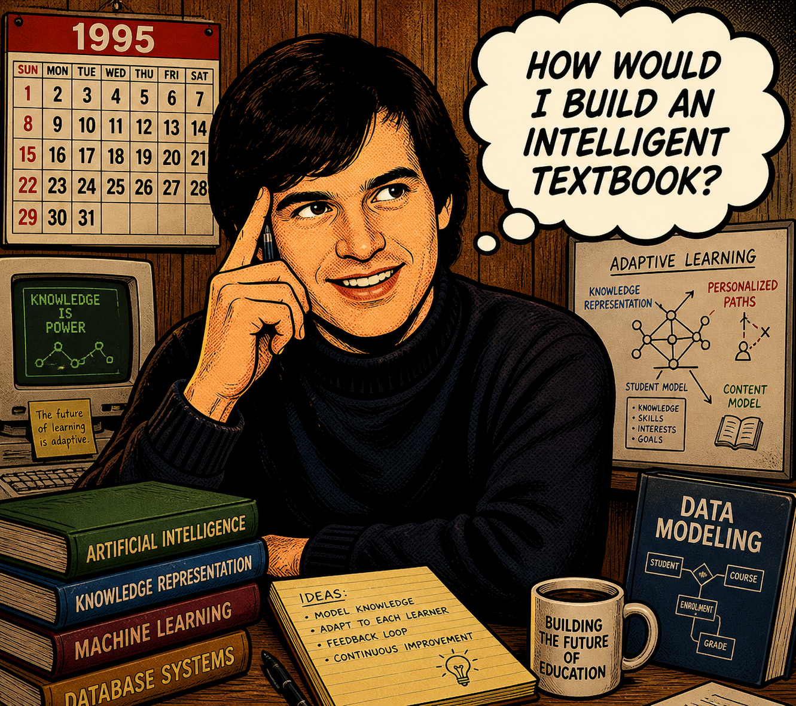
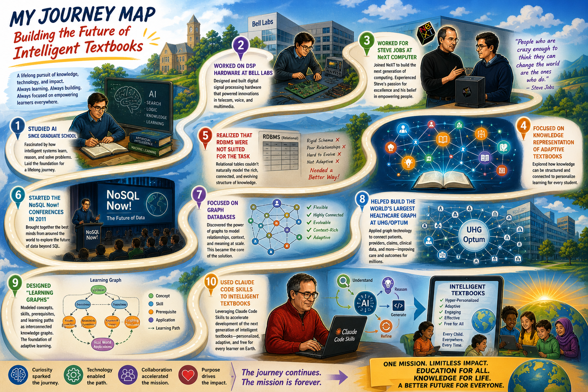
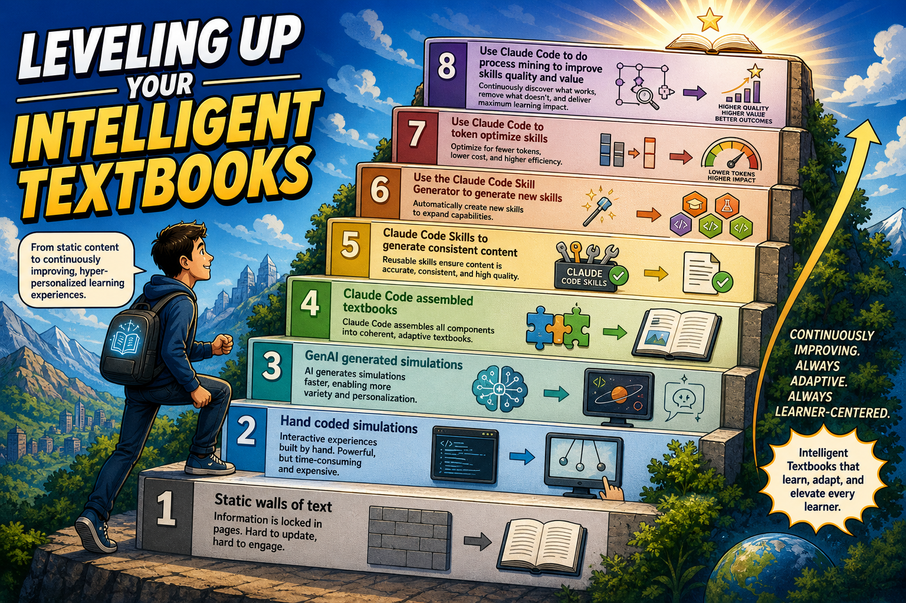
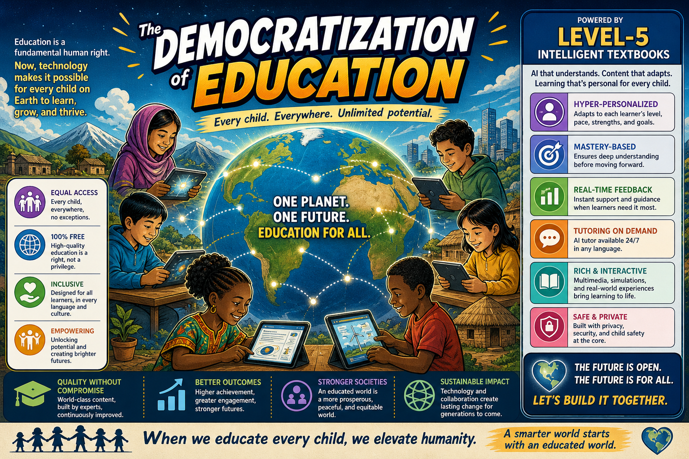

# Intelligent Textbooks

## Intelligent Textbooks

Using Claude Code Skills to generate intelligent textbooks. 
Dan McCreary

## The Inspiration

**Diamond Age:** Neal Stevenson's 1995 Cyberpunk Novel 

- A young girl is given an AI-powered tablet that imprints on the girl
- Every lesson the girl needs is customized to her context

<!--Image: Cover of Diamond Age book -->
</img>

## Dan's Quest

- How would I build such a device?

</img>

## The Problem With Paper Textbooks

- The static textbook problem (printed in 2019, used in 2026)
- One-size-fits-all fails the 80% (advanced bored, struggling lost)
- Cost & access gap (US $200 textbooks vs. global learners)
- The engagement crisis (passive reading vs. active learning)
- Teachers are drowning (no time to personalize)

## My Journey Infographic

## My Journey Text

- Studied AI since graduate school
- Worked on DSP hardware at Bell Labs
- Worked for Steve Jobs at NeXT Computer
- Focused on knowledge representation of adaptive textbooks
- Realized that RDBMS were not suited for the task
- Started the **NoSQL Now!** conferences in 2011
- Focused on graph databases
- Helped build the world's largest healthcare graph at UHG/Optum
- Designed "learning graphs"
- Used Claude Code Skills to intelligent textbooks

## MicroSims

- Worked as a volunteer with a local coding club
- Worked with Valarie Lockhart on teaching prompt engineering to teachers
- Valarie Lockhart coined the term "MicroSim" after using ChatGPT to generate p5.js
- I generalized the process and used iframes to make MicroSims easy to embed
- Published a paper formalizing the MicroSim standards

## MicroSim Uniqueness

<iframe src="../../sims/microsim-uniqueness/main.html" height="432px" width="100%" scrolling="no"></iframe>
[MicroSim Uniqueness](../../sims/microsim-uniqueness/index.md)

## The Five-Levels fo Intelligent Textbooks

<iframe src="../../sims/book-levels/main.html" height="600px" width="100%" scrolling="no"></iframe>
[Book Levels Fullscreen](../../sims/book-levels/main.html)

## The Bouncing Ball MicroSim Example

<iframe src="../../sims/bouncing-ball/main.html" height="600px" width="100%" scrolling="no"></iframe>

## Animal Cell (Interactive Infographic Overlay)

<iframe src="https://dmccreary.github.io/biology/sims/animal-cell/main.html" 
        height="730px"
        width="100%"
        scrolling="no"></iframe>

## Biogeochemical Cycles (Water, Nitrogen, Carbon, Phosphorus)

<iframe src="https://dmccreary.github.io/biology/sims/biogeochemical-cycles/main.html"
        height="530px"
        width="100%"
        scrolling="no"></iframe>

## Challenges Getting LLMs to Generate Consistent Content

- Getting LLMs to generate consistent simulation interfaces
- Every diagram MUST be interactive
- No static images or drawing
- Complex infographics are great, but overlay interactive region hovers

## How it works

1. Course description (100 point scale)
2. Learning graph
3. Chapter design
4. Chapter content generation (with microsim specifications)
5. MicroSim generation
6. Supplementary content generations (glossary, faq, quizzes, lesson plans)
7. Automated quality assessment (coverage, metrics, scaffolding)

## Learning Graph

- Core data structure behind content generation and hyper-personalization.
- Directed Acyclic Graph of concepts and their learning order

<iframe src="../../sims/learning-graph/graph-viewer.html"
        height="700px"
        width="100%"
        scrolling="no"></iframe>

## Level 2 Intelligent Book Content

- Chapters
- Pedagogical Agents [Book Mascots](https://dmccreary.github.io/book-mascots/list-mascots/)
- Glossary of Terms
- FAQs
- Quizzes
- MicroSims - physics, chemistry, biology, infographics, charts
- Systems Thinking - Causal Loop Diagrams
- Stories (mini-graphic novels)
- Teacher Guides/Instructor Guides
- Search
- Navigation
- Quality Reports (reading level etc.)

## Book Mascots

[Mascot Gallery](https://dmccreary.github.io/book-mascots/list-mascots/)

## Current Status

- 88 level 2 Books
- Getting ready to go to level 2 (cost effectively)
- 1,200 MicroSims
- 100s of Mini Graphic Novels
- Ongoing research on [Automating Instructional Design](https://dmccreary.github.io/automating-instructional-design/)
- Continued integration of [The Learning Sciences](https://dmccreary.github.io/learning-sciences/)

[Case Studies](https://dmccreary.github.io/intelligent-textbooks/case-studies/)

## Sample Titles

    - Intro to Python
    - MicroPython
    - Clocks and Watches
    - Physics
    - Algebra
    - Data Science
    - Deep Learning
    - Signal Processing (University of Minnesota)
    - Functions
    - Calculus
    - Chemistry
    - Biology
    - Ecology
    - Moss
    - Quantum Computing (a skeptics guide)
    - Dementia (with Rick Tanler)
    - Investor Relations (with David Berg)
    - Digital Transformation (with Daniel Yarmoluk)
    - Digital Citizenship

## Leveling Up Your Intelligent Textbooks

## Leveling Up Your Intelligent Textbooks Text

1. Static walls of text 
2. second level "Hand coded simulations" 
3. GenAI generated simulations
4. Claude Code assembled textbooks in GitHub
5. Claude Code Skills to generate consistent content 
6. Use the Claude Code Skill Generator to generate new skills 
7. Use Claude Code to token optimize skills 
8. Use Claude Code to do process mining to improve skills quality and value

## Skills for Developing Intelligent Textbooks

1. Created with Claude Code starting around October 2025
2. Currently about 30 skills
3. Thoroughly tested with Claude Code
4. Continually being optimized for token efficiency
5. Some testing on OpenAI Codex and Google Gemini

## The Democratization of Education

- A Side Effect of Dan's Quest

- How would the world change if a 12-year old girl from the remote regions of Africa has access to the
**same quality** of hyper-personalized education as every student at MIT?

- How could we use intelligent textbooks to democratize education for all children on Earth?

- Should an ultra-high quality of hyper-personalized education be free for all children on earth?

## The Democratization of Education

<!--
Please generate a wide-landscape infographic with the title "The Democratization of Education" depicting that all children on planet Earth will have access to free high-quality hyper-personalized education through level-5 intelligent textbooks.
--->

## Call to Action

- Ask ChatGPT|Claude|Gemini what MicroSims are?
- Ask ChatGPT|Claude|Gemini what the five levels of intelligent textbooks are?
- Review a sample intelligent textbook from the case studies
- Download the intelligent textbook skills into Claude Code, OpenAI Codex or Google AntiGravity
- Start with a course description and say "Build me a textbook"

