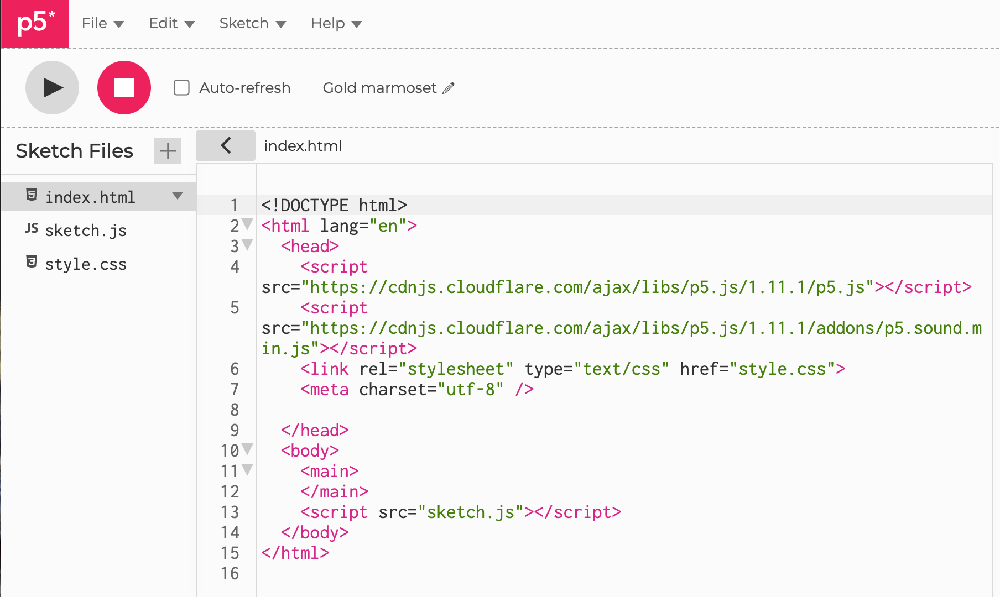

# Adding a MicroSim

In this section we show you how to add an individual [p5.js](../glossary.md) [MicroSim](../glossary.md#microsim) to your intelligent textbook.

A MicroSim is a single-page simulation used to illustrate a concept
in your textbook.  It is often written in JavaScript and the simulation
run within a rectangular canvas that fills the center area of the
page.  We design the MicroSim so that it can be easily added to
any web page with a single reference such as an HTML ```iframe```.

## The Need for Consistency

Although these guidelines might seem somewhat rigid at first,
our experience has show that by forcing consistency we
get much better results when we ask generative AI programs
to generate new MicroSims or have generative AI customize
a MicroSim.  Giving a generative AI program a well-documented
sketch.js file maximizes the probability that the generative AI application
or agent will generate the correct MicroSim without the need
for manual interventions.

## MicroSim Layout Strategy

Based on feedback from instructors, we use the following layout conventions.

1. The canvas is typically around 670 pixels wide to fit in the default center section of a mkdocs material page.
2. The canvas is divided into two regions.  The top region is the drawing region and the bottom region holds the controls such as sliders and buttons.
3. The top drawing region is drawn with a background color of ```aliceblue```.
4. The bottom control have a white background.
5. A JavaScript template using p5.js or vis.js is used to create a consistent layout so an iframe can be
quickly inserted into any markdown page in the textbook.
6. A CSS file creates a 2-pixel wide border so that the users know it is an active region that they can change simulation parameters.

Note that these are default intelligent textbook conventions, but there is still a wide variety of options you can still use.  Some MicroSims are best used in a screen that takes the full-with of your browser.  These are easy to create by overriding the default behavior.

## File Conventions



There are a variety of ways you can store MicroSims based on the needs of your users.  The structure below is to promote high-quality documentation and reuse
by allowing users to drag-and-drop MicroSim folders from repositories.  We also
try to be consistent with the file naming conventions of the p5.js editor as
shown above.

1. **One Directory Per MicroSim** - we encourage MicroSim authors to package everything a MicroSim needs into a single folder or directory.  This allows
the folder to be quickly copied by users or build tools.
2. **A index.md** - each MicroSim should contain an index.md file.  This
is the main markdown file for the MicroSim.
3. **A index.html file** - each MicroSim contains a pure HTML file that executes the MicroSim on a canvas.  By default this is called the index.html as per the
conventions in the p5.js editor
4. **A sketch.js file** - this contains the JavaScript for the MicroSim.  This
is the default name used by the p5.js editor.

Although the p5.js editor also has a style.css file, this is seldom used
by our MicroSims since much of the default CSS behavior is handled by
a site-wide CSS file in our on-line textbooks.

## Example of MicroSim Copy Command

If we stick to these conventions, you can quickly add a new MicroSim to
your textbook with the following UNIX copy command with the recursive
and verify options:

```sh
$ cp -rv ../microsims/docs/sims/sine-wave docs/sims
../microsims/docs/sims/sine-wave -> docs/sims/sine-wave
../microsims/docs/sims/sine-wave/sine-wave.js -> docs/sims/sine-wave/sine-wave.js
../microsims/docs/sims/sine-wave/sine-wave.html -> docs/sims/sine-wave/sine-wave.html
../microsims/docs/sims/sine-wave/index.md -> docs/sims/sine-wave/index.md
../microsims/docs/sims/sine-wave/sine-wave.png -> docs/sims/sine-wave/sine-wave.png
```

This command assumes you have checked out the MicroSims repository in a sibling directory for your textbook and you are in the home directory of your textbook.

After you execute this command you can then modify your mkdocs.yml and your sims/index.md files to reference this MicroSim.

### Addition to mkdocs.md

```yml
- Sims:
    - Gallery: sims/index.md
    - Sine Wave: sims/sine-wave/index.md
```
### Addition to sims/index.md

```markdown
## Sine Wave

[Sine Wave](./sine-wave/index.md)
```

### Iframe reference

Now any chapter can easily include this MicroSim in their content
with an HTML ```<iframe>``` reference

```html
<iframe src="/mkdocs-for-intelligent-textbooks/sims/sine-wave/sine-wave.html"
   width="676px" height="495px" scrolling="no"></iframe>
```

Note that the name of the repository must be included in the src attribute.
This seems like a bug and requires a global replacement if the
name of your git repository changes.

<iframe src="/mkdocs-for-intelligent-textbooks/sims/sine-wave/sine-wave.html"
   width="676px" height="495px" scrolling="no"></iframe>

Note that the width of the MicroSim is hard coded to be 676 pixels.
This can be optimized to fill the with of the main.

## Connection to the <main> Element

