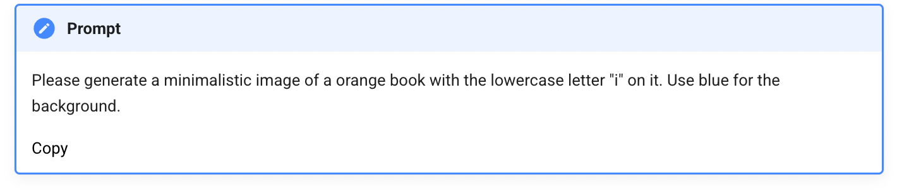

# Adding "Copy" to Prompt Admonitions

It would be wonderful if for every prompt, we could allow
the user to copy that prompt directly to their pasteboard with just a single click.
To do this we need to first add a JavaScript ```event listener``` that
runs if we see an admonition of type ```prompt```.  When we see
this the JavaScript will add a copy button that can be clicked on.
Clicking on the button will copy the entire contents of the admonition to the paste buffer.
We can then move the copy button to the upper right using CSS.

Here is what the screen will look like after we add the JavaScript:



After we add the CSS, the ```copy``` button will appear in the upper right corner of the admonition.


## Additional JavaScript

Here is the JavaScript:

```javascript
document.addEventListener("DOMContentLoaded", function () {
    // Find all admonitions with the "prompt" class
    document.querySelectorAll(".admonition.prompt").forEach((admonition) => {
        // Create a "Copy" button
        const copyButton = document.createElement("button");
        copyButton.textContent = "Copy";
        copyButton.className = "copy-button";

        // Append the button to the admonition
        admonition.appendChild(copyButton);

        // Add event listener for the button
        copyButton.addEventListener("click", () => {
            // Collect all text content inside the admonition except the title and button
            const promptText = Array.from(admonition.querySelectorAll("p:not(.admonition-title)"))
                .map((p) => p.textContent.trim())
                .join("\n");

            if (promptText) {
                // Copy the collected text to the clipboard
                navigator.clipboard.writeText(promptText).then(
                    () => {
                        // Show feedback on successful copy
                        copyButton.textContent = "Copied!";
                        setTimeout(() => (copyButton.textContent = "Copy"), 2000);
                    },
                    (err) => {
                        console.error("Failed to copy text: ", err);
                    }
                );
            } else {
                console.error("No prompt text found to copy.");
            }
        });
    });
});
```

## Additional CSS

```css
/* Styling for the Copy Button */
.admonition.prompt {
    position: relative;
}

.admonition.prompt .copy-button {
    position: absolute;
    top: 10px;
    right: 10px;
    background-color: #0056d6;
    color: white;
    border: none;
    border-radius: 5px;
    padding: 0.3rem 0.6rem;
    cursor: pointer;
    font-size: 0.8rem;
}

.admonition.prompt .copy-button:hover {
    background-color: #0041a4; /* Darker blue on hover */
}
```