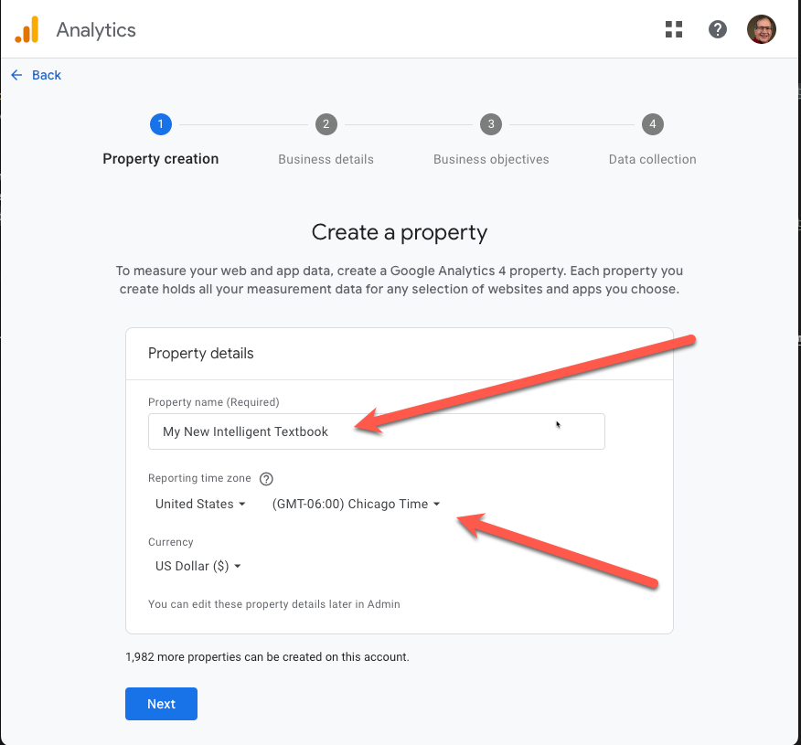
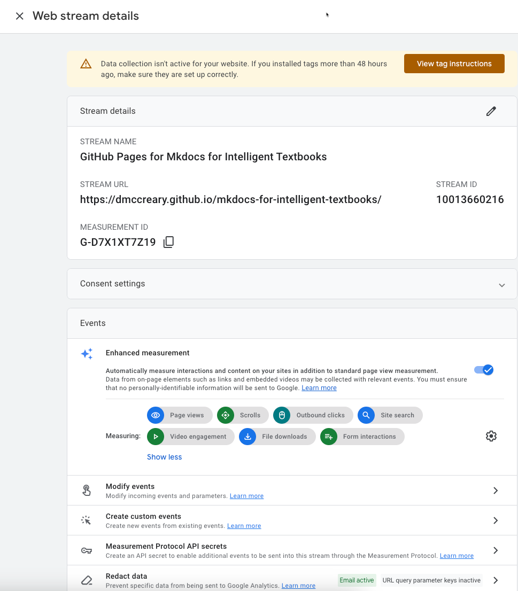
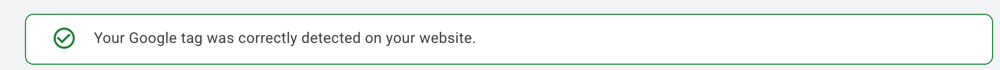

# Configuring Google Analytics

In the `mkdocs.yml` template file you will find the following lines:

```yml
#extra:
#  analytics:
#    provider: google
#    property: G-XXXX
```

You will need to first generate a Google Analytics property ID and then remove the
comment lines "#".

```yml
extra:
  analytics:
    provider: google
    property: G-XXXX
```

## Google Analytics Step By Step

For this step, you will need a Google Analytics account.  Once you have
that go to the Google Analytics developer site to create a new property:

[https://developers.google.com/analytics](https://developers.google.com/analytics)

### Step 1 - Find the Configure Icon


### Step 2 - Find the Create Button


### Step 3 - Select Property


### Step 4 - Name Your Property

And give it a timezone



### Step 5 - Describe Your Business


### Step 6 - Choose Your Business Objective


### Step 7 - Find Your Google Analytics Measurement ID



### Step 8 - Copy the Google Analytics Measurement ID into Your Mkdocs.yml and Check Your ID

After you do your next deploy with mkdocs `gh-deploy`, check that the tag in the <head> has the Google Analytics Script.

Use the Chrome Developer Tool to verify that the Google Analytics Script is Being Loaded


### Step 9 - Check Your ID

Google Analytics has a way to check that the website had the correct ID in it.


You will see the following text if the tags are found:



## References

[Google Analytics Docs](https://support.google.com/analytics/answer/9304153?hl=en&utm_id=ad#stream)