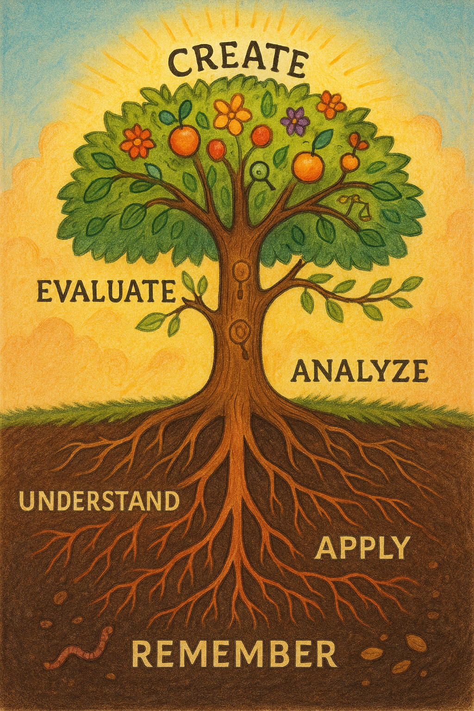

# Using the 2001 Bloom Taxonomy

<iframe src="../../sims/blooms-taxonomy/main.html" height="600px" width="600px" scrolling="no" style="overflow: hidden"></iframe>

We use the 2001 Bloom's Taxonomy to categorize learning objectives across six cognitive levels: Remember, Understand, Apply, Analyze, Evaluate, and Create. This scaffolds progressive skill development.

Bloom's Taxonomy (2001 revision by Anderson & Krathwohl) provides a hierarchical framework for organizing learning objectives from simple to complex cognitive processes. It's particularly valuable for course design because it:

1.  **Ensures Comprehensive Coverage**: Helps instructors design objectives that span all cognitive levels rather than focusing only on lower-order thinking

2.  **Provides Progressive Learning Structure**: Moves from foundational knowledge to higher-order thinking:

    -   **Remember**: Recall facts and basic concepts
    -   **Understand**: Explain ideas or concepts
    -   **Apply**: Use information in new situations
    -   **Analyze**: Draw connections among ideas
    -   **Evaluate**: Justify decisions or standpoints
    -   **Create**: Produce new or original work

3.  **Uses Action Verbs**: Each level has associated action verbs that help write measurable objectives:

    -   **Remember:** define, list, recall, identify
    -   **Understand:** summarize, paraphrase, classify, explain
    -   **Apply:** implement, execute, solve, use
    -   **Analyze:** differentiate, organize, compare, attribute
    -   **Evaluate:** judge, critique, check, assess
    -   **Create:** design, construct, plan, develop

4.  **Guides Assessment Design:** Learning objectives at each level suggest appropriate assessment methods

    -   **Lower levels:** quizzes, recognition tasks
    -   **Higher levels:** projects, presentations, research

5.  **Shows Learning Progression**: For a "Deep Learning" course, objectives might progress from:

    -   **Remember:** "Define neural network components"
    -   **Understand:** "Explain backpropagation algorithm"
    -   **Apply:** "Implement a CNN for image classification"
    -   **Analyze:** "Compare different optimization algorithms"
    -   **Evaluate:** "Assess model performance metrics"
    -   **Create:** "Design a novel architecture for specific problem"

This structured approach ensures students develop both foundational knowledge and advanced critical thinking skills throughout the course.

!!! pro tip
    Just remember the phrase "Remember Understanding Allows Analyzing Everything Creatively"

!!! prompt
    Please generate a colorful wide-landscape drawing of a tree using bright colors of knowledge that has the following levels:

    1. Remember (red) - The soil/foundation at the very bottom of the drawing where it all begins
    2. Understand (orange) - The small feeding roots below ground that take in nutrients
    3. Apply (yellow) - The main center root just below the surface system that grounds knowledge
    4. Analyze (green) - The main trunk above the ground that connects everything
    5. Evaluate (blue) - The mid-level above ground branches that judge where to grow
    6. Create (purple) - The crown/fruits at the top

Make sure to place all the labels in the correct order from bottom to top.

