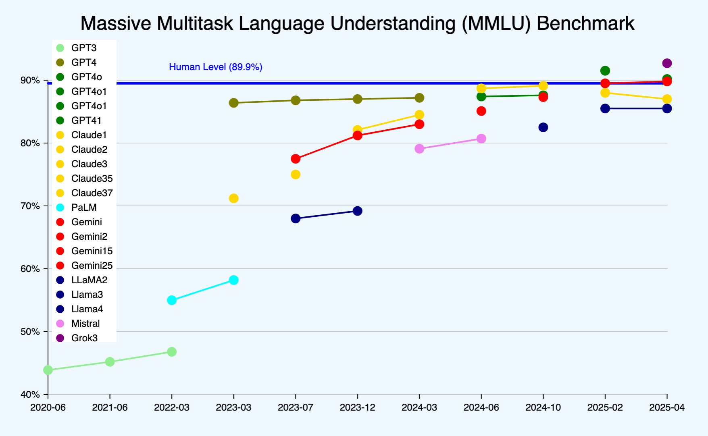
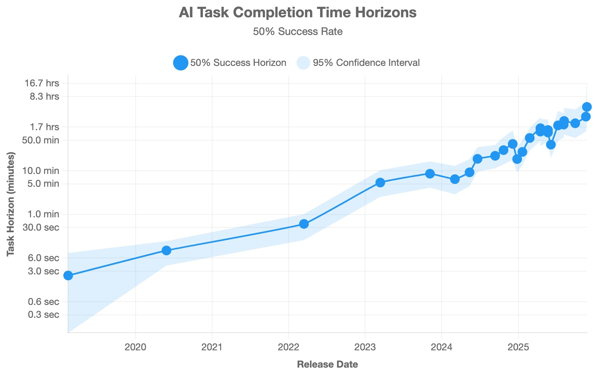
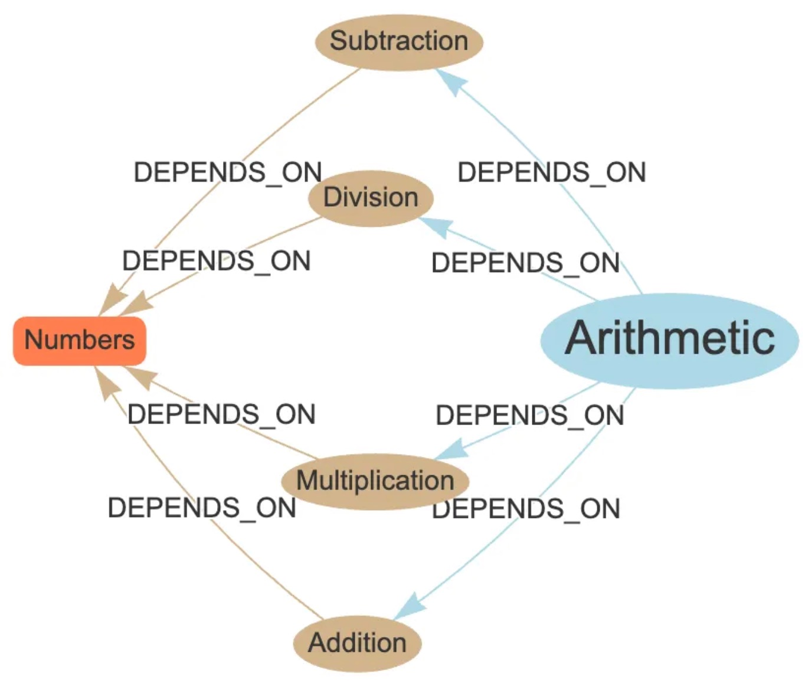
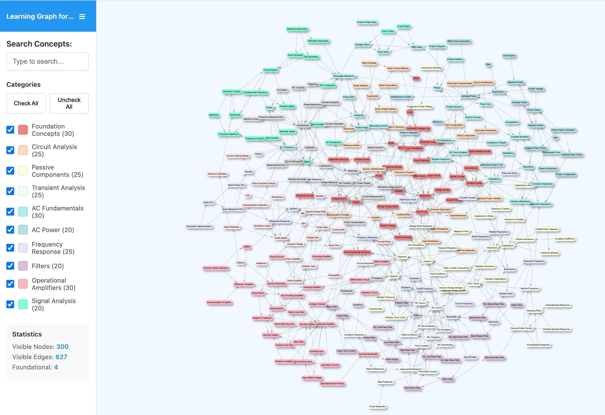
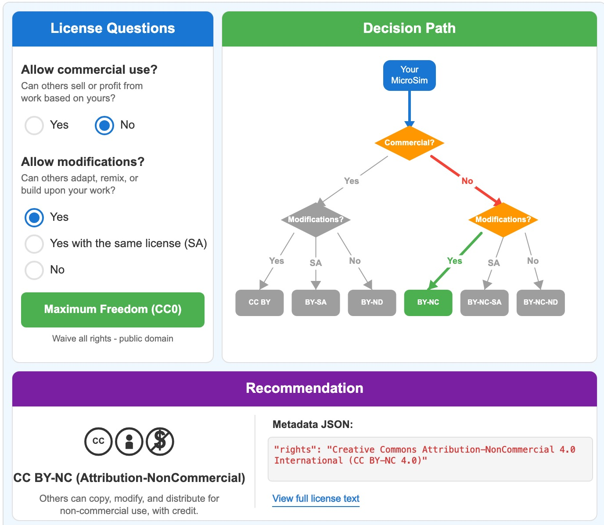

# Chapter 1: What is an Intelligent Textbook?

The term "intelligent textbook" encompasses a wide range of capabilities, from simple keyword search to fully autonomous AI tutors. To bring clarity to this spectrum, we need a framework that categorizes textbooks by their level of intelligence and helps authors choose appropriate goals for their projects.

## A Five-Level Model of Intelligent Textbooks

Inspired by the SAE J3016 standard for autonomous vehicles, which defines six levels from "no automation" to "full automation," we can classify textbooks into five distinct levels of intelligence. Each level builds upon the previous, adding capabilities that enhance the learning experience.

*Figure 1.1: Stairstep diagram showing five levels of intelligent textbooks from static to autonomous AI. Levels 3-5 cross the "Privacy Threshold" where personal data collection becomes necessary.*

The parallel to autonomous vehicles is instructive. Just as vehicle automation ranges from basic driver assistance to full self-driving capability, textbook intelligence ranges from static content to fully autonomous AI tutoring.

*Figure 1.2: Side-by-side comparison of SAE J3016 vehicle automation levels and corresponding intelligent textbook levels. The "Data Collection Threshold" between Levels 2 and 3 marks where privacy considerations become significant.*

### Level 1: Static Textbooks

Level 1 represents traditional textbooks in printed or basic digital format. These books contain text and static images, presenting content in a fixed linear sequence. There is no interactivity, no personalization, and no digital features beyond basic navigation.

Despite the advances in educational technology, approximately 90% of college textbooks remain at Level 1. This isn't necessarily a failure—static textbooks work well for many learning contexts. A well-written static text with clear explanations and thoughtful examples can be highly effective. The key limitation is that every reader receives identical content regardless of their background, learning style, or pace.

### Level 2: Interactive Content Textbooks

Level 2 textbooks add digital interactivity to the static foundation. Key features include:

- **Keyword search** enabling rapid navigation to specific topics
- **Hyperlinks** connecting related concepts within the text and to external resources
- **Embedded multimedia** including videos, animations, and audio
- **Self-assessment quizzes** allowing students to check their understanding
- **Interactive simulations** (MicroSims) that visualize concepts dynamically
- **Comprehensive glossaries** with in-text linking
- **Usage analytics** tracking how students interact with the material

Level 2 represents the sweet spot for many educational projects. The added interactivity significantly enhances learning without requiring complex infrastructure or raising significant privacy concerns. A single author with appropriate tools can create a Level 2 textbook that provides genuine educational value.

### Level 3: Adaptive Textbooks

Level 3 introduces personalization through deterministic algorithms. The textbook tracks individual student progress and adapts content presentation based on demonstrated understanding. Key capabilities include:

- **Personalized learning pathways** that adjust based on assessment results
- **Concept graph traversal** that ensures prerequisites are mastered before advancing
- **Spaced repetition** scheduling reviews at optimal intervals
- **Alternative explanations** offered when students struggle with particular concepts

Level 3 requires significant technical infrastructure including robust data management, graph algorithms, and persistent storage of student progress. It also crosses an important privacy threshold—the system must track individual learning histories to provide personalization.

This privacy threshold carries significant regulatory consequences. In the United States, student data is protected by FERPA (Family Educational Rights and Privacy Act), which governs access to educational records and requires institutional safeguards. COPPA (Children's Online Privacy Protection Act) adds additional requirements when students are under 13. In the European Union, GDPR (General Data Protection Regulation) imposes strict requirements on collecting, processing, and storing personal data—including provisions like "the right to be forgotten," which requires organizations to delete personal data upon request. This means student records in databases, backups, and even log files must be completely removable, significantly complicating system architecture.

For educators and institutions, these regulations create substantial compliance burdens. Organizations must demonstrate to auditors that student data is properly protected, access is controlled, and deletion requests can be honored. This increases risk for teachers and schools holding student records—a data breach or compliance failure can result in significant fines and reputational damage. The infrastructure required for compliant Level 3 systems drives up both development and operational costs, making the jump from Level 2 to Level 3 far more significant than simply adding personalization features.

*Figure 1.3: The Privacy Threshold: Level 3 Inflection Point.*

### Level 4: Textbooks with Chatbots

Level 4 integrates large language models as interactive tutoring assistants. Students can ask questions in natural language and receive contextually relevant answers. The chatbot draws on the textbook content, the student's learning history, and general knowledge to provide personalized explanations.

Key capabilities include:

- **Natural language Q&A** about textbook content
- **Contextual explanations** tailored to the student's current progress
- **Socratic dialogue** guiding students toward understanding through questions
- **Comprehensive logging** of all interactions for quality improvement

Level 4 represents a significant leap in capability but also in complexity. The integration of LLMs introduces costs (API calls), latency concerns, and potential for hallucination. Careful prompt engineering and retrieval-augmented generation (RAG) architectures help ensure chatbot responses remain grounded in accurate content.

### Level 5: Autonomous AI Textbooks

Level 5 represents an aspirational goal: textbooks that deeply understand individual learners and autonomously generate customized lessons in real-time. Such systems would adapt not just content selection but content creation, producing explanations, examples, and exercises tailored to each student's specific needs.

Level 5 remains largely theoretical. The combination of reliable LLMs, comprehensive learner modeling, and real-time content generation presents significant technical challenges. Privacy implications are also profound—such systems would require detailed understanding of individual students to function effectively.

For practical purposes, most intelligent textbook projects should target Levels 2 through 4. Level 2 provides substantial educational benefits with manageable complexity. Levels 3 and 4 offer additional personalization for contexts where the infrastructure and privacy considerations can be addressed.

## AI is Growing Exponentially

The capabilities available for intelligent textbooks are not static. Artificial intelligence, particularly large language models, has demonstrated consistent exponential improvement over recent years. Understanding this trajectory helps authors make informed decisions about which capabilities to incorporate and when.

*Figure 1.4: The MMLU (Massive Multitask Language Understanding) benchmark tracks AI performance across academic subjects. Multiple model families—GPT, Claude, Gemini, Llama, and others—show rapid convergence toward the human baseline of 89.9% (blue horizontal line) between 2020 and 2025.*

## The METR 7-Month Doubling Rate

Research from METR (Model Evaluation and Threat Research) has documented a striking pattern: AI task completion capabilities have been doubling approximately every seven months. This means that tasks which were impossible for AI systems in early 2023 became routine by late 2024, and capabilities continue expanding rapidly.

*Figure 1.5: Logarithmic chart showing AI task completion time horizons from 2019 to 2025. The exponential growth from seconds to hours demonstrates the consistent 7-month doubling rate.*

The metric METR uses is "task horizon"—the duration of tasks that AI systems can reliably complete. In February 2019, GPT-2 could handle tasks lasting about 2.4 minutes. By March 2023, GPT-4 extended this to approximately 5.4 hours. Projections suggest that by late 2026, AI systems may reliably complete tasks spanning weeks.

*Figure 1.6: Extending the METR trend line to 2030 suggests AI systems may eventually handle tasks spanning nearly two years. Green dots represent frontier models; gray dots represent non-frontier models.*

For intelligent textbook authors, this trajectory has practical implications:

- **Content generation** that required significant human oversight in 2023 now works reliably with lighter review
- **MicroSim creation** that once demanded programming expertise can increasingly be handled by AI with appropriate prompts
- **Chatbot integration** has become more practical as LLM costs decrease and reliability improves

The exponential trend suggests that techniques described in this book will become easier and more powerful over time. Authors who develop skills in AI-assisted content creation now will be well-positioned as capabilities continue expanding.

## Examples of Intelligent Textbooks

To make these concepts concrete, consider several examples from diverse domains:

**Beginning Electronics**: A Level 2 textbook teaching circuit fundamentals includes interactive simulations where students can adjust voltage and resistance values and observe current changes in real-time. Ohm's Law becomes tangible when you can manipulate the variables yourself.

**Graph Algorithms**: A textbook on graph theory includes animated visualizations of algorithms like breadth-first search and Dijkstra's shortest path. Students can step through execution, observing how data structures change at each iteration.

**Geometry**: An interactive geometry course allows students to manipulate shapes, exploring how changing angles affects other properties. The abstract becomes concrete through direct manipulation.

These examples share common characteristics: they take concepts that are difficult to convey through static text and make them interactive and explorable.

## Features of Intelligent Textbooks

Beyond the level classification, intelligent textbooks share several key features that distinguish them from traditional materials:

**Modular Architecture**: Content is organized into discrete concepts with explicit dependencies, enabling non-linear navigation and adaptive sequencing.

**Rich Media Integration**: Text is supplemented with diagrams, animations, videos, and interactive simulations as appropriate for each concept.

**Assessment Integration**: Learning checks are woven throughout the material, not relegated to chapter ends, enabling continuous feedback.

**Accessibility**: Digital format enables features like adjustable text size, screen reader compatibility, and alternative content formats.

**Analytics**: Usage data provides insight into how students interact with material, enabling continuous improvement.

## MicroSims

MicroSims—small, focused interactive simulations—are a distinguishing feature of intelligent textbooks. Unlike comprehensive simulation environments, MicroSims target specific concepts with minimal interface complexity.

A well-designed MicroSim has several characteristics:

- **Single concept focus**: Each simulation addresses one specific idea
- **Immediate feedback**: Changes to inputs produce visible results without delay
- **Minimal controls**: Only essential parameters are adjustable
- **Self-contained**: The simulation works without external dependencies

MicroSims are particularly valuable for concepts involving:

- Dynamic relationships (cause and effect)
- Spatial or geometric reasoning
- Processes that unfold over time
- Systems with multiple interacting variables

Chapter 4 provides detailed guidance on designing and implementing effective MicroSims.

## Simplicity, Interactivity, and AI

The creation of MicroSims has been transformed by AI. Previously, building even simple interactive simulations required programming expertise, design skills, and significant development time. Now, AI can generate functional MicroSims from natural language descriptions.

The key insight is that MicroSims should be simple. A simulation with three sliders and a single visualization is far more effective than a complex environment with dozens of controls. This simplicity makes AI generation practical—the prompts remain focused, and the generated code is manageable.

## Embedding MicroSims in Web Pages

MicroSims are typically embedded in textbook pages using HTML iframes. This approach provides several benefits:

- **Isolation**: The simulation runs independently, preventing conflicts with page styling
- **Portability**: The same simulation can be embedded in multiple contexts
- **Responsiveness**: Proper sizing ensures simulations work on various screen sizes

The standard pattern places each MicroSim in its own directory with an HTML file for standalone use and a markdown file for documentation.

## The Iframe Superpower

The HTML iframe element deserves special attention. It creates an independent browsing context—essentially a window within a window—that has proven remarkably powerful for educational content.

Key benefits of iframe-based embedding:

**Complete Isolation**: JavaScript variables, CSS styles, and DOM elements in the iframe cannot conflict with the parent page. A MicroSim can use any library versions without worrying about the host page's dependencies.

**Security Boundaries**: Iframes provide controlled sandboxing. The parent page can restrict what the embedded content can do, protecting both the learner and the content.

**Cross-Origin Capability**: MicroSims hosted on one domain can be embedded in textbooks hosted elsewhere. This enables sharing and reuse across projects.

**Responsive Embedding**: Modern CSS makes it straightforward to create responsive iframe containers that adapt to different screen sizes while maintaining appropriate aspect ratios.

The iframe has been called "the superpower of the web" for good reason—it enables composition of independent applications in ways that no other technology matches.

## The Learning Graph

A learning graph is a directed acyclic graph (DAG) representing concept dependencies. Each node represents a concept; each edge indicates that one concept depends on understanding another.

*Figure 1.7: A simple learning graph for arithmetic concepts. The orange "Numbers" node is the foundation, with brown operation nodes (Addition, Subtraction, Multiplication, Division) depending on it. The blue "Arithmetic" node connects all operations, showing how concepts build upon each other.*

The learning graph is not merely a visualization tool—it is the core data structure that supports the entire intelligent textbook.

<!-- TODO: Put Figure description here-->
*Figure 1.8: A screen image of a learning graph for a circuits course.  This graph contains 300 concepts, 627 edges.
The user interface created using the vis-network.js library supports search and category filters based on a
taxonomy.  Each node is a concept that is colored based on the taxonomy class it belongs to.  The example above includes categories for Foundation Concepts, Circuit Analysis, Passive Components, Transient Analysis, AC Fundamentals, AC Power, Frequency Response, Filters, Operational Amplifiers and Signal Analysis.*

The learning graph above is for a circuits course typically taught in a electrical engineering curriculum.  The graph has 300 concepts and 627 edges.  Each edge is a hint about the order that concepts should be presented when generating chapter content.

## Separating Concepts from Content

A crucial insight in intelligent textbook design is the separation of *concepts* from *content*. Concepts are the atomic units of knowledge—discrete ideas that can be learned, assessed, and connected. Content is the material (text, images, simulations) that teaches those concepts.

This separation enables:

- **Multiple representations**: A single concept can be taught through text, video, simulation, or examples
- **Adaptive selection**: Different content can be presented based on learner needs
- **Reuse**: Content modules can serve multiple textbooks covering overlapping concepts
- **Assessment alignment**: Questions map to concepts, not to specific content pages

The concept list becomes the stable foundation; content can evolve and improve while the conceptual structure remains consistent.

## The Learning Graph as the Core Data Structure

The learning graph serves as the backbone of the intelligent textbook architecture:

**Content Sequencing**: The graph ensures concepts are presented in valid order—prerequisites always come before dependent concepts. A topological sort of the graph produces a valid teaching sequence.

**Chapter Organization**: Clusters of related concepts naturally form chapters. Graph analysis reveals these clusters and suggests logical groupings.

**Prerequisite Checking**: Before presenting advanced content, the system can verify that prerequisite concepts have been covered or mastered.

**Gap Identification**: When students struggle, the graph helps identify which prerequisite concepts may need review.

**Curriculum Design**: The graph structure reveals the overall shape of a domain—which concepts are foundational, which are terminal, and which form bridges between topic clusters.

## Generating Book Chapter Structure

The learning graph directly informs chapter structure. Concepts cluster into natural groupings based on:

- **Dependency proximity**: Concepts that share prerequisites or are prerequisites for the same advanced concepts
- **Topical similarity**: Concepts dealing with related subject matter
- **Pedagogical flow**: Natural teaching sequences that build understanding progressively

AI can analyze a learning graph and propose chapter structures that respect dependencies while grouping related concepts. The author reviews and adjusts these suggestions, but the graph provides a principled starting point.

## The Graph as Ground Truth for Content Generation

When AI generates content, the learning graph serves as ground truth:

**Concept Coverage**: Generated chapters must cover their assigned concepts—the graph defines what belongs in each chapter.

**Prerequisite References**: Content can reference prerequisites because the graph declares them explicitly.

**Forward References**: The graph identifies which advanced concepts build on current material, enabling appropriate foreshadowing.

**Consistency Checking**: Generated content can be validated against the graph—are all concepts covered? Are prerequisites explained before use?

The graph transforms content generation from open-ended writing to constrained generation with verifiable properties.

## Learning Paths

A learning path is a valid traversal through the concept graph. Multiple paths may exist from foundational concepts to learning goals, and different paths may suit different learners.

Consider a graph where both "Algebra" and "Geometry" lead to "Trigonometry." A student stronger in visual reasoning might benefit from the Geometry path; a student comfortable with symbolic manipulation might prefer the Algebra path. Both are valid; the graph enables the choice.

Adaptive textbooks (Level 3 and above) can recommend learning paths based on:

- Assessed prior knowledge
- Learning style preferences
- Time constraints
- Learning goals

## The Student Graph

While the learning graph represents domain knowledge, the *student graph* represents an individual learner's knowledge state. Each concept in the student graph carries:

- **Mastery level**: Unknown, learning, or mastered
- **Assessment history**: When and how the concept was evaluated
- **Time spent**: Engagement metrics for related content

The student graph is a personalized overlay on the domain graph. It enables the textbook to understand what each learner knows and what they're ready to learn next.

## Finding the Zone of Proximal Development

*Figure 1.8 - using a knowledge space and assessments to quickly find a the concepts that the student is ready to learn.  This is a simple graph traversal algorithm and no expensive LLMs are required.*

Vygotsky's "zone of proximal development" describes knowledge just beyond what a learner can access independently but within reach with appropriate support. The learning graph operationalizes this concept.

A concept is in the zone of proximal learning when:

- All its prerequisites are mastered (or nearly mastered)
- The concept itself is not yet mastered
- The concept leads toward the learner's goals

Graph traversal algorithms can efficiently identify concepts in this zone—the "frontier" of a student's expanding knowledge.

## Recommending Concepts

With the student graph and learning graph aligned, the system can recommend what to learn next:

1. Identify the frontier: concepts whose prerequisites are mastered
2. Rank by relevance: how directly does this concept lead to learning goals?
3. Consider variety: balance between deepening and broadening
4. Account for difficulty: don't overwhelm with too many challenging concepts simultaneously

This recommendation is deterministic—no LLM required—making it suitable for Level 3 adaptive textbooks.

## Recommending Content

Once a concept is selected, the system recommends specific content:

- Primary explanation (text with diagrams)
- MicroSim for hands-on exploration
- Worked examples
- Practice problems
- Alternative explanations if the primary doesn't succeed

Content recommendation can consider the learner's demonstrated preferences—some students learn better from examples first, others from principles first.

## Avoiding Hallucination

For an intelligent textbook to be trustworthy, it must be grounded in accurate information. This is particularly important when AI is involved in content generation, as language models can produce plausible-sounding but incorrect statements—a phenomenon called hallucination.

Ground truth for intelligent textbooks comes from:

- **Authoritative sources**: Established textbooks, peer-reviewed papers, official documentation
- **Domain expertise**: The author's own verified knowledge
- **Explicit citations**: Clear attribution enabling readers to verify claims
- **Worked examples**: Demonstrations that can be independently checked

Large language models sometimes generate content that sounds authoritative but is factually incorrect. When using AI to assist with textbook creation, several practices help minimize this risk:

**Review all generated content**: AI output should be treated as a draft requiring verification, not final copy.

**Request citations**: Prompting models to cite sources (and then verifying those citations exist) catches many errors.

**Use retrieval augmentation**: Providing relevant source documents as context helps keep generation grounded.

**Check quantitative claims**: Numbers, dates, and statistics are particularly prone to errors and should always be verified.

**Test code and examples**: Any generated code or worked examples should be executed to confirm correctness.

## Open Source

The intelligent textbook ecosystem thrives on open-source foundations. Key components include:

- **MkDocs**: Documentation generator that converts markdown to websites
- **Material for MkDocs**: Theme providing rich features and attractive styling
- **p5.js**: JavaScript library for creating interactive graphics and simulations
- **Various visualization libraries**: Tools for charts, graphs, diagrams, and more

Using open-source tools ensures that intelligent textbooks remain accessible and that authors maintain control over their content without vendor lock-in.

## Creative Commons

For educational materials to have maximum impact, they should be freely shareable. Creative Commons licenses provide a standardized way to grant permissions while maintaining appropriate attribution and use restrictions.

The CC BY-NC-SA license (Attribution-NonCommercial-ShareAlike) is popular for educational content:

- **BY**: Users must give credit to the original author
- **NC**: Commercial use requires separate permission
- **SA**: Derivative works must use the same license

This license allows educators to freely use, adapt, and share materials while preventing unauthorized commercial exploitation.

## Licensing Books and MicroSims

When creating an intelligent textbook, consider licensing carefully:

- **Content license**: Typically Creative Commons for educational materials
- **Code license**: MIT or Apache for any software components
- **Media licenses**: Ensure all images, videos, and other media have appropriate permissions

Clear licensing removes ambiguity and enables the widest appropriate use of your materials.  Our book on MicroSim search includes a MicroSim that guides you through the process of selecting the correct category of license based on how you answer specific questions.

*Figure 1.9

## Observing Copyright and Using External Images

While creating content, respect intellectual property rights:

- **Never copy substantial text** from copyrighted sources without permission
- **Use only properly licensed images**: Public domain, Creative Commons, or explicitly licensed
- **Create original diagrams** when possible—AI can help generate custom illustrations
- **Cite all sources** appropriately

When in doubt about image licensing, create original graphics. Modern AI image generation tools can produce custom illustrations for many educational contexts.

---

With this foundation in place—understanding what makes a textbook intelligent, how AI capabilities are evolving, and the importance of quality and licensing—we can turn to the practical question of how to actually generate an intelligent textbook. Chapter 2 provides a step-by-step workflow for transforming domain expertise into structured, interactive educational content.
