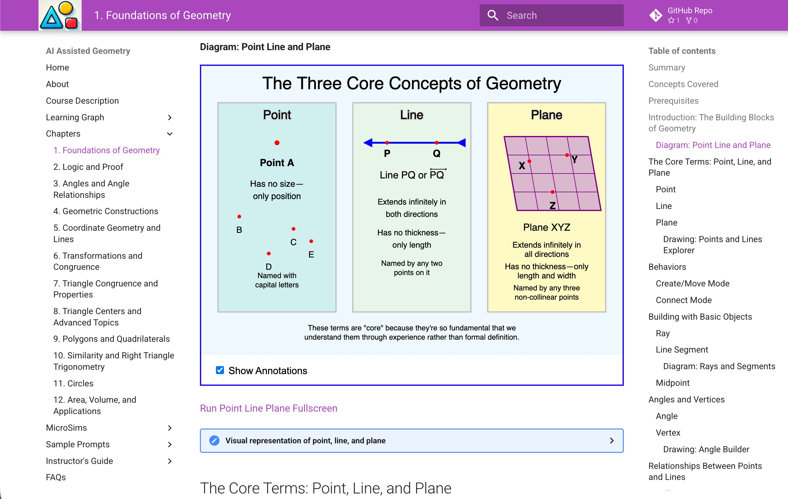
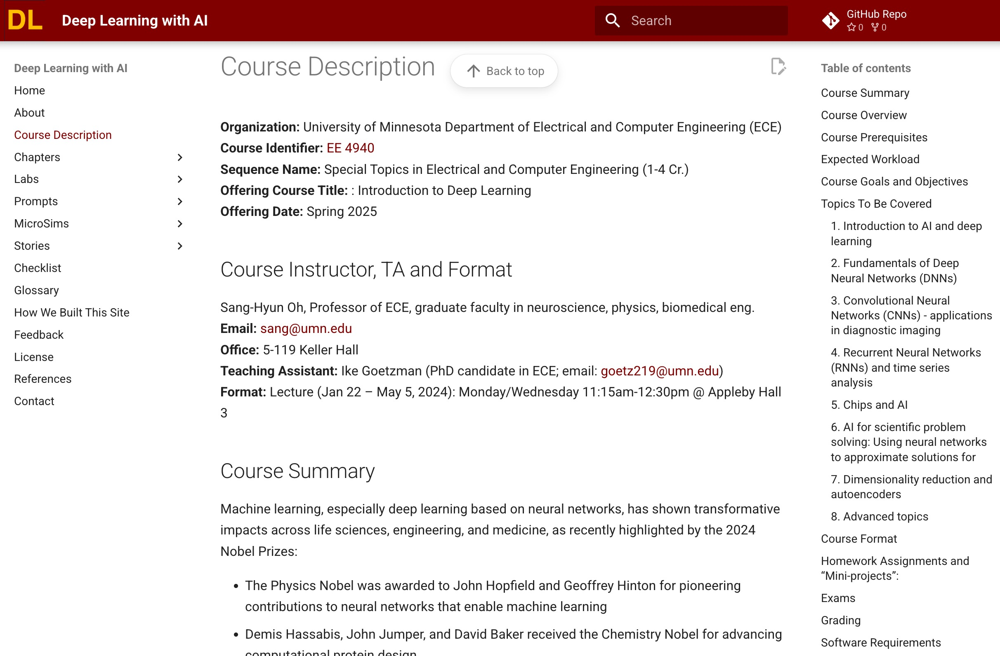
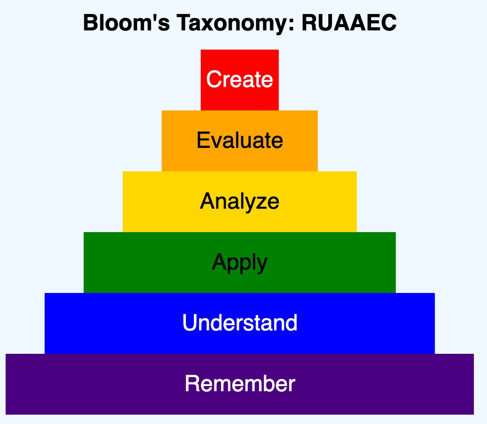
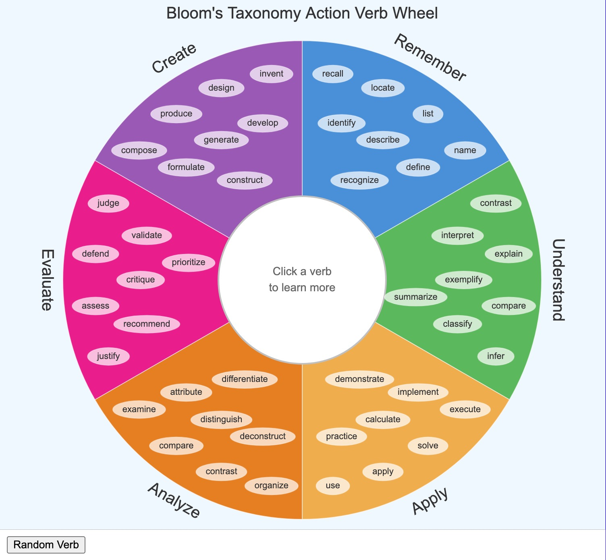
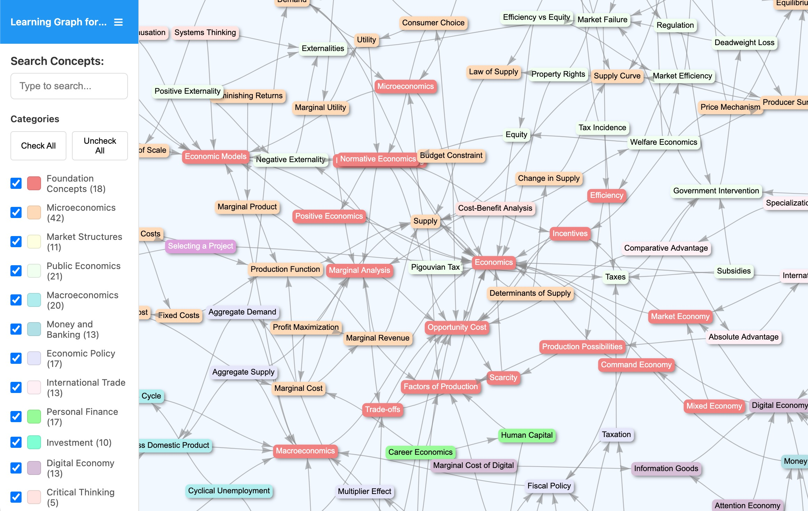
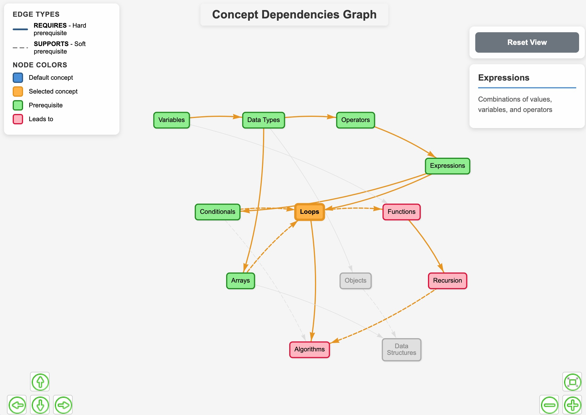
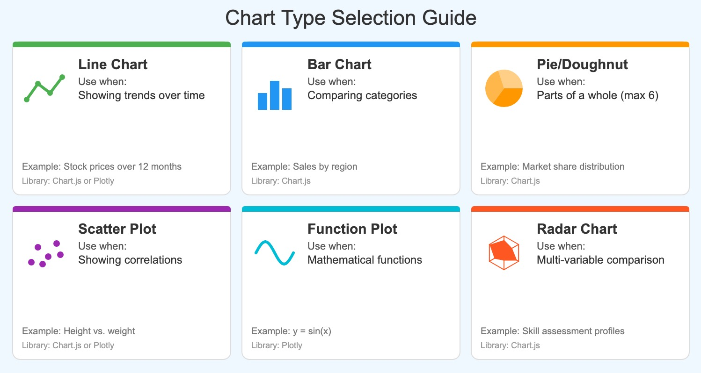

# Chapter 2: How to Generate an Intelligent Textbook

Creating an intelligent textbook is a systematic process that transforms domain expertise into structured, interactive educational content. This chapter presents a workflow that has been refined through the creation of over sixty textbooks across diverse domains.

## The Book Building Process

The process divides into distinct phases:

1. **Foundation**: Establish the learning graph that structures all content
2. **Content Generation**: Create chapters, sections, and supporting materials
3. **Enhancement**: Add interactive elements, assessments, and polish
4. **Validation**: Ensure quality and pedagogical soundness
5. **Publication**: Deploy and maintain the finished textbook


*Figure 2.1: The complete intelligent textbook generation workflow. Starting from the Course Description (top left), the process flows through concept enumeration, dependency analysis, and learning graph creation, then expands into chapter content, glossaries, and interactive elements.*

Each phase builds on the previous, and AI assistance accelerates every step. The key is maintaining quality through systematic validation rather than blind trust in generated content.

## Generating HTML from Markdown

Intelligent textbooks use Markdown as the source format. Markdown offers several advantages:

- **Simplicity**: Authors focus on content, not formatting
- **Version control**: Text files work well with Git
- **Portability**: Content can be rendered to multiple formats
- **AI compatibility**: Language models work naturally with Markdown

The build process converts Markdown source files into a polished HTML website with navigation, search, and interactive features.

## MkDocs and Material

MkDocs is a static site generator designed for documentation projects. Combined with the Material theme, it provides a complete platform for intelligent textbooks.

Key features include:

- **Navigation generation**: Automatic sidebar and breadcrumbs from file structure
- **Search**: Full-text search across all content
- **Responsive design**: Works on desktop and mobile devices
- **Syntax highlighting**: Beautiful code blocks with copy buttons
- **Admonitions**: Callout boxes for notes, warnings, and tips
- **Math rendering**: LaTeX equation support via MathJax or KaTeX
- **Social cards**: Automatic preview images for social media sharing

A basic MkDocs project requires only a configuration file (`mkdocs.yml`) and a `docs/` directory containing Markdown files. The `mkdocs serve` command provides live preview during development, and `mkdocs build` generates the final HTML site.



*Figure 2.7: A geometry intelligent textbook built with MkDocs Material. The left sidebar shows chapter navigation, the main content area displays text with an embedded MicroSim, and the right sidebar provides a table of contents for the current page.*

## The Course Description

Every intelligent textbook begins with a course description—a structured document that defines the educational scope and objectives. A complete course description includes:

**Title and Overview**: What the course covers and why it matters.

**Target Audience**: Who should take this course? What background is assumed?

**Prerequisites**: What must learners already know? This shapes the foundation concepts.

**Duration**: Expected time to complete the material (influences depth and scope).

**Learning Outcomes**: What will learners be able to do after completing the course? Written as measurable objectives.

**Topic Outline**: Major subject areas to be covered, in approximate order.

The course description serves as the prompt for subsequent AI-assisted generation. A well-crafted description produces better learning graphs, more coherent chapters, and more relevant assessments.



*Figure 2.8: A course description page for a deep learning course. The structured format includes title, audience, prerequisites, duration, learning outcomes, and topic outline—all elements that guide subsequent AI-assisted content generation.*

## Bloom's Taxonomy of Learning Objectives

Learning objectives should be written using Bloom's Taxonomy, a framework that classifies cognitive skills from basic to advanced.



*Figure 2.2: The six levels of Bloom's Taxonomy arranged as a pyramid. From the base: Remember, Understand, Apply, Analyze, Evaluate, Create. The mnemonic "RUAAEC" helps recall the sequence. Each level represents increasing cognitive complexity.*

Each level has associated action verbs that help write measurable learning objectives:



*Figure 2.3: An interactive verb wheel showing action verbs organized by Bloom's Taxonomy level. Each colored section contains verbs appropriate for that cognitive level—from "recall" and "identify" at the Remember level to "design" and "invent" at the Create level. This reference helps authors write precise learning objectives.*

**Level 1 - Remember**: Recall facts and basic concepts. Verbs: define, list, memorize, recall.

**Level 2 - Understand**: Explain ideas and concepts. Verbs: describe, explain, summarize, paraphrase.

**Level 3 - Apply**: Use information in new situations. Verbs: solve, demonstrate, apply, implement.

**Level 4 - Analyze**: Draw connections among ideas. Verbs: compare, contrast, categorize, examine.

**Level 5 - Evaluate**: Justify decisions and judgments. Verbs: critique, assess, judge, recommend.

**Level 6 - Create**: Produce new or original work. Verbs: design, construct, develop, formulate.

A well-designed course includes objectives at multiple levels, with foundational content at lower levels and advanced content at higher levels. This progression shapes both content creation and assessment design.

## The Concept List

From the course description, generate a comprehensive list of concepts—the atomic units of knowledge that the course teaches. For a typical course, aim for 200-250 concepts.

Each concept should:

- Have a clear, concise label (under 32 characters)
- Represent a single, coherent idea
- Be teachable and assessable
- Use title case consistently

Examples from a circuits course:
- Ohm's Law
- Series Circuit
- Parallel Circuit
- Kirchhoff's Voltage Law
- Capacitor Charging Curve

AI can generate concept lists from course descriptions with high accuracy, particularly for established domains. The author's role is to review, refine, and ensure completeness.

## Ordering Concepts

Concepts must be ordered so that prerequisites come before dependent concepts. This ordering reflects pedagogical reality—you cannot understand Kirchhoff's Laws without first understanding voltage and current.

The ordering process:

1. Identify foundational concepts that require no prerequisites
2. For each remaining concept, list its prerequisite concepts
3. Verify that the ordering forms a valid directed acyclic graph (DAG)
4. Resolve any cycles by clarifying concept boundaries

AI assists by suggesting likely dependencies based on domain knowledge, but human review catches errors in prerequisite relationships.

## The Dependency Graph

The dependency graph makes concept relationships explicit and machine-readable. Each concept connects to concepts it depends on, forming a DAG that enables:

- Validation that content respects prerequisites
- Adaptive learning paths that skip mastered concepts
- Identification of foundational concepts (many dependents) vs. terminal concepts (no dependents)
- Cluster detection revealing natural topic groupings



*Figure 2.4: An interactive learning graph viewer showing approximately 200 economics concepts. The left sidebar provides category filters (Foundation Concepts, Microeconomics, Market Structures, etc.). The main area displays a force-directed graph with color-coded nodes representing different concept categories and arrows showing dependencies.*

The learning graph concept applies across all domains. Here's an example from computer science:



*Figure 2.5: A programming concept dependency graph showing how foundational concepts (Variables, Data Types, Operators) flow through intermediate concepts (Expressions, Conditionals, Loops, Functions) to advanced topics (Algorithms, Data Structures, Recursion). Color coding distinguishes prerequisites (green), the selected concept (orange), and concepts that lead to others (pink). Solid lines indicate hard prerequisites; dashed lines indicate supporting relationships.*

A simple CSV format captures dependencies:

```
ConceptID,ConceptLabel,Dependencies
1,Voltage,
2,Current,
3,Resistance,
4,Ohm's Law,1|2|3
5,Series Circuit,4
6,Parallel Circuit,4
```

Foundation concepts have empty dependency columns. Dependent concepts list prerequisite IDs separated by pipe characters.

## Generating the Dependency Graph

AI can generate dependency graphs from concept lists with reasonable accuracy. The prompt should include:

- The complete concept list
- Domain context from the course description
- Instructions to output in the specified CSV format
- Guidance to be conservative—only include dependencies that are truly required

Generated graphs should be validated:

- Check for cycles (invalid in a DAG)
- Verify foundation concepts exist (concepts with no dependencies)
- Ensure all referenced concept IDs exist
- Review a sample of dependencies for correctness

Visualization tools help identify issues. A well-formed learning graph should show a clear flow from foundation concepts at the top to advanced concepts at the bottom.

## Generating a Concept Taxonomy

Beyond dependencies, concepts benefit from categorical organization. A taxonomy groups related concepts, typically into 10-15 categories.

Example taxonomy for an electronics course:
- Fundamentals (voltage, current, resistance)
- Components (resistors, capacitors, inductors)
- Circuit Analysis (Kirchhoff's Laws, mesh analysis)
- Semiconductors (diodes, transistors)
- Digital Logic (gates, flip-flops)
- Power Systems (transformers, rectifiers)

The taxonomy aids navigation and helps balance chapter length. Each category typically becomes a chapter or major section.

## Balancing the Taxonomy

A balanced taxonomy has roughly equal concept counts per category. Imbalanced taxonomies suggest either:

- Categories that should be split (too many concepts)
- Categories that should be merged (too few concepts)
- Missing concepts in sparse categories

Aim for 15-25 concepts per category. This produces chapters of appropriate length and ensures even coverage of the domain.

## Generating a Book Ontology

For sophisticated textbooks, consider developing a formal ontology that defines concept types and relationships beyond simple dependencies:

- **Part-of relationships**: Components that make up larger wholes
- **Type hierarchies**: Specialized forms of general concepts
- **Causal relationships**: Concepts that explain or cause others

While not required for most projects, ontological structure enables more sophisticated reasoning about content and more precise learning path recommendations.

## Generating Chapter Structures

With the taxonomy in place, generate chapter structures that group related concepts into coherent narratives. Each chapter should:

- Focus on one taxonomy category or closely related categories
- Include 8-15 concepts
- Build from simpler to more complex concepts
- End with synthesis that ties concepts together

The chapter structure becomes the outline for content generation. Each concept becomes a section or subsection.

## Balancing Chapter Length

Chapters should be roughly balanced in length. Significant imbalances suggest restructuring:

- Very long chapters: Split into multiple chapters or promote subsections
- Very short chapters: Merge with related chapters or add depth

Target 2,000-5,000 words per chapter for manageable reading sessions. This typically translates to 15-30 minutes of reading time.

## Moving Concepts and Respecting Dependency

When reorganizing chapters, ensure that concept dependencies are preserved. A concept can only appear in or after the chapter containing its prerequisites.

Validation tools can check that:
- All prerequisite concepts appear earlier in the book
- No circular references exist within or across chapters
- Foundation concepts appear in early chapters

When violations occur, either move concepts to respect dependencies or reconsider whether the dependency is truly required.

## Generating Chapter Content

With structure defined, generate chapter content using AI assistance. Effective prompts include:

- The chapter outline with concept list
- Learning objectives for the chapter
- Target audience and prerequisites
- Writing style guidelines
- Examples of desired output

Generated content requires review for:

- Accuracy of explanations
- Appropriate depth for audience
- Clear progression from simple to complex
- Correct use of terminology
- Engaging writing style

## Avoiding the Wall of Text

Dense prose exhausts readers. Effective educational content breaks up text with:

- **Headings**: Clear signposts for navigation
- **Lists**: Enumerated points for scanning
- **Tables**: Comparative information in structured format
- **Diagrams**: Visual representation of concepts and relationships
- **Examples**: Concrete instances of abstract concepts
- **Callouts**: Important notes and warnings set apart
- **Exercises**: Active engagement with material

A rule of thumb: no more than three consecutive paragraphs without a visual break.

## Rules for Non-Pure Text Content

Plan non-text elements systematically:

- **One diagram per major concept**: Visual learners need pictures
- **One example per abstract concept**: Concrete instances aid understanding
- **One exercise per section**: Active engagement reinforces learning
- **Tables for comparisons**: When comparing 3+ items on multiple dimensions

Generate placeholder markers during initial drafting, then fill with appropriate content.

## Adding Lists, Tables, and Diagrams

Lists work well for:
- Steps in a process
- Features or characteristics
- Options or alternatives
- Quick reference information

Tables work well for:
- Comparing multiple items
- Specifications and parameters
- Summary of properties
- Decision matrices

Diagrams work well for:
- Showing relationships
- Illustrating structure
- Depicting processes
- Visualizing data

Choosing the right chart type depends on the data and the story you want to tell:



*Figure 2.6: A reference guide for selecting chart types. Line charts show trends over time; bar charts compare categories; pie charts show parts of a whole (limit to 6 segments); scatter plots reveal correlations; function plots display mathematical relationships; radar charts enable multi-variable comparison. Each type serves different communication needs.*

AI can generate all three formats. For diagrams, tools like Mermaid enable text-based diagram definitions that can be AI-generated and version-controlled.

## Adding MicroSims

Identify concepts that benefit from interactive exploration. Good candidates include:

- Relationships with adjustable parameters
- Processes that unfold over time
- Geometric or spatial concepts
- Systems with multiple interacting components

For each MicroSim:
1. Define the concept to be illustrated
2. Identify the key parameters to expose as controls
3. Determine the visualization approach
4. Generate the implementation using AI
5. Test and refine until behavior is correct

## Generating MicroSims

AI can generate functional MicroSims from descriptions. An effective prompt includes:

- The concept to be illustrated
- The controls needed (sliders, buttons, etc.)
- The visual output expected
- The technology to use (typically p5.js)
- Size constraints (usually 400-500 pixels wide)

Generated code requires testing:
- Does the simulation correctly illustrate the concept?
- Do controls work as expected?
- Is the visualization clear and informative?
- Does it work across different browsers?

Iterate until the MicroSim effectively supports learning. Chapter 4 provides detailed guidance on MicroSim design and implementation.

---

With the content generation workflow complete, Chapter 3 explores additional features that enhance intelligent textbooks: glossaries, FAQs, quizzes, and visual polish. These elements transform good content into a polished educational product.
