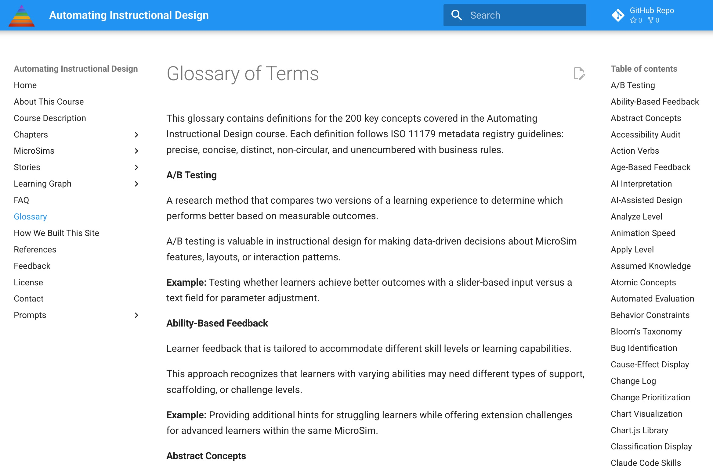
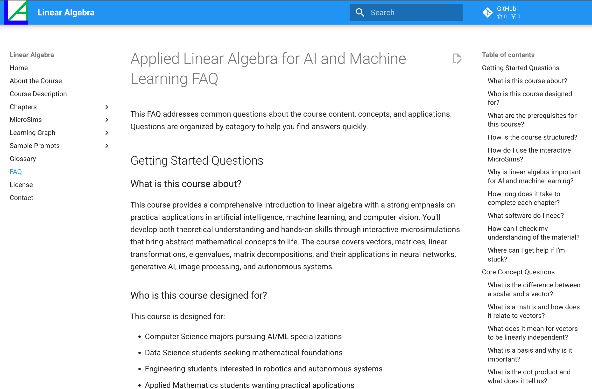
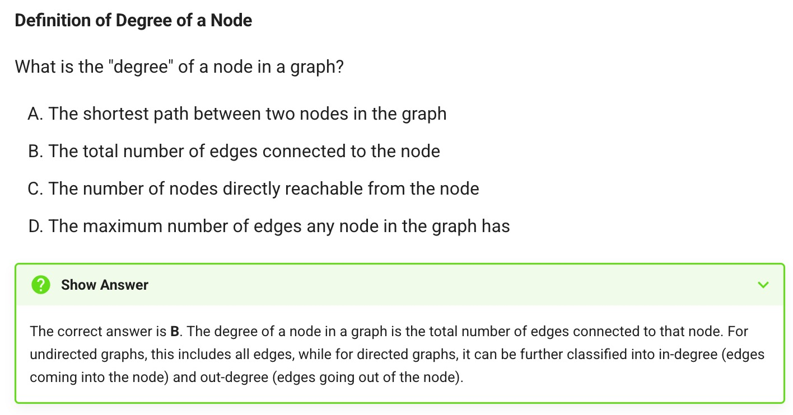
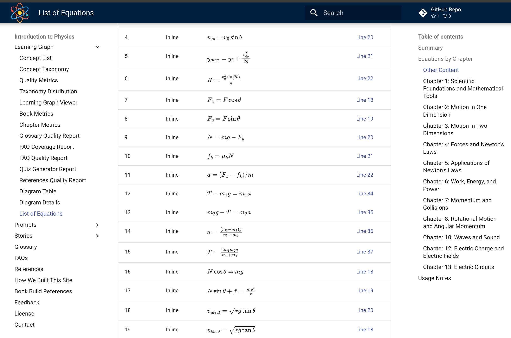
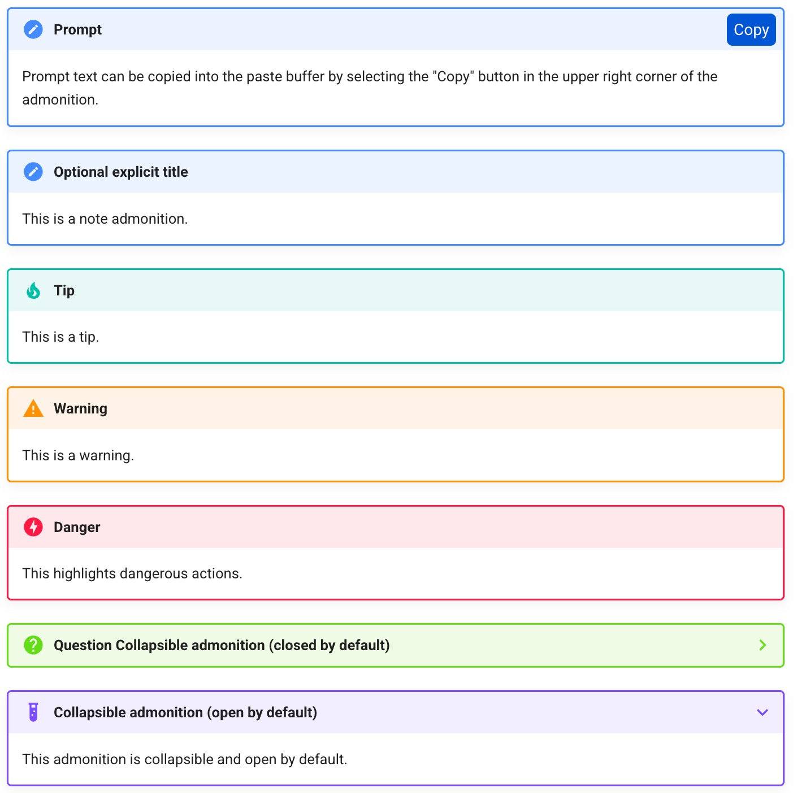
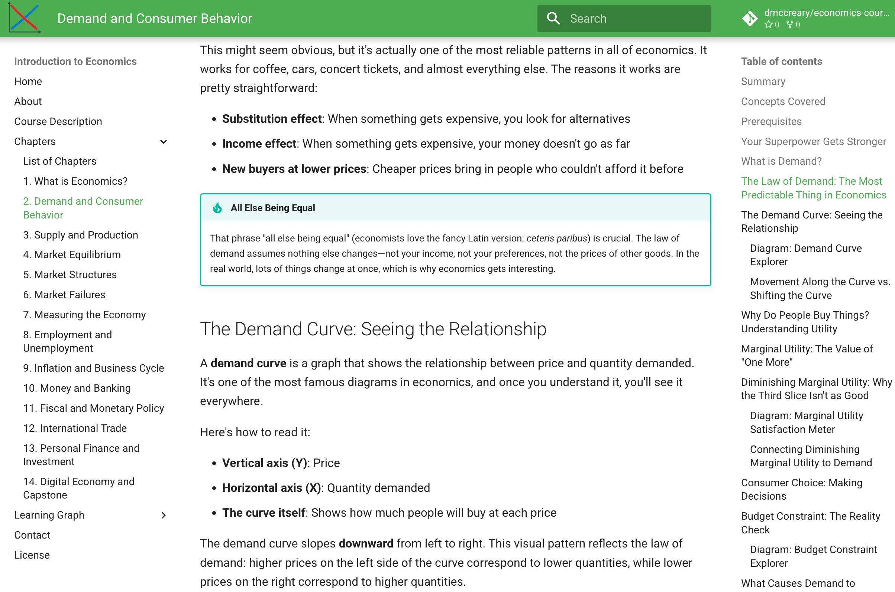

# Chapter 3: Adding Bells and Whistles

With core content in place, additional features transform a good textbook into an exceptional one. This chapter covers the supplementary elements that enhance learning and polish the final product: glossaries, FAQs, quizzes, equation formatting, and visual branding.

## Generating a Glossary of Terms

A comprehensive glossary serves multiple purposes:

- Provides quick reference for terminology
- Establishes consistent definitions across the textbook
- Helps readers who encounter terms out of sequence
- Supports search and navigation

### ISO 11179 Compliance

Glossary definitions should follow the ISO 11179 metadata registry standard, which ensures quality through specific requirements:

**Precise**: Each definition exactly delimits the concept, neither too broad nor too narrow.

**Concise**: Definitions use the minimum words necessary, typically 20-50 words.

**Distinct**: No two definitions should be interchangeable.

**Non-circular**: Definitions cannot use the term being defined.

**Free of business rules**: Definitions describe what something *is*, not how it should be used.

### Generating Glossary Content

AI can generate glossary entries from the concept list. An effective prompt includes:

- The complete concept list
- Requirements for ISO 11179 compliance
- Target definition length (20-50 words)
- Request for examples where helpful (aim for 60-80% of terms)
- Alphabetical ordering requirement

*Figure 3.1: A glossary page from an intelligent textbook built with MkDocs Material. The left sidebar provides navigation, the main content shows ISO 11179-compliant definitions with examples, and the right sidebar offers an alphabetical index for quick access. Each term includes a precise definition and practical example.*

Review generated glossaries for:

- Accuracy of definitions
- Appropriate technical depth
- Cross-reference opportunities
- Consistent terminology

The glossary becomes a living document, updated as content evolves.

## Generating FAQs

Frequently Asked Questions anticipate reader confusion and provide direct answers. Well-designed FAQs:

- Address common misconceptions
- Bridge gaps between concepts
- Provide practical guidance
- Serve as chatbot training data

### FAQ Structure

Organize FAQs into 5-6 categories:

1. **Getting Started**: Basic orientation questions
2. **Core Concepts**: Questions about fundamental ideas
3. **Technical Details**: Implementation and specification questions
4. **Common Challenges**: Troubleshooting and problem-solving
5. **Best Practices**: Guidance for effective application
6. **Advanced Topics**: Questions for deeper exploration

### Bloom's Distribution in FAQs

Balance question complexity across Bloom's Taxonomy levels:

- Remember/Understand: 50% (foundational questions)
- Apply/Analyze: 35% (practical application)
- Evaluate/Create: 15% (advanced thinking)

This distribution ensures FAQs serve learners at all levels.

### Generating FAQ Content

Generate FAQs after at least 30% of chapter content exists, ensuring sufficient context. The prompt should include:

- Course description and learning objectives
- Concept list and glossary
- Existing chapter content
- Target count (aim for 40+ questions)
- Category distribution requirements

Review for:
- Question clarity and naturalness
- Answer accuracy and completeness
- Appropriate references to chapters and concepts
- Balance across categories

*Figure 3.2: An FAQ page from a linear algebra intelligent textbook. Questions are organized by category with expandable answers. The collapsible format keeps the page scannable while providing detailed responses when needed.*

## Generating Quizzes

Assessment is essential for learning. Quizzes allow students to check understanding and identify gaps.

## Self Assessment

Self-assessment quizzes differ from graded exams:

- Immediate feedback after each question
- Explanations for correct and incorrect answers
- Links to relevant content for review
- No time pressure
- Option to retry

This low-stakes format encourages practice and reduces anxiety.

## Quiz Question Types

Multiple question types test different skills:

**Multiple Choice**: Select one correct answer from options. Tests recognition and recall.

**Multiple Select**: Select all correct answers. Tests comprehensive understanding.

**True/False**: Evaluate statement accuracy. Tests factual knowledge.

**Fill-in-the-Blank**: Complete sentences or equations. Tests recall without cues.

**Matching**: Pair related items. Tests relationship understanding.

**Ordering**: Arrange items in correct sequence. Tests process understanding.

For automated generation and grading, multiple choice remains the most practical format.

## Multiple Choice Question Generation

Each multiple choice question consists of:

- **Stem**: The question or incomplete statement
- **Correct answer**: The right response
- **Distractors**: Plausible but incorrect options (typically 3)

Quality multiple choice questions:

- Have clear, unambiguous stems
- Contain only one definitively correct answer
- Include plausible distractors
- Avoid "all of the above" or "none of the above"
- Test understanding rather than memorization alone

## Great Distractors

The quality of a multiple choice question depends largely on its distractors. Great distractors:

**Represent common misconceptions**: Students who misunderstand the concept should find them attractive.

**Are grammatically consistent**: All options should fit the stem naturally.

**Are similar in length and complexity**: The correct answer shouldn't stand out structurally.

**Are definitively wrong**: No ambiguity about incorrectness.

AI-generated distractors often require refinement. Prompt for specific misconception types:

- Confusion between similar concepts
- Application of wrong formulas or methods
- Reversal of cause and effect
- Incomplete understanding of conditions

### Quiz Distribution

Aim for 8-12 questions per chapter, distributed across:

- Bloom's Taxonomy levels (more lower-level for introductory chapters)
- Key concepts (at least 80% concept coverage)
- Question difficulty (mix of easy, medium, hard)

Balance answer positions so correct answers distribute evenly across options.

*Figure 3.3: A multiple choice quiz rendered in MkDocs Material. Each question displays with numbered options, immediate feedback on selection, and explanations for both correct and incorrect answers. This format supports self-paced learning.*

## Formatting Equations

STEM subjects require mathematical notation. Several technologies render equations from LaTeX-like syntax.

## LaTeX

LaTeX is the standard notation for mathematical typesetting. Inline math uses single dollar signs: `$E = mc^2$`. Display math uses double dollar signs or dedicated environments for centered, larger equations.

Common LaTeX elements:

- Fractions: `\frac{numerator}{denominator}`
- Exponents: `x^2` or `x^{complex}`
- Subscripts: `x_1` or `x_{long}`
- Greek letters: `\alpha`, `\beta`, `\gamma`
- Operators: `\sum`, `\int`, `\prod`
- Matrices: `\begin{matrix}...\end{matrix}`

## KaTeX

KaTeX is a fast, lightweight JavaScript library for rendering LaTeX in web browsers. Key characteristics:

- **Speed**: Renders immediately, no visible delay
- **Self-contained**: No external dependencies after loading
- **Limited**: Supports most but not all LaTeX features

KaTeX works well for most educational content. Only very specialized notation may require alternatives.

## MathJax

MathJax is a comprehensive JavaScript library supporting the full range of LaTeX mathematics:

- **Complete**: Supports virtually all LaTeX math features
- **Flexible**: Multiple output formats (HTML, SVG, MathML)
- **Slower**: More rendering overhead than KaTeX

For intelligent textbooks, MathJax is often the safer choice, ensuring any equation can be rendered correctly.

### Configuration

MkDocs Material supports both libraries. Include the appropriate JavaScript in your configuration and use the `pymdownx.arithmatex` extension for processing.

*Figure 3.4: Physics equations rendered with MathJax in an intelligent textbook. Both inline equations and display-mode equations render clearly, with proper formatting for fractions, Greek letters, and operators.*

## Admonitions

Admonitions are callout boxes that highlight special content. MkDocs Material supports numerous types:

**Note**: General information worth highlighting
**Tip**: Helpful suggestions
**Warning**: Cautions and potential problems
**Danger**: Critical warnings
**Example**: Illustrative cases
**Quote**: Citations and quotations
**Abstract/Summary**: Brief overviews
**Info**: Supplementary details
**Question**: Prompts for thought
**Success**: Positive outcomes or confirmations

Admonitions break up text and draw attention to important content. Use them consistently but sparingly—overuse diminishes their impact.

*Figure 3.5: The variety of admonition types available in MkDocs Material. Each type has a distinct color and icon, making it easy for readers to identify the nature of the callout at a glance.*

*Figure 3.6: Admonitions used in context within a textbook page. The note and warning callouts break up the text flow and highlight important information without disrupting the reading experience.*

## Notes, Quotes, and Callouts

Beyond formal admonitions, informal callouts serve similar purposes:

**Notes**: Supplementary information that supports but isn't essential to the main text.

**Quotes**: Expert opinions, historical context, or memorable phrasing.

**Callouts**: Emphasis for critical points, "remember this" content.

Each type serves different purposes:

- Notes for curious readers who want more depth
- Quotes for authority and variety
- Callouts for information that must not be missed

## Generating a Cover from the Course Description

A professional cover establishes credibility and aids discovery. AI image generation tools can create custom covers from descriptions.

An effective cover prompt includes:

- The subject matter (visual elements that represent the domain)
- The mood (professional, approachable, technical, creative)
- Color preferences (often matching the textbook's color scheme)
- Style guidance (illustration, photography, abstract)

Avoid:

- Crowded designs
- Small text (unreadable in thumbnails)
- Generic stock imagery
- Copyrighted content

The cover should work at multiple sizes, from thumbnail to full display.

*Figure 3.7: Custom social media preview cards generated by MkDocs Material. When links are shared on social platforms, these preview images display the book title, description, and branding, improving discoverability and click-through rates.*

## Generating Logos and Favicons

Every intelligent textbook benefits from consistent branding:

**Logo**: Represents the textbook in headers and promotional materials. Should be recognizable at small sizes and work in both color and monochrome.

**Favicon**: The small icon appearing in browser tabs. Must be clear at 32x32 or even 16x16 pixels.

Both can be generated from AI prompts that describe the subject matter and desired style. Simple, bold designs work better than complex illustrations at small sizes.

### Technical Requirements

- Logo: PNG with transparent background, at least 200px width
- Favicon: ICO or PNG format, 32x32 pixels
- Both should work against light and dark backgrounds

The MkDocs Material theme displays the logo in the navigation header and uses the favicon for browser tabs.

---

With these supplementary elements in place—glossary, FAQs, quizzes, equations, admonitions, and branding—the intelligent textbook is well-rounded and professional. Chapter 4 turns to the heart of interactivity: designing and implementing effective MicroSims that bring concepts to life.
