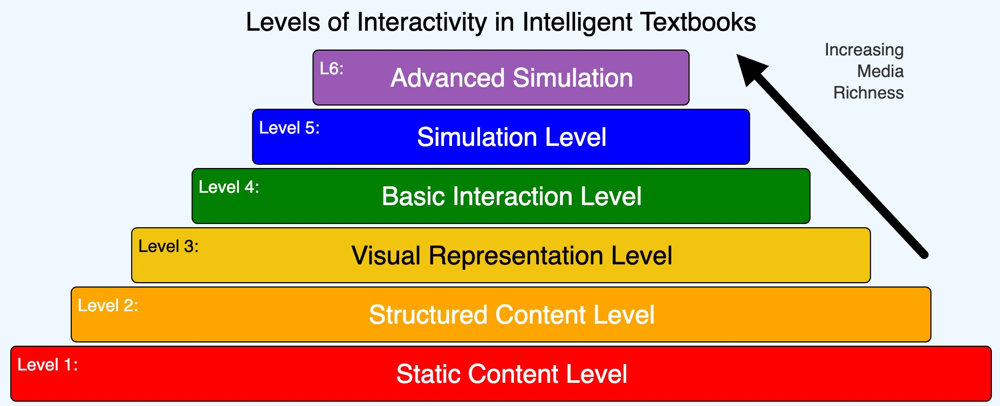
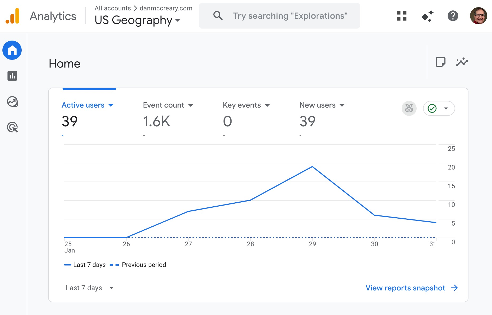

# Chapter 5: Level 2 Book Analytics

Level 2 intelligent textbooks include usage analytics—the ability to understand how students interact with the content. This data enables continuous improvement and provides insight into learning patterns.



*Figure 5.1: A chart showing the spectrum of interactivity levels in educational content. From passive reading (Level 1) through interactive simulations (Level 2) to personalized adaptive systems (Levels 3-5). Level 2 analytics provide the foundation for understanding how students engage with interactive elements.*

## Google Analytics

Google Analytics is the most widely used web analytics platform, and it integrates easily with MkDocs-based textbooks. The free tier provides sufficient capability for most educational projects.

### Setup

Adding Google Analytics requires:

1. Create a Google Analytics account and property
2. Obtain your measurement ID (format: G-XXXXXXXXXX)
3. Add the ID to your MkDocs configuration

In `mkdocs.yml`:

```yaml
extra:
  analytics:
    provider: google
    property: G-XXXXXXXXXX
```

MkDocs Material automatically includes the tracking code on all pages.



*Figure 5.2: Google Analytics 4 dashboard showing real-time usage data for an intelligent textbook. The interface displays active users, event counts, page views, and engagement metrics that help authors understand how students interact with content.*

### Privacy Considerations

Google Analytics collects usage data that, while anonymized, raises privacy considerations:

- Inform users through a privacy policy
- Consider cookie consent mechanisms
- Evaluate whether data collection is necessary for your context
- GDPR and other regulations may apply

For educational contexts, especially those involving minors, consult relevant policies before implementing analytics.

## Metrics

Analytics platforms provide numerous metrics. Focus on those that inform educational improvement.

## View

Basic view metrics include:

**Page Views**: Total number of pages viewed. Indicates overall usage volume.

**Unique Page Views**: Distinct viewing sessions per page. Removes repeat views within a session.

**Users**: Distinct individuals (technically, distinct browsers) accessing the content.

**Sessions**: Periods of continuous activity, with 30-minute timeout.

These metrics establish baseline usage and identify popular content.

## Engagement

Engagement metrics reveal interaction depth:

**Average Time on Page**: How long users spend before navigating away. Longer times suggest engaged reading.

**Bounce Rate**: Percentage of single-page sessions. High bounce rates may indicate navigation problems or mismatched expectations.

**Pages per Session**: How many pages users view in one visit. Higher numbers suggest exploration and engagement.

**Scroll Depth**: How far down pages users scroll. Indicates whether content is fully read.

## Monitoring Pageviews

Pageview data answers fundamental questions:

- Which chapters are most popular?
- Which pages are rarely visited?
- What are common entry points?
- Where do users typically exit?

This information guides content priorities. Popular pages deserve more polish; unpopular pages may need better discovery or different content.

## Monitoring Scrolling

Scroll depth reveals reading behavior:

- Do users read entire pages or abandon partway?
- Where do readers typically stop scrolling?
- Do interactive elements at page bottom get seen?

Scroll tracking requires additional JavaScript beyond basic analytics. The pattern:

```javascript
window.addEventListener('scroll', function() {
  let scrollPercent = (window.scrollY / document.body.scrollHeight) * 100;
  // Track milestone percentages: 25%, 50%, 75%, 100%
});
```

Send events when users cross threshold percentages.

## Using JavaScript for Activity Monitoring

Custom JavaScript extends beyond standard analytics:

```javascript
// Track time on page
let startTime = Date.now();
window.addEventListener('beforeunload', function() {
  let timeSpent = Date.now() - startTime;
  // Send time data to analytics
});
```

This approach captures fine-grained interaction data that standard analytics miss.

## Instrumenting MicroSim Activity

MicroSims provide rich opportunities for interaction tracking. Understanding how students use simulations reveals learning patterns.

### What to Track

**Simulation Loads**: When does the MicroSim appear in the viewport?

**Interaction Start**: When does the user first interact (not just view)?

**Parameter Changes**: Which controls do users adjust?

**Value Distributions**: What parameter values do users explore?

**Session Duration**: How long do users engage with the simulation?

**Repeat Visits**: Do users return to the same simulation?

## Monitoring In-Simulation Actions

Within MicroSims, track specific interactions:

```javascript
function mousePressed() {
  if (isOverButton) {
    gtag('event', 'microsim_button_click', {
      'sim_name': 'ohms-law',
      'button_name': 'reset'
    });
  }
}
```

Use Google Analytics 4's custom event tracking to capture these interactions.

## Monitoring Start Simulation

Distinguish between passive viewing and active engagement:

```javascript
let hasInteracted = false;

function mousePressed() {
  if (!hasInteracted) {
    hasInteracted = true;
    gtag('event', 'microsim_start', {
      'sim_name': 'ohms-law'
    });
  }
  // ... rest of interaction handling
}
```

The first interaction signals intentional engagement, not just scrolling past.

## Monitoring Slider Activity

Slider interactions reveal exploration patterns:

```javascript
function sliderChanged(sliderName, oldValue, newValue) {
  gtag('event', 'microsim_slider', {
    'sim_name': 'ohms-law',
    'slider_name': sliderName,
    'old_value': oldValue,
    'new_value': newValue
  });
}
```

Aggregate this data to understand:

- Which parameters do users adjust most?
- What value ranges do users explore?
- Do users find extreme values or stay near defaults?
- Do users systematically explore or make random changes?

### Aggregating Interaction Data

Individual events become meaningful through aggregation:

- **Heatmaps**: Visualize where slider values cluster
- **Sequences**: Understand common interaction patterns
- **Funnels**: Track progression through multi-step simulations
- **Cohorts**: Compare behavior across different user groups

### Balancing Data Collection

More data isn't always better:

- Track what informs decisions, not everything possible
- Consider storage and analysis costs
- Respect user privacy
- Don't let tracking slow down simulations

Start with essential metrics and expand based on specific questions.

---

## Using Analytics for Improvement

Data collection serves improvement. Regular analysis reveals:

**Content Gaps**: Pages with high bounce rates may confuse users or fail expectations.

**Navigation Issues**: Unexpected exit points suggest missing links or confusing structure.

**MicroSim Problems**: Simulations rarely engaged may be hard to discover, unclear, or broken.

**Learning Obstacles**: Pages where users spend excessive time may contain confusing content.

### Iterative Improvement

Use analytics in improvement cycles:

1. Identify metrics suggesting problems
2. Hypothesize causes
3. Make targeted changes
4. Monitor impact on metrics
5. Iterate

This data-driven approach ensures changes actually improve learning outcomes.

---

Level 2 analytics provide visibility into usage without requiring individual learner tracking. Chapter 6 explores Level 3 capabilities, where personalized tracking enables adaptive learning paths.
