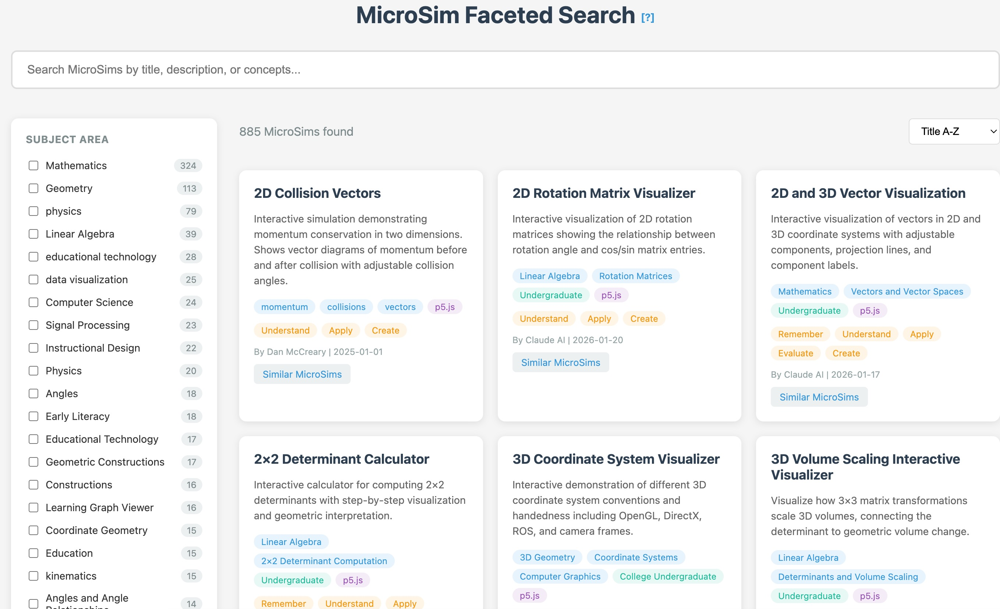

# Chapter 7: Learning Standards

As intelligent textbooks mature, interoperability becomes important. Standards enable textbooks to communicate with learning management systems, share data across platforms, and participate in larger educational ecosystems.

## xAPI

The Experience API (xAPI, formerly Tin Can API) is a specification for learning technology that enables tracking learning experiences across different systems.


*Figure 7.1: Network diagram showing relationships between learning technology standards and regulations. Central nodes include xAPI and Learning Record Stores (LRS), which connect to LMS platforms, intelligent textbooks, and regulatory frameworks (FERPA, GDPR). Labeled edges show relationships: "defines," "connects," "describes," and "must comply."*

### Core Concepts

xAPI uses a simple statement structure:

**Actor**: Who did the action (learner identity)
**Verb**: What action was taken (e.g., completed, answered, experienced)
**Object**: What was acted upon (content, question, activity)

Example statement:
```json
{
  "actor": {
    "mbox": "mailto:learner@example.com"
  },
  "verb": {
    "id": "http://adlnet.gov/expapi/verbs/completed"
  },
  "object": {
    "id": "http://example.com/courses/electronics/chapter-3",
    "definition": {
      "name": {"en-US": "Circuit Analysis Basics"}
    }
  }
}
```

### Extended Statements

Additional elements enrich statements:

**Result**: Outcome information (score, success, duration)
**Context**: Additional context (instructor, platform, related activities)
**Timestamp**: When the experience occurred

### xAPI for Intelligent Textbooks

Map textbook interactions to xAPI statements:

| Textbook Event | xAPI Verb | Object Type |
|----------------|-----------|-------------|
| View page | experienced | Page |
| Complete chapter | completed | Chapter |
| Answer quiz question | answered | Question |
| Pass quiz | passed | Assessment |
| Interact with MicroSim | interacted | Activity |

This mapping enables textbooks to report learning experiences to any xAPI-compatible system.

## Learning Record Stores

Learning Record Stores (LRS) are databases designed to store xAPI statements. They provide:

**Statement Storage**: Persist learning experience data

**Query API**: Retrieve statements by actor, verb, object, or time

**Aggregation**: Compute statistics across statements

**Forwarding**: Send statements to other LRS systems

### LRS Options

Several LRS implementations exist:

**Learning Locker** (open source): Full-featured, self-hosted option

**Watershed** (commercial): Cloud-hosted with analytics

**SCORM Cloud** (commercial): Includes SCORM compatibility

**Custom Implementation**: xAPI spec is simple enough to implement directly

For intelligent textbooks, an LRS enables centralized learning data across multiple textbooks and systems.

## Skills

Skills represent discrete competencies that learners develop. Unlike concepts (which are units of knowledge), skills emphasize what learners can do.

### Skill Taxonomies

Standardized skill taxonomies enable interoperability:

**O*NET**: US Department of Labor occupational skills database
**ESCO**: European Skills, Competences, and Occupations
**Industry-specific**: Domain-specific skill frameworks

### Skills in Intelligent Textbooks

Map concepts to skills to answer: "What can the learner do after mastering this content?"

A circuit analysis concept might map to skills like:
- Calculate current in series circuits
- Identify voltage drops in parallel circuits
- Select appropriate components for given requirements

Skills-based reporting connects educational content to workforce development.

## MicroSim Metadata

Rich metadata makes MicroSims discoverable and reusable. Standard metadata fields:

**Identification**:
- Unique identifier (URI)
- Title and description
- Author and creation date

**Educational**:
- Target concepts
- Bloom's Taxonomy level
- Prerequisite knowledge
- Estimated interaction time

**Technical**:
- File format and dependencies
- Minimum screen size
- Accessibility features

**Classification**:
- Subject area
- Keywords and tags
- Related simulations

### Metadata Format

JSON provides a flexible metadata format:

```json
{
  "id": "https://example.com/sims/ohms-law",
  "title": "Ohm's Law Explorer",
  "description": "Interactive simulation of voltage-current relationships",
  "concepts": ["ohms-law", "voltage", "current", "resistance"],
  "bloomLevel": "apply",
  "duration": "5-10 minutes",
  "author": "Dan McCreary",
  "created": "2026-01-15"
}
```

## MicroSim Faceted Search

With proper metadata, MicroSims become searchable assets:

**Faceted Search Interface**:
- Filter by subject area
- Filter by Bloom's Taxonomy level
- Filter by concept
- Filter by interaction type

**Discovery Features**:
- Similar simulations ("users who used this also used...")
- Prerequisite chains ("before this simulation, try...")
- Complementary resources ("related content...")

A central MicroSim repository could serve multiple intelligent textbooks, reducing duplication and increasing quality.



*Figure 7.2: A faceted search interface for discovering MicroSims. The left sidebar provides filters by subject area, Bloom's Taxonomy level, and interaction type. The main area displays matching simulations with thumbnails and descriptions. This interface demonstrates how proper metadata enables discoverable educational resources.*

## Intelligent Textbook Standards

Beyond individual specifications, the intelligent textbook ecosystem needs broader standards:

### Learning Graph Format

A standard format for learning graphs enables:
- Exchange between authoring tools
- Analysis by independent tools
- Integration with curriculum management systems

Candidate format elements:
- Concept identification and labeling
- Dependency relationships
- Taxonomy categories
- Mapping to external skill frameworks

### Textbook Metadata

Standard textbook metadata enables discovery:
- Course description elements
- Target audience
- Prerequisites
- Content inventory
- Assessment information

### Interoperability Profiles

Define levels of interoperability:

**Level 1**: Standard metadata for discovery
**Level 2**: xAPI integration for tracking
**Level 3**: Learning graph exchange
**Level 4**: Real-time adaptive integration

Each level builds on previous, allowing incremental adoption.

### Schema Definition

This book uses a schema URI to identify compliant textbooks:

```yaml
extra:
  schema: https://dmccreary.github.io/intelligent-textbooks/ns/textbook/v1
```

Textbooks declaring this schema commit to:
- Standard directory structure
- Required metadata files
- Compatible MicroSim format
- Documented concept organization

---

## Benefits of Standardization

Investing in standards pays dividends:

**For Authors**: Reusable components, shared tooling, community resources

**For Learners**: Portable credentials, cross-platform progress, recognized achievements

**For Institutions**: Easier integration, comparative analytics, vendor flexibility

**For the Ecosystem**: Growing repository of interoperable educational resources

---

Standards emerge through use. The intelligent textbook community is early in this process. Chapter 8 explores the next level of intelligence: chatbots that can engage learners in natural language dialogue.
