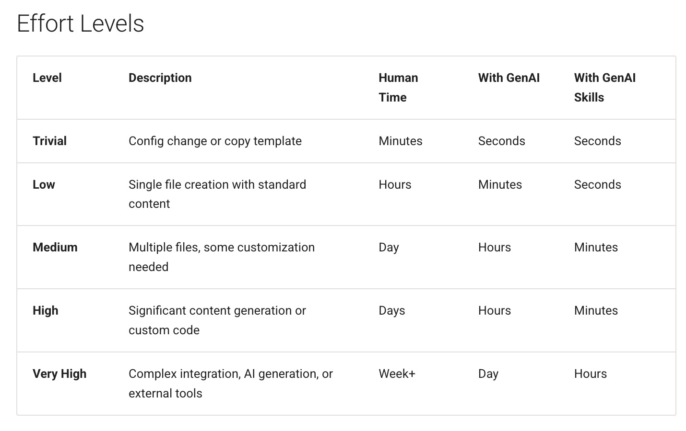
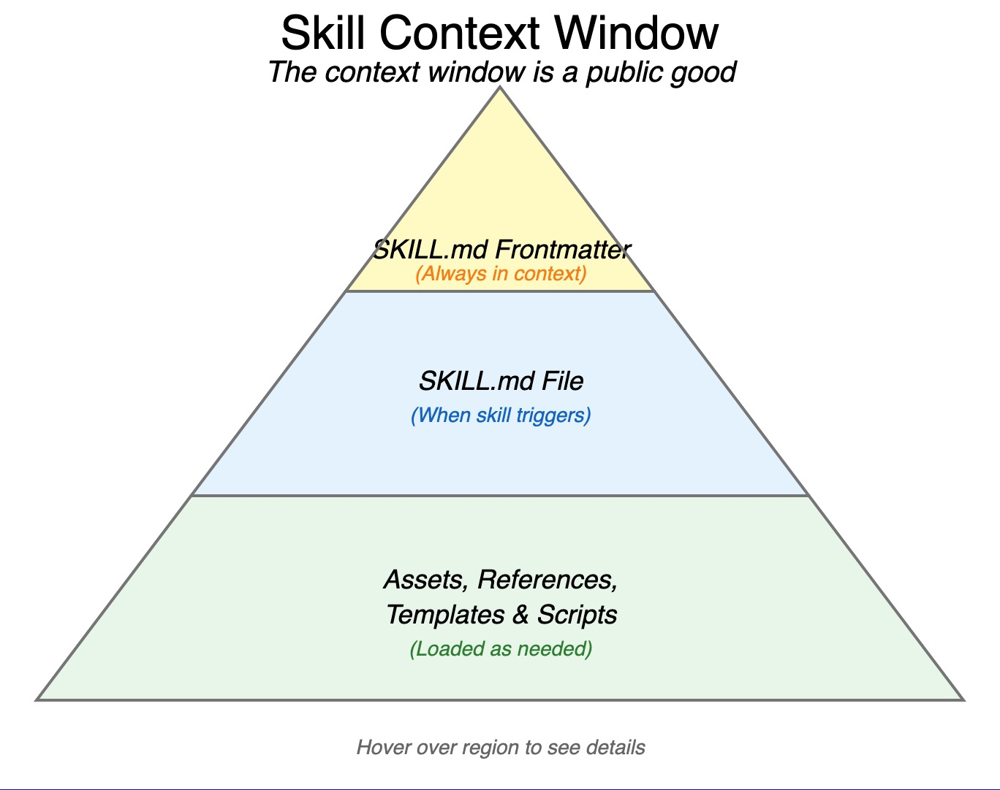
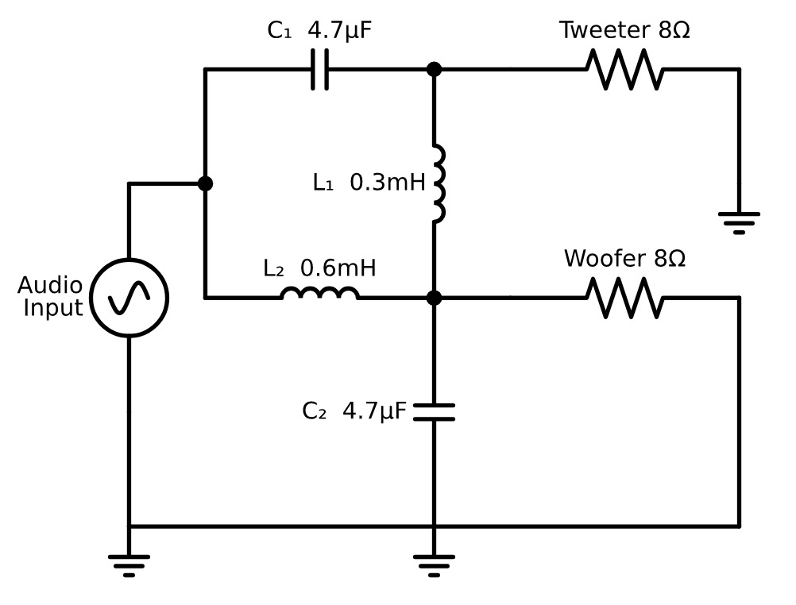

# Chapter 9: Generating Skills

AI skills are structured prompts and workflows that enable language models to perform specific, repeatable tasks. For intelligent textbook creation, skills transform ad-hoc prompting into systematic, reliable processes.

## What Are AI Skills

A skill is a reusable capability that:

- Addresses a specific, well-defined task
- Includes context and instructions for the task
- Produces consistent output format
- Can be invoked repeatedly with different inputs

Skills differ from one-off prompts in their structure and reusability. Rather than crafting a new prompt each time, invoke a skill that encapsulates best practices.



*Figure 9.3: Comparison of effort levels across three approaches. Trivial tasks (config changes) take minutes manually but seconds with GenAI. High-effort tasks (significant content generation) drop from days to hours with GenAI, and to minutes with specialized skills. The multiplicative time savings justify the investment in skill development.*

### Skill Components

A well-defined skill includes:

**Name and Description**: Clear identification of what the skill does.

**Trigger Conditions**: When should this skill be used?

**Input Requirements**: What information must be provided?

**Process Steps**: What does the skill do with the input?

**Output Specification**: What format and content will be produced?

**Quality Criteria**: How is output quality assessed?

## Skills and Agents

AI agents combine skills with decision-making capability:

**Skills**: Individual capabilities (generate a quiz, create a MicroSim)

**Agents**: Systems that select and sequence skills to accomplish goals

For textbook generation, an agent might:

1. Assess the current state of the textbook
2. Identify what's missing or needs improvement
3. Select appropriate skills to address gaps
4. Execute skills in appropriate order
5. Validate results

This agent-based approach enables more autonomous operation.

## Tasks, Workflows, and Skill Matching

### Task Decomposition

Complex tasks break into skill-appropriate subtasks:

**Task**: Create Chapter 5
**Subtasks**:
- Generate chapter outline (outline skill)
- Write each section (content generation skill)
- Create section diagrams (diagram skill)
- Add MicroSims (MicroSim skill)
- Generate review questions (quiz skill)

### Workflow Orchestration

Skills execute in sequences respecting dependencies:

1. Learning graph must exist before chapters
2. Glossary should exist before detailed content
3. Content must exist before quizzes
4. All content before final quality check

Workflow tools coordinate skill execution.

## Managing the Context Window

Language models have limited context windows—the amount of text they can process at once. Skill design must respect these limits.

### Context Strategies

**Selective Inclusion**: Only include information relevant to the current task.

**Summarization**: Compress large documents into essential points.

**Chunking**: Process large tasks in manageable pieces.

**Progressive Refinement**: Build up complex outputs through multiple passes.

### Example: Chapter Generation

A full textbook won't fit in context. Instead:

1. Provide course description and chapter outline
2. Include glossary terms relevant to this chapter
3. Add immediately preceding chapter summary for continuity
4. Reference concept list but not full dependency graph

This selective context enables high-quality generation within limits.



*Figure 9.2: Diagram showing how skills selectively include relevant information within the limited context window. Only the necessary elements—course description, chapter outline, relevant glossary terms—are included, while extraneous content is excluded to stay within token limits.*

## Case Study: Claude Code Skills

Claude Code provides a practical example of skills in action. Its skill system includes:

**Skill Definition**: Markdown files in a `skills/` directory describing each skill's purpose, inputs, and outputs.

**Skill Discovery**: The system identifies available skills and matches them to user requests.

**Skill Execution**: Selected skills receive appropriate context and produce structured outputs.

**Skill Chaining**: Complex tasks invoke multiple skills in sequence.

This architecture enables Claude Code to handle diverse software development tasks through composable capabilities.

### Skill Structure

A Claude Code skill file includes:

```markdown
# Skill Name

## Description
What this skill does and when to use it.

## Inputs
- Input 1: Description
- Input 2: Description

## Process
1. Step one
2. Step two
3. Step three

## Output
Description of expected output format.
```

This structure makes skills discoverable and executable.

## Skills as a Standard

Standardizing skill definitions enables sharing and interoperability:

**Portable Skills**: Skills defined once, used across projects.

**Skill Libraries**: Collections of skills for specific domains.

**Skill Composition**: Complex skills built from simpler ones.

**Quality Metrics**: Standard ways to evaluate skill performance.

### Skill Interchange Format

A standard format might include:

```json
{
  "name": "generate-quiz",
  "version": "1.0",
  "description": "Generate multiple-choice quiz questions",
  "inputs": {
    "chapter_content": "Markdown content to quiz on",
    "concept_list": "Concepts to assess",
    "question_count": "Number of questions (default: 10)"
  },
  "outputs": {
    "questions": "Array of quiz question objects"
  },
  "prompt_template": "...",
  "quality_metrics": ["concept_coverage", "bloom_distribution"]
}
```

## Book Generation Skills

For intelligent textbook creation, a standard skill set includes:

### Learning Graph Skill

Generates the concept dependency graph from course description.

**Input**: Course description document
**Output**: Concept list, dependencies, taxonomy
**Quality**: Valid DAG, balanced categories, complete coverage

### Chapter Generator Skill

Creates chapter content from outline and concept list.

**Input**: Chapter outline, concepts, glossary, prior chapters
**Output**: Complete chapter markdown
**Quality**: Word count, scaffolding compliance, prerequisite respect

### Glossary Generator Skill

Produces ISO 11179-compliant definitions.

**Input**: Concept list, course context
**Output**: Alphabetized glossary entries
**Quality**: Definition quality, example coverage, cross-references

### Quiz Generator Skill

Creates assessment questions aligned to concepts.

**Input**: Chapter content, concept list, Bloom's distribution target
**Output**: Multiple-choice questions with explanations
**Quality**: Concept coverage, distractor quality, answer balance

### FAQ Generator Skill

Produces frequently asked questions and answers.

**Input**: Course description, chapter content, glossary
**Output**: Categorized FAQ document
**Quality**: Coverage, Bloom's distribution, answer accuracy

## MicroSim Generation Skills

MicroSim creation requires specialized skills:

### Concept-to-Sim Skill

Identifies concepts that would benefit from simulation.

**Input**: Concept list with descriptions
**Output**: Ranked list of simulation candidates with rationale

### Sim Design Skill

Creates simulation specifications from concepts.

**Input**: Concept to simulate, target Bloom's level
**Output**: Simulation spec (controls, visualization, behavior)

### P5.js Implementation Skill

Generates working simulation code.

**Input**: Simulation specification
**Output**: Complete p5.js implementation
**Quality**: Functional correctness, code quality, responsiveness

### Sim Documentation Skill

Creates documentation and embedding code.

**Input**: Simulation code, concept information
**Output**: index.md file with context and usage



*Figure 9.1: A circuit diagram generated by a specialized skill. The skill takes a circuit description as input and produces a properly formatted schematic diagram. Specialized skills like this enable AI to produce domain-specific visualizations that would otherwise require expert tools.*

## Search and Reuse

As skill libraries grow, discovery becomes important:

### Skill Search

Find relevant skills through:
- Keyword matching on names and descriptions
- Semantic search using skill embeddings
- Filtering by input/output types
- Filtering by domain or task category

### Skill Reuse Patterns

**Direct Reuse**: Use skill as-is for matching tasks.

**Parameterized Reuse**: Adjust skill parameters for variants.

**Composition**: Combine skills for complex tasks.

**Adaptation**: Modify skill for related but different tasks.

## Embeddings and Ad-Hoc MicroSims

For advanced use, generate custom MicroSims on demand:

### Semantic Matching

When a learner struggles with a concept:

1. Embed the concept description
2. Search for similar existing MicroSims
3. If good match exists, suggest it
4. If no match, consider generating new simulation

### Dynamic Generation

Generate MicroSims in response to learner needs:

1. Identify the concept causing difficulty
2. Determine appropriate visualization approach
3. Invoke MicroSim generation skill
4. Validate generated simulation
5. Present to learner with explanation

This approach enables personalized interactive content, though validation remains challenging.

---

## Building Your Skill Library

Start with essential skills:

1. **Learning Graph**: Foundation for all other content
2. **Glossary**: Establishes terminology
3. **Chapter Content**: Core educational material
4. **Quiz**: Assessment for learning validation
5. **FAQ**: Common questions and answers

Add specialized skills as needs emerge:

- MicroSim generation for interactive content
- Diagram generation for visual explanations
- Code example generation for programming topics
- Problem set generation for practice exercises

Document each skill thoroughly. Future you (and collaborators) will thank present you.

---

Chapter 10 looks ahead at the trajectory of AI capabilities and what it means for the future of intelligent textbooks.
