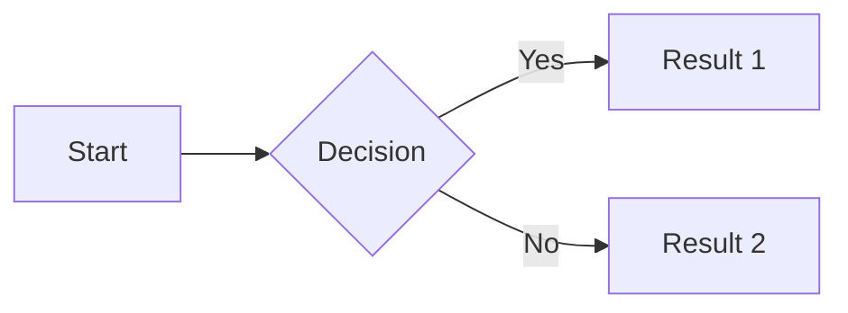

# Complete MkDocs Configuration Reference

Comprehensive `mkdocs.yml` configuration for intelligent textbooks.

## Basic Configuration

### Minimal Setup

```yaml
site_name: My Intelligent Textbook
site_description: An interactive learning experience
site_author: Your Name
site_url: https://yourusername.github.io/repo-name/

theme:
  name: material

plugins:
  - search
```

---

## Production-Ready Configuration

### Complete mkdocs.yml Template

```yaml
# Site Information
site_name: My Intelligent Textbook
site_description: Interactive textbook demonstrating Level 2+ intelligence features
site_author: Your Name
site_url: https://yourusername.github.io/repo-name/

# Repository Information (optional but recommended)
repo_url: https://github.com/yourusername/repo-name
repo_name: yourusername/repo-name
edit_uri: edit/main/docs/

# Copyright
copyright: Copyright &copy; 2025 Your Name

# Theme Configuration
theme:
  name: material

  # Color Palette
  palette:
    # Light mode
    - scheme: default
      primary: indigo
      accent: indigo
      toggle:
        icon: material/brightness-7
        name: Switch to dark mode

    # Dark mode
    - scheme: slate
      primary: indigo
      accent: indigo
      toggle:
        icon: material/brightness-4
        name: Switch to light mode

  # Typography
  font:
    text: Roboto
    code: Roboto Mono

  # Logo and Favicon
  logo: assets/logo.png
  favicon: assets/favicon.ico

  # Features
  features:
    # Navigation
    - navigation.instant       # Instant loading (SPA-like)
    - navigation.tracking      # Anchor tracking
    - navigation.tabs          # Top-level sections as tabs
    - navigation.tabs.sticky   # Sticky tabs
    - navigation.sections      # Section index pages
    - navigation.expand        # Expand nav by default
    - navigation.path          # Show breadcrumb path
    - navigation.indexes       # Section index pages
    - navigation.top           # Back to top button

    # Search
    - search.suggest           # Search suggestions
    - search.highlight         # Highlight search terms
    - search.share             # Share search results

    # Header
    - header.autohide          # Hide header on scroll

    # Content
    - content.code.copy        # Copy code button
    - content.code.annotate    # Code annotations
    - content.tabs.link        # Link content tabs
    - content.tooltips         # Tooltips

    # Table of Contents
    - toc.follow               # Follow TOC scroll
    - toc.integrate            # Integrate TOC in nav

# Plugins
plugins:
  - search:
      lang: en
      separator: '[\s\-,:!=\[\]()"/]+|\.(?!\d)|&[lg]t;|(?!\b)(?=[A-Z][a-z])'

  - social:
      cards: true
      cards_layout_options:
        background_color: "#1e3a8a"
        color: "#ffffff"

  # Optional: Custom plugin for social override
  # - social_override

# Markdown Extensions
markdown_extensions:
  # Python Markdown
  - abbr                        # Abbreviations
  - admonition                  # Admonitions (notes, warnings)
  - attr_list                   # Attribute lists for HTML/CSS
  - def_list                    # Definition lists
  - footnotes                   # Footnotes
  - md_in_html                  # Markdown in HTML
  - toc:
      permalink: true
      permalink_title: Link to this section
      toc_depth: 3
  - tables                      # Tables

  # PyMdown Extensions
  - pymdownx.arithmatex:        # Math equations
      generic: true
  - pymdownx.betterem:          # Better emphasis
      smart_enable: all
  - pymdownx.caret              # Superscript (^)
  - pymdownx.mark               # Highlighting (==text==)
  - pymdownx.tilde              # Subscript (~)
  - pymdownx.critic             # Track changes
  - pymdownx.details            # Collapsible admonitions
  - pymdownx.emoji:             # Emoji support
      emoji_index: !!python/name:material.extensions.emoji.twemoji
      emoji_generator: !!python/name:material.extensions.emoji.to_svg
  - pymdownx.highlight:         # Code highlighting
      anchor_linenums: true
      line_spans: __span
      pygments_lang_class: true
  - pymdownx.inlinehilite       # Inline code highlighting
  - pymdownx.keys               # Keyboard keys
  - pymdownx.magiclink:         # Auto-link URLs
      repo_url_shorthand: true
      user: yourusername
      repo: repo-name
  - pymdownx.smartsymbols       # Smart symbols
  - pymdownx.snippets           # Include external files
  - pymdownx.superfences:       # Nested code blocks
      custom_fences:
        - name: mermaid
          class: mermaid
          format: !!python/name:pymdownx.superfences.fence_code_format
  - pymdownx.tabbed:            # Tabbed content
      alternate_style: true
  - pymdownx.tasklist:          # Task lists
      custom_checkbox: true

# Extra CSS and JavaScript
extra_css:
  - css/extra.css
  - css/microsims.css

extra_javascript:
  - js/extra.js
  # MathJax for equations
  - https://polyfill.io/v3/polyfill.min.js?features=es6
  - https://cdn.jsdelivr.net/npm/mathjax@3/es5/tex-mml-chtml.js

# Extra Configuration
extra:
  # Analytics
  analytics:
    provider: google
    property: G-XXXXXXXXXX
    feedback:
      title: Was this page helpful?
      ratings:
        - icon: material/emoticon-happy-outline
          name: This page was helpful
          data: 1
          note: Thanks for your feedback!
        - icon: material/emoticon-sad-outline
          name: This page could be improved
          data: 0
          note: Thanks for your feedback!

  # Social Links
  social:
    - icon: fontawesome/brands/github
      link: https://github.com/yourusername
    - icon: fontawesome/brands/twitter
      link: https://twitter.com/yourusername
    - icon: fontawesome/brands/linkedin
      link: https://linkedin.com/in/yourusername

  # Version selector (if you have multiple versions)
  version:
    provider: mike

  # Generator notice
  generator: false  # Hide "Made with Material for MkDocs"

# Navigation Structure
nav:
  - Home: index.md

  - Getting Started:
      - tutorial/index.md
      - Installation: tutorial/installation.md
      - Quick Start: tutorial/quickstart.md
      - Your First Textbook: tutorial/first-textbook.md

  - Concepts:
      - concepts/index.md
      - Five Levels: concepts/five-levels.md
      - Learning Graphs: concepts/learning-graphs.md
      - Bloom's Taxonomy: concepts/blooms-taxonomy.md
      - MicroSims: concepts/microsims.md
      - Pedagogy: concepts/pedagogy.md

  - Workflows:
      - workflows/index.md
      - Step 1 - Course Description: workflows/01-course-description.md
      - Step 2 - Enumerate Concepts: workflows/02-enumerate-concepts.md
      - Step 3 - Dependency Graph: workflows/03-dependency-graph.md
      - Step 4 - Taxonomy: workflows/04-taxonomy.md
      - Step 5 - Glossary: workflows/05-glossary.md
      - Chapter Development: workflows/chapter-development.md

  - MicroSims:
      - sims/index.md
      - Templates: sims/templates/index.md
      - Book Levels: sims/book-levels/index.md
      - Learning Graph: sims/learning-graph/index.md
      - Bloom's Taxonomy: sims/blooms-taxonomy/index.md

  - Prompts:
      - prompts/index.md
      - Learning Graph:
          - prompts/learning-graph/00-course-description.md
          - prompts/learning-graph/01-personas.md
          - prompts/learning-graph/02-enumerate-concepts.md
          - prompts/learning-graph/03-dependency-graph.md
          - prompts/learning-graph/04-taxonomy.md
      - Content Generation:
          - prompts/content/chapter-content.md
          - prompts/content/glossary.md
          - prompts/content/faq.md

  - Case Studies:
      - case-studies/index.md
      - Example 1: case-studies/example-1.md
      - Example 2: case-studies/example-2.md

  - Reference:
      - Glossary: glossary.md
      - Resources: reference/resources.md
      - FAQ: reference/faq.md

# Watch for changes (development)
watch:
  - docs
  - custom_theme
```

---

## Configuration by Feature

### Social Cards Configuration

Generate preview images for social media sharing:

```yaml
plugins:
  - social:
      cards: true
      cards_layout: default
      cards_layout_options:
        background_color: "#1e3a8a"  # Dark blue
        color: "#ffffff"              # White text
        font_family: Roboto
```

### Custom Social Images Per Page

In page frontmatter:

```yaml
---
title: Page Title
image: /path/to/custom-image.png
---
```

### Search Configuration

Enhanced search with better tokenization:

```yaml
plugins:
  - search:
      lang: en
      separator: '[\s\-,:!=\[\]()"/]+|\.(?!\d)|&[lg]t;|(?!\b)(?=[A-Z][a-z])'
      pipeline:
        - stemmer
        - stopWordFilter
        - trimmer
```

### Math Equations (MathJax)

```yaml
markdown_extensions:
  - pymdownx.arithmatex:
      generic: true

extra_javascript:
  - https://polyfill.io/v3/polyfill.min.js?features=es6
  - https://cdn.jsdelivr.net/npm/mathjax@3/es5/tex-mml-chtml.js
```

Usage in markdown:
```markdown
Inline equation: $E = mc^2$

Block equation:
$$
\int_{-\infty}^{\infty} e^{-x^2} dx = \sqrt{\pi}
$$
```

### Code Highlighting

```yaml
markdown_extensions:
  - pymdownx.highlight:
      anchor_linenums: true        # Link to line numbers
      line_spans: __span
      pygments_lang_class: true
  - pymdownx.inlinehilite          # Inline code: `#!python print()`
  - pymdownx.superfences           # Code fences with extras
```

### Diagrams with Mermaid

```yaml
markdown_extensions:
  - pymdownx.superfences:
      custom_fences:
        - name: mermaid
          class: mermaid
          format: !!python/name:pymdownx.superfences.fence_code_format
```

Usage:
````markdown

````

### Admonitions (Notes, Warnings)

```yaml
markdown_extensions:
  - admonition
  - pymdownx.details
```

Usage:
```markdown
!!! note
    This is a note

!!! warning "Custom Title"
    This is a warning with custom title

??? tip "Collapsible Tip"
    This is collapsible
```

---

## Custom CSS and JavaScript

### extra.css Example

```css
/* Custom styles for intelligent textbook */

/* MicroSim iframes */
iframe {
    border: 2px solid #ccc;
    border-radius: 8px;
    margin: 20px 0;
}

/* Glossary term styling */
.glossary-term {
    font-weight: bold;
    color: #1e3a8a;
}

/* Learning graph visualization */
.learning-graph {
    max-width: 100%;
    margin: 20px auto;
}

/* Responsive adjustments for MicroSims */
@media (max-width: 768px) {
    iframe {
        height: 400px !important;
    }
}

/* Concept cards */
.concept-card {
    border: 1px solid #e0e0e0;
    border-radius: 8px;
    padding: 16px;
    margin: 12px 0;
    background: #f9f9f9;
}

.concept-card h3 {
    margin-top: 0;
    color: #1e3a8a;
}

/* Progress indicator */
.progress-bar {
    width: 100%;
    height: 8px;
    background: #e0e0e0;
    border-radius: 4px;
    overflow: hidden;
}

.progress-bar-fill {
    height: 100%;
    background: linear-gradient(90deg, #4f46e5, #06b6d4);
    transition: width 0.3s ease;
}
```

### extra.js Example

```javascript
// Custom JavaScript for intelligent textbook features

document.addEventListener('DOMContentLoaded', function() {
    // Glossary term tooltips
    initGlossaryTooltips();

    // Track learning progress
    initProgressTracking();

    // MicroSim analytics
    trackMicroSimInteractions();
});

function initGlossaryTooltips() {
    const terms = document.querySelectorAll('.glossary-term');
    terms.forEach(term => {
        term.addEventListener('mouseenter', showTooltip);
        term.addEventListener('mouseleave', hideTooltip);
    });
}

function initProgressTracking() {
    // Track which concepts have been visited
    const conceptPages = [
        '/concepts/learning-graphs/',
        '/concepts/microsims/',
        // ... add all concept pages
    ];

    const visited = JSON.parse(localStorage.getItem('visited') || '[]');
    const currentPath = window.location.pathname;

    if (conceptPages.includes(currentPath) && !visited.includes(currentPath)) {
        visited.push(currentPath);
        localStorage.setItem('visited', JSON.stringify(visited));
    }

    // Update progress bar if present
    updateProgressBar(visited.length, conceptPages.length);
}

function updateProgressBar(current, total) {
    const progressBar = document.querySelector('.progress-bar-fill');
    if (progressBar) {
        const percentage = (current / total) * 100;
        progressBar.style.width = percentage + '%';
    }
}

function trackMicroSimInteractions() {
    // Track when users interact with MicroSims
    const iframes = document.querySelectorAll('iframe');
    iframes.forEach(iframe => {
        iframe.addEventListener('load', function() {
            console.log('MicroSim loaded:', iframe.src);
            // Send analytics event if configured
        });
    });
}

// Utility: Show tooltip for glossary terms
function showTooltip(event) {
    const term = event.target;
    const definition = term.getAttribute('data-definition');
    if (definition) {
        const tooltip = document.createElement('div');
        tooltip.className = 'glossary-tooltip';
        tooltip.textContent = definition;
        document.body.appendChild(tooltip);

        const rect = term.getBoundingClientRect();
        tooltip.style.position = 'absolute';
        tooltip.style.top = (rect.bottom + window.scrollY + 5) + 'px';
        tooltip.style.left = rect.left + 'px';
    }
}

function hideTooltip() {
    const tooltips = document.querySelectorAll('.glossary-tooltip');
    tooltips.forEach(t => t.remove());
}
```

---

## Deployment Configuration

### GitHub Pages

Add to `.github/workflows/ci.yml`:

```yaml
name: Deploy MkDocs to GitHub Pages

on:
  push:
    branches:
      - main

jobs:
  deploy:
    runs-on: ubuntu-latest
    steps:
      - uses: actions/checkout@v3

      - name: Set up Python
        uses: actions/setup-python@v4
        with:
          python-version: 3.x

      - name: Install dependencies
        run: |
          pip install mkdocs-material
          pip install mkdocs-material[imaging]

      - name: Deploy
        run: mkdocs gh-deploy --force
```

### Custom Domain

Create `docs/CNAME`:
```
yourdomain.com
```

Update `mkdocs.yml`:
```yaml
site_url: https://yourdomain.com/
```

---

## Testing Configuration

Test your configuration locally:

```bash
# Validate config
mkdocs build --strict

# Serve locally
mkdocs serve

# Build and check for errors
mkdocs build --verbose
```

---

## Summary

This configuration enables:
- Level 2 intelligent textbook features
- Responsive design
- Search and navigation
- Math equations and diagrams
- Code highlighting
- Social sharing
- Analytics tracking
- Custom styling for educational content

Customize based on your specific needs, but this provides a solid foundation for an intelligent textbook.
