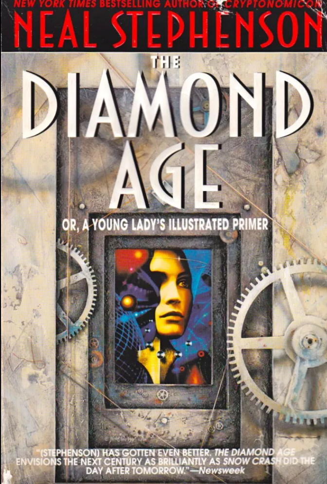
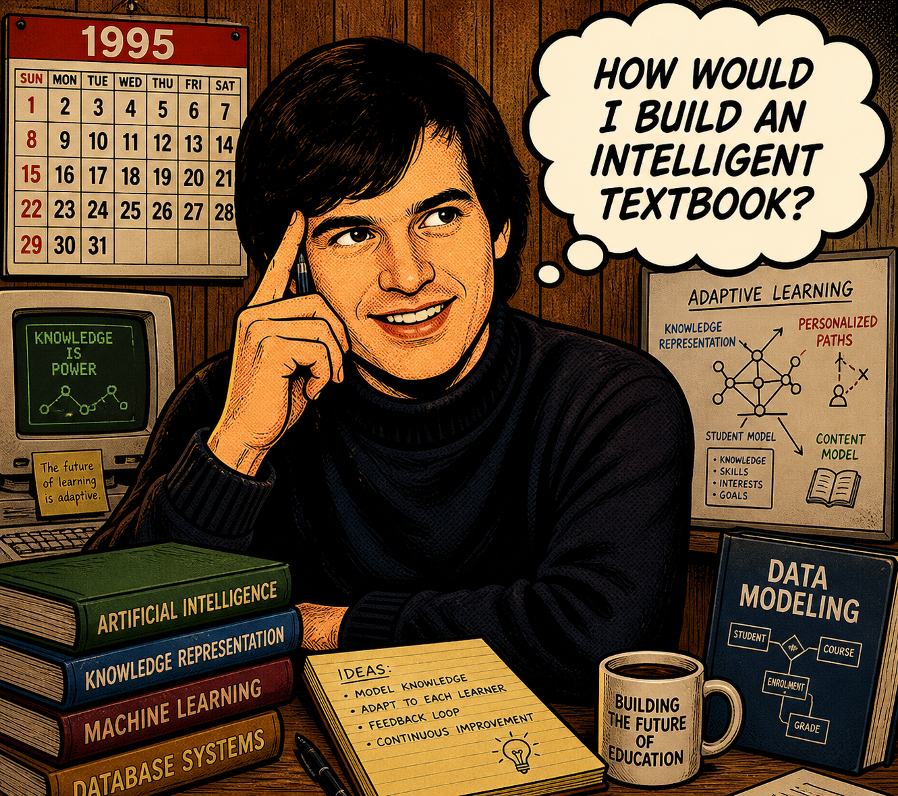
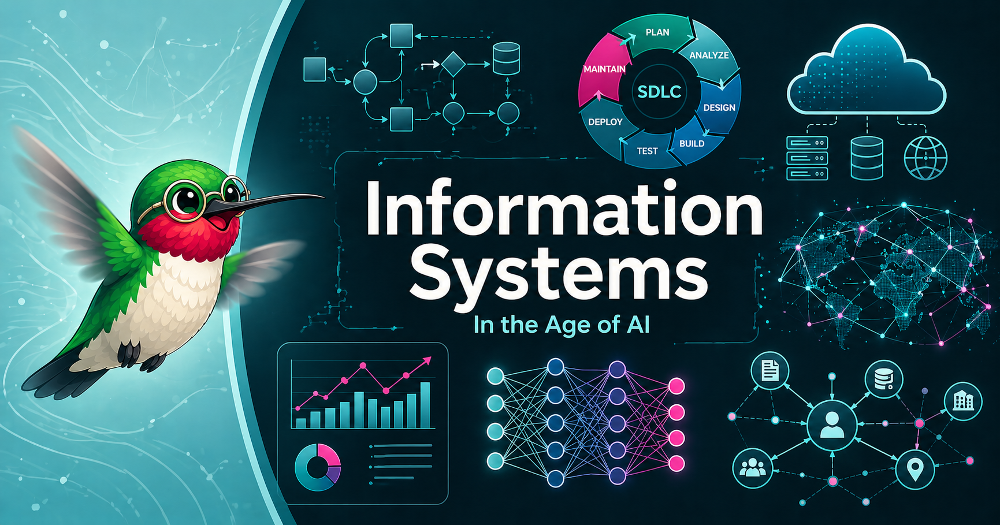
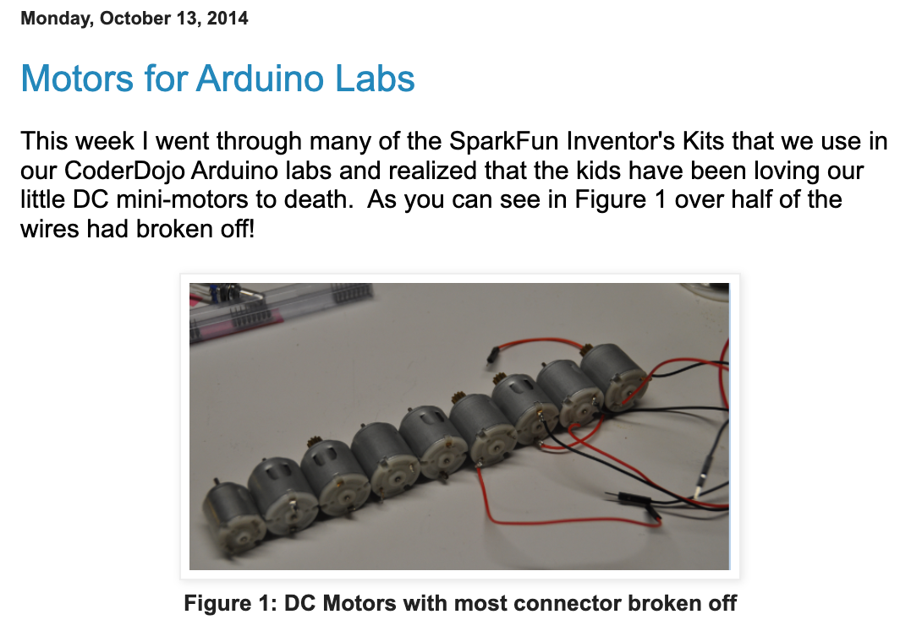
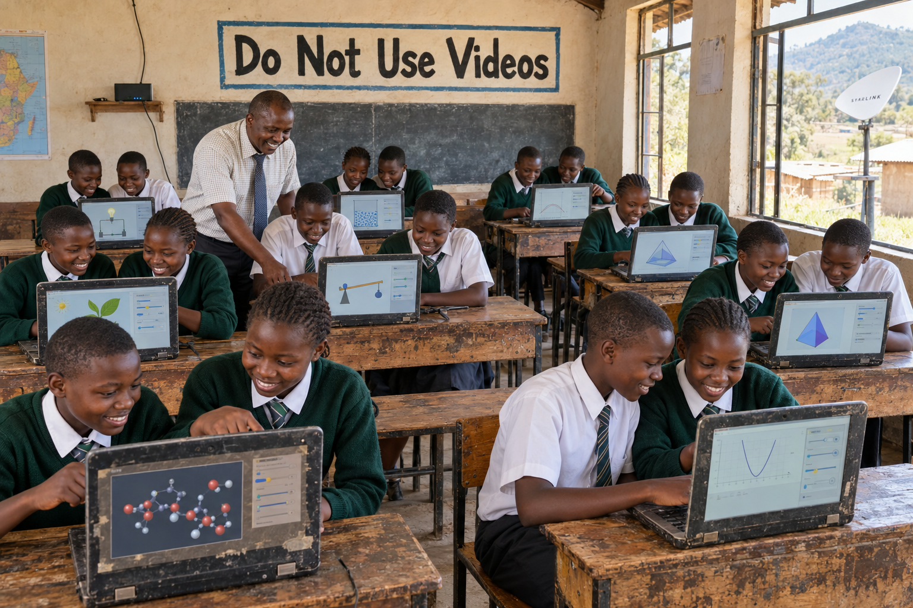
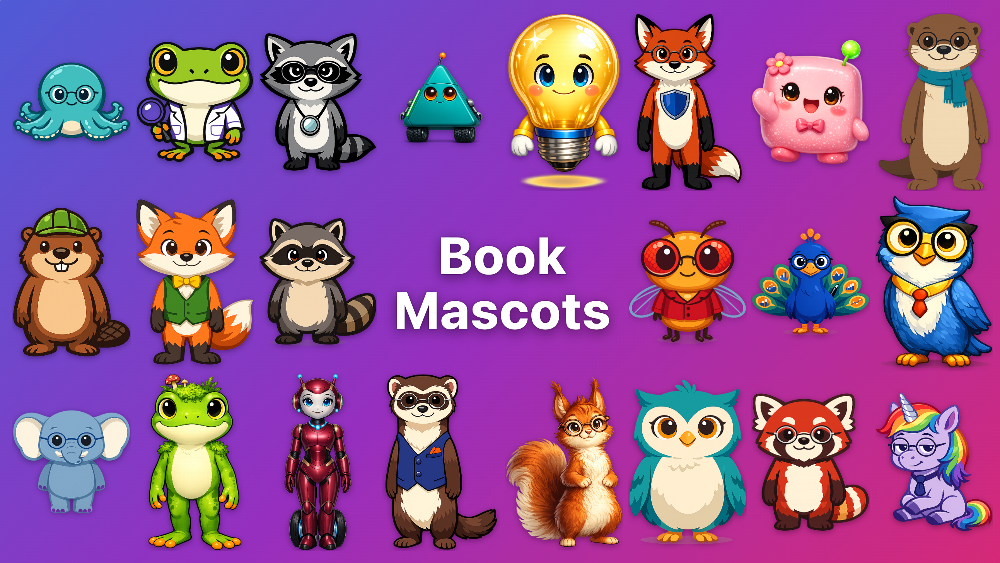
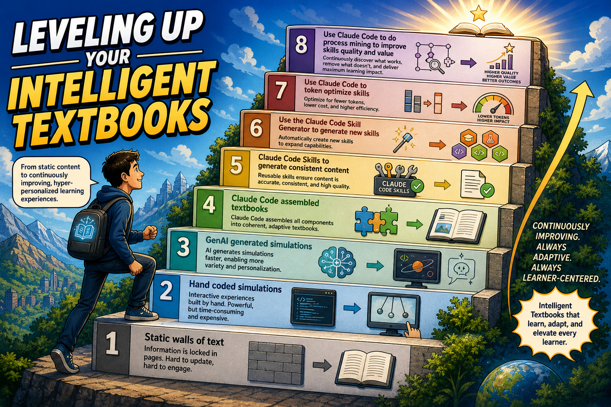
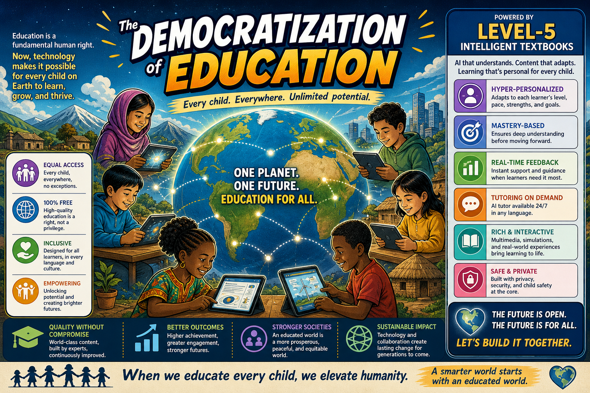
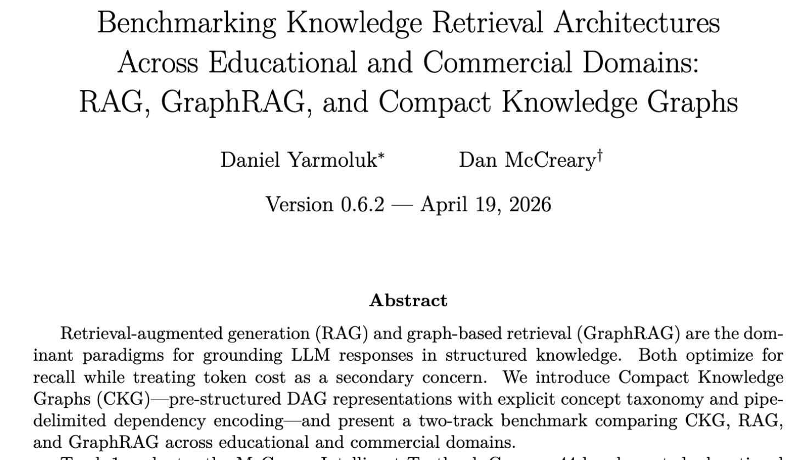

# Intelligent Textbooks in 35 Minutes

## Overview of Intelligent Textbooks in 35 Minutes

Democratizing Education for Using Intelligent Textbooks 

- AI in Education Conference
- St. Mary's University
- September, 2026
- Dan McCreary
</img>

## My Original Inspiration

**Diamond Age:** Neal Stephenson's 1995 Cyberpunk Novel 

- A young girl is given an AI-powered tablet that imprints on the girl
- Every lesson the girl needs is customized to her context

<!--Image: Cover of Diamond Age book -->
</img>
</img>

## Dan's Quest

- How would I build such a device?

</img>

## The Problem With Paper Textbooks

<ul style="font-size: 1.1em; margin: 4px 0 4px 30px;">
<li style="margin-bottom: 2px;">The static textbook problem (printed in 2019, used in 2026)</li>
<li style="margin-bottom: 2px;">One-size-fits-all "Direct Instruction" model fails the 80% - the advanced bored, the struggling get lost</li>
<li style="margin-bottom: 2px;">Cost & access gap: US college students pay $1,300 per year on out-of-date printed textbooks</li>
<li style="margin-bottom: 2px;">The engagement crisis (passive reading vs. active learning)</li>
<li style="margin-bottom: 2px;">Teachers are drowning (no time to personalize)</li>
</ul>

Prompt Goal: *"Generate a 1,000 page textbook on information systems with 100 MicroSims"*
</img>

## Current Status

What you can do now (available since October 2025):

*"Hey Claude, please generate a high quality interactive intelligent textbook. 
Use Dan McCreary's intelligent textbook skills [https://github.com/dmccreary/ibook-skills](https://github.com/dmccreary/ibook-skills) 
Use the following course description...PATH TO YOUR COURSE DESCRIPTION... 
Create a Learning Graph with 500 Concepts".*

## What is an Interactive Intelligent Textbook

* A textbook with "a brain" (learning graph) that can be classified into five levels
* A simple but powerful network of concepts and their learning order dependencies
* A simple classification system for concepts (taxonomy)
* Forced interactivity (few plan-old-images)
* No reliance on bandwidth hungry videos
* Small lightweight simulations (500 lines of JavaScript in an 10K byte download)
* Focus on structures that generate events that predict student mastery of a concept
* Hooks for easy migration to a xAPI/LRS infrastructure
* Designed to migrate from level 2.9 to level 5 without changing the data structures

## Health Education

Hey Claude, Please generate age-appropriate six textbooks base in the Minnesota Department of
Education guidelines:

{ align="right" width="400px"}

Generated six textbooks which shared content.

## Infographic Posters

[Infographic Posters](https://dmccreary.github.io/health-education/posters/)

{ align="right" width="400px"}

[Families: Many Ways To Care](https://dmccreary.github.io/health-education/posters/families-many-ways-to-care/)

## Local Minnesota Participants

* The Thinking Spot - Monday "Office Hours"
    * **Rima Parikh** - Coding Club and STEM Kits
    * **Arun Batchu** - Testing Skills, Scratch
    * **Rick Tanler** - Understanding Dementia
* MicroSims
    * **Valarie Lockhart** - Originator of MicroSims
    * **Troy Peterson** - WikiTube
* ISD 197
    * **Miles Lawson** - Digital Citizen Ship
    * **Peter Olson-Skog**
* Groves Learning Organization
    * **Curtis Olufsin** - Automation, ASL
    * **Andy Tolin** - Coding Club
* My Mentees
    * **Anvith Pothula** - Graph Neural Network Textbook
    * **Rishik Kondadadi** - Seizure Awareness in Minnesota Schools
* Stone Arch Collaborative
    * **Shannon Seaver** - AI Leadership in schools - CreateMPLS
    * **Dr. Randy Smasal** - Change management consulting
    * **Lori Ryan** - textbooks for marketing and brand management
    * **Stephanie Lensing** - textbooks for marketing and brand management
* University of St. Thomas
    * **Dan Yarmoluk** - Digital Transformation
    * 12 Student Textbooks
* University of Minnesota
    * **Dr. Sharat Bhatra** - Circuits, Senior Seminar, 12 Students 
    * **Dr. Jarvis Haupt** - Signal Processing
    * **Dr. Gan Qui** - Physics of Semiconductor Devices

## What It Will Generate

1. Extended Course Description - enriched with Learning Objectives using the Bloom Taxonomy and Quality Score
2. Inferred Concept List - between prerequisites and objectives
3. Learning Graph (Concept Dependency Graph) - the **ground truth** of the textbook
4. Book Mascot Character Sheet - enhanced engagement
5. Book Chapter Design - Focus on coverage and balance
6. Book Chapter Content - heart of the textbook
7. Placeholders for diagrams, figures, drawings, infographics, simulations - all interactive
8. Microsims - interactive elements that tracks mouse events (hover and clicks)
9. Glossary of Terms - precise, concise, distinct definitions with examples and links
10. FAQ - common questions and answers with links
11. Quizzes - multiple choice
12. References - with annotations for relevance
13. Graphic Novel Stories
14. Book Type Specific Concent - code executions, circuit simulations, timelines, maps, pronunciation, flashcards, lesson plans, challenge cards, kit book covers
15. Custom Cover Page - social media previews
16. About this Book
17. Landing Page with cover
18. Appendices, Contact, License, Teachers and Instructor's Guides
19. Book statics - quality reports, book metrics, reading level checks
20. Book announcements for social media and README.md

## MicroSims

</img>
- Worked as a volunteer with a local coding club starting in 2014
- Worked with Valarie Lockhart on teaching prompt engineering to teachers
- Valarie Lockhart coined the term "MicroSim" after using ChatGPT to generate p5.js
- I generalized the process and used iframes to make MicroSims easy to embed
- Published a paper formalizing the MicroSim standards with Valarie and Troy Peterson

## MicroSim Uniqueness

<iframe src="../../sims/microsim-uniqueness/main.html" height="500px" width="100%" scrolling="no"></iframe>
[MicroSim Uniqueness](../../sims/microsim-uniqueness/index.md)

## The Five Levels of Intelligent Textbooks

<iframe src="../../sims/book-levels/main.html" height="600px" width="100%" scrolling="no"></iframe>
[Book Levels Fullscreen](../../sims/book-levels/main.html)

## Timeline of Intelligent Textbooks

<iframe src="../../sims/intelligent-textbook-timeline/main.html" height="700px" width="100%" scrolling="no"></iframe>
[Timelines Fullscreen](../../sims/intelligent-textbook-timeline/main.html)

## Productivity Jumps

<iframe src="../../sims/productivity-jumps/main.html" height="700px" width="100%" scrolling="no"></iframe>
[Productivity Jumps Fullscreen](../../sims/productivity-jumps/main.html)

## Final 10 Hours

- Most time-consuming tasks was user interface layout cleanup of the MicroSims (placement)
- New Claude Vision tool now "sees" UI and will apply layout fixes
- Saves and additional 3-4 hours per book
- Automation of mascot design and cover design also saves 1 hour

## Current Status (this is real now)

- 120 level 2.99 Books
- Getting ready to go to level 3 (cost effectively) using xAPI and LRS
- 6,000 MicroSims
- 350+ Mini Graphic Novels
- 300+ Interactive Infographic Posters
- Ongoing research on [Automating Instructional Design](https://dmccreary.github.io/automating-instructional-design/)
- Continued integration of [The Learning Sciences](https://dmccreary.github.io/learning-sciences/)

[Case Studies](https://dmccreary.github.io/intelligent-textbooks/case-studies/)

## Target Classroom

The target classroom is a remote school in Africa that has limited internet bandwidth.
Our goal is to give each of these students the same MIT-caliber education as the most advanced colleges and universities in the US today.

<!--
Please generate an image of a junior high-school classroom in rural Kenya in Africa.  The classroom has a single StarLink connection for the entire school and the there are 10 old beat-up and worn Windows and Chromebook computers.  However the 20 students are all every engaged using animations from Micro-Simulations in their intelligent textbooks.  The single teacher is very happy.  A sign on the wall reads "Do Not Use Videos" since they take up too much bandwidth.  The school does not have a lot of money, but they are helping their students learn.
--->

## The Bouncing Ball MicroSim Example

<iframe src="../../sims/bouncing-ball/main.html" height="600px" width="100%" scrolling="no"></iframe>

## Animal Cell (Interactive Infographic Overlay)

<iframe src="https://dmccreary.github.io/biology/sims/animal-cell/main.html" 
        height="730px"
        width="100%"
        scrolling="no"></iframe>

## Biogeochemical Cycles (Water, Nitrogen, Carbon, Phosphorus)

<iframe src="https://dmccreary.github.io/biology/sims/biogeochemical-cycles/main.html"
        height="630px"
        width="100%"
        scrolling="no"></iframe>

## Challenges Getting LLMs to Generate Consistent Content

- Getting LLMs to generate consistent simulation interfaces
- Every diagram MUST be interactive (for level 3 xAPI enabled)
- No static images or drawing
- Complex infographics are great, but overlay interactive region hovers

## How I Generate Intelligent Textbooks

1. Course description (100 point scale)
2. => Learning graph
3. => Chapter design
4. => Chapter content generation (with mascot and microsim specifications)
5. => MicroSim generation
6. => Supplementary content generations (glossary, faq, quizzes, lesson plans, references)
7. => Automated quality assessment (coverage, metrics, scaffolding)

## Learning Graph

- Core data structure behind content generation and hyper-personalization.
- Directed Acyclic Graph of concepts and their learning order

<iframe src="../../sims/graph-viewer/main.html"
        height="700px"
        width="100%"
        scrolling="no"></iframe>

[Computer Science (400)](https://dmccreary.github.io/computer-science/sims/graph-viewer/main.html)
[Information Systems (580)](https://dmccreary.github.io/information-systems/sims/graph-viewer/main.html)

## Book Mascots

</img>
[Book Mascot Montage](https://dmccreary.github.io/book-mascots/mascot-montage/)

## Sample Titles

    - Digital Citizenship (ISD 197)
    - Personal Finance (State Guidelines)
    - Learning Python
    - Scratch
    - Learning Linux
    - Coding Clubs
    - Learning MicroPython (Physical Computing)
    - AP Courses: Calculus, Physics, Chemistry, Biology, Natural Sciences
    - Algebra
    - Data Science
    - Deep Learning
    - Signal Processing (University of Minnesota)
    - IB Courses: Theory of Knowledge, Functions
    - Ecology (AP Natural Sciences)
    - Quantum Computing (a skeptics guide)
    - Dementia (with Rick Tanler)
    - Digital Transformation (with Daniel Yarmoluk)
    - Cooking Science
    - Public Health
    - Forensic Science

## Leveling Up Your Intelligent Textbooks

## Leveling Up Your Intelligent Textbooks Text

1. Static walls of text 
2. second level "Hand coded simulations" 
3. GenAI generated simulations
4. Claude Code assembled textbooks in GitHub
5. Claude Code Skills to generate consistent content 
6. Use the Claude Code Skill Generator to generate new skills 
7. Use Claude Code to token optimize skills 
8. Use Claude Code to do process mining to improve skills quality and value

## Skills for Developing Intelligent Textbooks

1. Created with Claude Code starting around October 2025
2. Currently about 13 core skills
3. Thoroughly tested with Claude Code works on OpenAI ChatGPT and Google Gemini
4. Continually being optimized for token efficiency - targeting $2/textbook

## The Democratization of Education

- A Side Effect of Dan's Quest

- How would the world change if a 12-year old girl from the remote regions of Africa has access to the
**same quality** of hyper-personalized education as every student at MIT?

- How could we use intelligent textbooks to democratize education for all children on Earth?

- Should an ultra-high quality of hyper-personalized education be free for all children on earth?

## The Democratization of Education

<!--
Please generate a wide-landscape infographic with the title "The Democratization of Education" depicting that all children on planet Earth will have access to free high-quality hyper-personalized education through level-5 intelligent textbooks.
--->

## Making Teaching Fun

- From "Sage on the Stage" to Guide on the Side

## Making Chatbot 41x lower Cost

## Call to Action

- Try it out yourself!
- Requires a $20/month Claude Pro, ChatGPT or Google Gemini account
- Use Claude Sonnet for 95% of skills
- Generate 6-8 textbooks per month (in three 5 hour windows per day)
- Per textbook cost $2-$3 depending on complexity of MicroSims

Because every child on Earth can be Nell

</img>

## Appendix

[WikiTube Solar System Simulation](https://wikitube-3d-microsims.netlify.app/solar/Solar_System.html)
